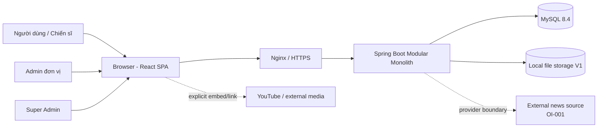
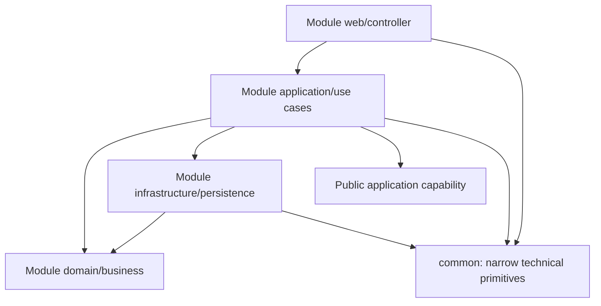
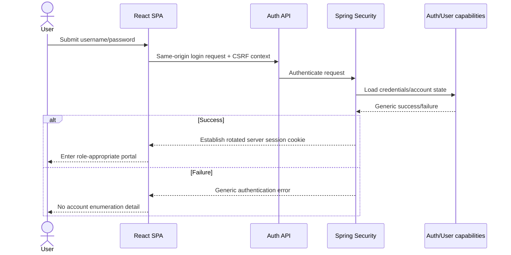
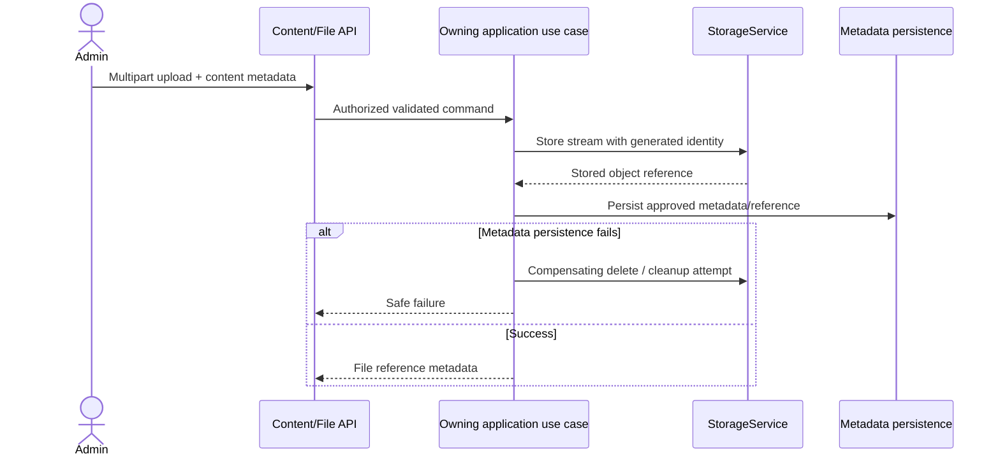
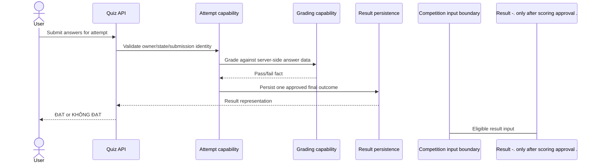

# SYSTEM DESIGN — V0.3

**Project:** Hệ thống Giáo dục Chính trị
**Document ID:** PES-SD-V0.3
**Version:** 0.3
**Date:** 2026-08-16
**Status:** Accepted
**Depends on:** `docs/v0.1/BUSINESS-REQUIREMENTS.md`, `docs/v0.2/FUNCTIONAL-SPECIFICATION.md`, `docs/v0.2/SCREEN-CATALOG.md`, `docs/ADR/ADR-001-technology-baseline.md`, `docs/ADR/ADR-002-no-docker.md`, `docs/ADR/ADR-004-authentication-session-strategy.md`, `docs/v0.5/UI-GUIDELINE.md`
**Downstream:** V0.4 Database Design, backend/API implementation, frontend integration, V0.6 Test & Acceptance

---

## 1. Purpose and status boundary

Tài liệu này là entry point normative cho kiến trúc MVP backend/API/integration. Nó mô tả ranh giới Modular Monolith, ownership, security, REST conventions, storage/integration/runtime và các decision dependency đủ để review trước V0.4.

`Accepted` xác nhận architecture/system-design baseline cho downstream design; không tự chấp nhận mọi `TD-*`, đóng `OI-*`, phê duyệt production infrastructure hoặc mở khóa toàn bộ V0.4. Các mục đánh dấu **Proposed**, **Deferred**, **Candidate** hoặc bị `OI-*` chặn chưa được dùng để suy ra business rule cuối. V0.3 không tạo entity, JPA mapping, bảng/cột/khóa/index, SQL/Flyway business migration, DTO cụ thể hoặc endpoint inventory cuối.

## 2. Design drivers and fixed constraints

- Một đơn vị, khoảng 500 users, website responsive qua Internet (`USR-005`, `NFR-001..NFR-003`). Không giả định CPU/RAM/disk cụ thể.
- Java 21, Spring Boot 4.1.x, Spring MVC/REST, Spring Security, JPA/Hibernate, Flyway, MySQL 8.4 LTS, Maven Wrapper, OpenAPI và Actuator (`NFR-004..NFR-007`, `TECH-001..TECH-009`).
- React 19/TypeScript/Vite và frontend libraries đã khóa; frontend tích hợp qua TanStack Query → API client → REST (`TECH-003`, `TECH-004`).
- Modular Monolith/package-by-feature; không microservices hoặc distributed infrastructure (`NFR-005`, `OOS-011`).
- Nginx, GitHub và no-Docker/no-Compose/no-Testcontainers (`NFR-009`, `NFR-010`, `TECH-010..TECH-012`, ADR-002).
- File binary nằm ngoài MySQL; V1 dùng local filesystem qua `StorageService`, future adapter có thể S3-compatible.
- Timezone nghiệp vụ là `Asia/Ho_Chi_Minh`; cách lưu timestamp thuộc V0.4.
- V0.2 Open Issues `OI-001..OI-015` giữ nguyên. Technical recommendation không được dùng để đóng OI nghiệp vụ.

## 3. System context

### 3.1 Actors and external boundaries

- **Người dùng / Chiến sĩ (`USER`)**: đọc nội dung, làm quiz/weekly question, xem kết quả/ranking.
- **Admin đơn vị (`ADMIN`)**: quản lý users, invitation, nội dung, quiz, configuration, dashboard/reporting.
- **Super Admin (`SUPER_ADMIN`)**: role cao nhất; V1 vẫn chỉ một đơn vị. Không suy ra permission matrix chi tiết.
- **Browser**: chạy React SPA; không phải security authority.
- **External news source**: boundary deferred, provider/method chưa chốt (`OI-001`).
- **External media**: link/embed YouTube; không mặc định YouTube API, download hoặc proxy.



## 4. Runtime/container architecture

```mermaid
flowchart TB
    Internet[Internet client]
    TLS[HTTPS termination - Nginx]
    SPA[React static assets]
    APIProxy[/api reverse proxy]
    App[Java 21 Spring Boot process]
    DB[(MySQL 8.4 LTS)]
    Files[(Local storage root)]
    Health[Actuator health]

    Internet --> TLS
    TLS --> SPA
    TLS --> APIProxy
    APIProxy --> App
    App --> DB
    App --> Files
    App --> Health
```

Baseline V1 không Docker:

1. Nginx phục vụ React static assets và SPA fallback cho non-file, non-API routes.
2. Nginx reverse proxy `/api` tới Spring Boot; health exposure được giới hạn theo vận hành.
3. Spring Boot chạy như một Java process do process manager của host quản lý; lựa chọn cụ thể là `TD-002`.
4. MySQL và storage root là dependencies ngoài process. Service account chỉ có quyền filesystem cần thiết.
5. Static assets có thể dùng cache headers theo fingerprint; HTML shell không được cache theo cách chặn rollout.
6. Topology/config Nginx cuối phụ thuộc server/domain/TLS ở `OI-003`; đây không phải production configuration đã verify.

## 5. Modular Monolith structure

### 5.1 Dependency view



Mũi tên `App → Infra` biểu diễn orchestration qua interface/implementation trong cùng module, không bắt buộc ceremony hexagonal. Module nhỏ có thể dùng package ít hơn, nhưng trách nhiệm vẫn phải tách: controller không chứa rule, transaction nằm ở application use case, persistence không leak ra API.

### 5.2 Rules bắt buộc

- Package-by-feature dưới root `vn.pes`; không tạo global `controller/service/repository` theo layer.
- Module không truy cập repository/entity nội bộ của module khác. Cross-module behavior đi qua public application capability hoặc query boundary rõ.
- Không trả JPA entity trực tiếp qua REST; request/response DTO tách biệt.
- Controller chịu HTTP mapping, authentication context và input boundary; không tính điểm/chấm bài/quyết định publication.
- `common` chỉ chứa technical/shared primitives đã có nhiều consumer: error envelope support, time/request context hoặc configuration nhỏ. Không chứa business entity/repository/service chung.
- Tránh circular dependency. Khi hai module cần nhau, xác định owner của use case và dùng một chiều dependency hoặc read/query contract; không cho phép mutual repository access.
- Không bắt buộc Spring Modulith hoặc dependency-analysis library mới trong V0.3. Boundary được kiểm soát bằng package convention, review và tests sau này.

### 5.3 Logical responsibilities inside a module

| Area | Responsibility | Must not do |
|---|---|---|
| `web` / controller | HTTP mapping, DTO validation, status/header, authenticated principal | Business rule, transaction orchestration, repository access |
| `application` / use case | Orchestration, authorization relevant to use case, transaction boundary, cross-module capability calls | Expose persistence object, hold open transaction over network/file stream |
| `domain` / business | Invariants and decisions that are actually approved | Invent OI-dependent behavior, depend on Spring MVC |
| `infrastructure` / persistence | JPA/repository adapters, filesystem/provider adapters | Leak entity/query implementation into another module/API |

## 6. Module inventory and ownership

Exactly 14 current package boundaries are normative for V0.3.

| Module | Responsibility / conceptual ownership | Public application capabilities | Allowed dependencies | Prohibited dependencies | Requirement / Use Case groups | OI impact |
|---|---|---|---|---|---|---|
| `auth` | Authentication, registration orchestration, credentials, invitation validity capability and session lifecycle | Authenticate/logout; register USER; validate/manage invitation through authorized use cases | `user` public account capability; `common`; Spring Security adapter | Direct user repository; content/competition repositories | `USR-001..USR-004`; `UC-AUTH-001`, `UC-AUTH-002`, `UC-ADM-INV-001` | `OI-006`; `TD-001`, `TD-003` |
| `user` | Account/profile-lite, role and Cán bộ/Chiến sĩ classification; organization assignment only after decision | Create/read/update account profile/role; user query for authorized consumers | `common`; auth identity reference via public contract | Auth credential internals; competition repository | `USR-004`; `UC-ADM-USER-001`; admin/user parts of `ADM-001` | `OI-014` |
| `handbook` | Handbook categories, articles, publication and search within Handbook | Browse/search/detail; Admin category/article management | `file` public metadata/access capability; `common` | File adapter internals; other content repositories | `HAN-001..HAN-005`; `UC-HAN-001..003`, `UC-ADM-001` | `OI-005`, `OI-015` |
| `resolution` | Resolution metadata/content, topic/lesson hierarchy and attachments; no learning progress | Browse/detail; Admin content management | `file` capability; `common` | Quiz/competition repository; progress tracking | `RES-001..RES-005`; `UC-RES-001..002`, `UC-ADM-001` | `OI-005`, `OI-015` |
| `news` | Categories and Admin-authored text/video/link; normalized external-news boundary | Browse/detail/manage; accept normalized provider input after approval | `file` capability where uploaded media exists; `common`; future provider port | Provider-specific types in web/domain; synchronous provider dependency in user request | `NEWS-001..NEWS-005`; `UC-NEWS-001..003`, `UC-ADM-001` | `OI-001`, `OI-005` |
| `music` | Topic-grouped local media metadata and external YouTube link/embed metadata; no playlist/history/statistics | Browse/play metadata/manage | `file` capability for uploaded media; `common` | YouTube API/download assumption; listening-history repository | `MUS-001..MUS-004`; `UC-MUS-001..002`, `UC-ADM-001` | `OI-005` |
| `quiz` | Question Bank, test configuration, attempt, submission, server grading, pass/fail result and quiz-ranking boundary | Manage questions/tests; start/read/submit attempt; result/ranking queries after decisions | `user` identity query; `common`; optional explicit competition input boundary after approval | Competition formula; user repository; client-side grading | `QUIZ-001..QUIZ-010`; `UC-QUIZ-001..006` | `OI-002`, `OI-007..OI-009` |
| `politicaleducation` | Program → Topic → Lecture → Document → Test content hierarchy; no progress | Browse/manage hierarchy/content; test association only after decision | `file` capability; possibly `quiz` public capability after `OI-011`; `common` | Direct quiz repository; invented completion tracking | `EDU-001..EDU-004`; `UC-EDU-001..002`, `UC-ADM-001` | `OI-005`, `OI-011`, `OI-012`, `OI-015` |
| `hochiminh` | Daily teaching content, source/context/meaning/image/related content and today lookup | Today/detail/manage | `file` capability; `common` time abstraction | Advanced-search/history repository not required | `HCM-001..HCM-004`; `UC-HCM-001..002`, `UC-HOME-001`, `UC-ADM-001` | `OI-005` |
| `weeklyquestion` | Weekly question configuration, current lookup, answer submission, server grading and controlled reveal | Manage/current/submit/reveal capabilities | `user` identity query; `common`; optional competition input boundary after approval | Competition formula; scheduler assumed by default | `WEEK-001..WEEK-005`; `UC-WEEK-001..003` | `OI-002`, `OI-010` |
| `competition` | Competition policy boundary, eligible score inputs, calculation/read model and leaderboard ownership after approval | Accept eligible source; calculate/query score/ranking; manage policy after approval | Public result/input capabilities from `quiz`, `weeklyquestion`, approved sources; `user` organization query; `common` | Direct source repositories; UI-defined formula | `COMP-001..COMP-007`; `UC-COMP-001..004` | `OI-002`, `OI-012`, `OI-014` |
| `file` | Storage metadata/reference capability and storage adapter abstraction; binary outside MySQL | Store/open/read/delete metadata-safe object; authorize/resolve downloads | `common`; configured local filesystem adapter | Content-domain repository; exposing arbitrary path | `FILE-001..FILE-005`; `UC-FILE-001..003` | `OI-005`, `OI-015`; `TD-004` |
| `dashboard` | Admin dashboard/report query boundary, cross-module read aggregation and on-demand export orchestration | Widget queries; period report; export | Public/query capabilities of source modules; `user`; `competition`; `common` | Mutating source repositories; polling/scheduler by default | `REP-001..REP-006`; `UC-REP-001..003` | `OI-002`, `OI-013`, `OI-014`; `TD-005` |
| `common` | Narrow cross-cutting technical support, shared error/request/time/config primitives | Stable technical utilities only | JDK/framework primitives | Business ownership, generic business repository/service/entity | `NFR-*`, `TECH-*`; no standalone business UC | No business OI ownership |

## 7. Cross-module collaboration and data ownership

- Content modules own their publication/content concepts; `file` owns storage reference and byte access, not the parent content lifecycle.
- `auth` owns credential/session concerns; `user` owns profile/role concepts. Registration is orchestrated by `auth` and requests account creation through a `user` capability.
- `quiz` and `weeklyquestion` own their own result facts. `competition` may consume an explicit, approved representation of eligible activity; it never queries their repositories directly.
- `dashboard` owns reporting projections/query orchestration, not source facts. Widget failure is isolated.
- A cross-module write must have one application use case as transaction owner. If atomicity across owners cannot be achieved cleanly, implementation must define consistency behavior after the relevant business rule is approved; do not add a broker/outbox speculatively.
- V0.3 defines logical ownership only. Physical relationships, constraints, delete behavior and indexes belong to V0.4.

## 8. Transaction and concurrency boundaries

- Transaction begins/ends in the application/service use case; controller never manages it.
- Read queries may use read-only transactions when implementation evidence supports it.
- Do not keep a DB transaction open while streaming a file, generating a long export or calling an external provider. Persist/resolve metadata in a short transaction, then perform I/O with explicit failure handling.
- Registration, invitation consumption (if later defined), quiz submission, weekly submission, publication/delete, competition calculation/adjustment and file-metadata/filesystem coordination need concurrency design in V0.4/implementation.
- Repeated quiz/weekly submissions must not create multiple final outcomes for the same approved business identity; the identity and attempt policy remain blocked by `OI-007`, `OI-008`, `OI-010`.
- No special isolation level, distributed lock or locking algorithm is selected without approved rules and query evidence.

## 9. Authentication technical design

### 9.1 Business requirement vs technical candidate

Business requirement is limited to username/password, self-registration with valid invitation and roles (`USR-001..USR-004`). It does not select JWT, server session, password policy, reset or lockout.

**TD-001 — Approved (ADR-004):** use Spring Security with a secure server-managed browser session and HttpOnly cookie for the same-origin Nginx deployment.

Rationale:

- Browser SPA and API share one origin through Nginx; current frontend client already sends `credentials: include`.
- Server-side invalidation and Spring Security CSRF/session protections fit a single-instance/resource-constrained MVP.
- Bounded server-side session state is proportionate for the current web-only scale of about 500 users; monitor actual session/memory behavior instead of adding distributed session infrastructure pre-emptively.
- Avoids browser token storage and JWT refresh/revocation complexity not required by source.

Alternatives: stateless JWT bearer token or opaque token service. They add lifecycle/storage/revocation concerns without a current multi-client requirement. If future mobile/public API or horizontal deployment requirements appear, session placement/stickiness may need a new ADR; no Redis/JWT dual mode is approved now.

Current `formLogin` + HTTP Basic in `SecurityConfig` is skeleton-only. HTTP Basic is **not** the intended production browser authentication mechanism; a later auth implementation task must align the filter chain/login/logout/session/CSRF behavior with ADR-004 without weakening public endpoint controls.

### 9.2 Conceptual login sequence



### 9.3 Password, session and CSRF expectations

- Password storage uses Spring Security `PasswordEncoder` abstraction with an adaptive one-way hash supported/recommended by Spring Security. This technical principle is Approved; exact algorithm/work factor is measured and configured during implementation under `TD-003`.
- Never log plaintext password, hash, session ID, cookie, CSRF token or credential payload.
- Production cookie: HttpOnly, Secure and `SameSite=Lax` for the approved same-origin flow, with the narrowest practical path/domain; session fixation protection and rotation on authentication. Any future cross-origin topology requires a security/ADR review before changing SameSite/CORS/CSRF behavior.
- CSRF remains enabled for state-changing session-authenticated requests; SPA obtains/sends token through an approved Spring-compatible mechanism.
- HTTPS is mandatory in production. Authentication response is generic; no username enumeration.
- Minimum length, complexity, reset, lockout/rate policy are Deferred business/security decisions. Brute-force mitigation must be approved before public production exposure, without inventing account behavior here.

## 10. Registration and invitation boundary

```mermaid
sequenceDiagram
    actor U as Unregistered user
    participant API as Auth registration API
    participant Inv as Invitation capability
    participant User as User account capability

    U->>API: Registration input + invitation code
    API->>Inv: Validate under approved lifecycle
    alt Invalid or policy not satisfied
        Inv-->>API: Generic validation failure
        API-->>U: Registration rejected; no account created
    else Valid
        Inv-->>API: Validity result
        API->>User: Create USER account atomically as policy allows
        User-->>API: Account created
        API-->>U: Success; return to login
    end
```

`OI-006` blocks one-time/multi-use, expiry, quota, owner and organization assignment. Registration API, concurrency handling and V0.4 model cannot be finalized until those are decided. No auto-login is assumed.

## 11. Authorization baseline

- Roles: `SUPER_ADMIN`, `ADMIN`, `USER`. Cán bộ/Chiến sĩ is classification, not a role.
- Public access is deliberate: login/registration technical endpoints and minimal health/documentation exposure appropriate to environment. Content/User Portal requires authenticated access per V0.2 unless later explicitly changed.
- Every Admin REST capability verifies `ADMIN` or `SUPER_ADMIN` on backend. Frontend route guards/action hiding are usability only.
- Authorization belongs at request/use-case boundary; resource/ownership checks must be repeated in application logic where an identifier can expose another resource (IDOR defense).
- Do not define per-module/per-action permission matrix or hardcode final annotation mapping in V0.3 (`OOS-004`).
- API semantics: invalid/expired session → 401; authenticated but insufficient role/resource permission → 403.

## 12. REST API conventions — Approved V1 baseline

These conventions are the Accepted V1 baseline. They do not constitute a final endpoint inventory.

### 12.1 Addressing and semantics

- Approved prefix: `/api/v1`. Existing `/api/system/ping` is skeleton-only and does not establish final business versioning.
- Resource paths use lowercase plural nouns and stable identifiers; actions are modeled through resource/state changes where practical, not RPC verbs everywhere.
- `GET` is safe/read-only; `POST` creates or triggers non-idempotent domain command; `PUT` replaces where contract supports it; `PATCH` changes explicit fields; `DELETE` follows approved lifecycle only.
- Do not expose persistence IDs/types as domain contract by accident. Identifier format is selected with V0.4/API implementation.
- JSON field names use `camelCase`; timestamps include offset/zone semantics. Business date/week interpretation uses `Asia/Ho_Chi_Minh`.
- OpenAPI documents approved contracts and security schemes; annotations must not duplicate obvious details excessively.

### 12.2 Status principles

| Situation | HTTP status principle |
|---|---:|
| Successful read/update | `200` |
| Successful create | `201` with stable resource reference when applicable |
| Successful command without body | `204` when no response representation is needed |
| Input/field validation | `400` |
| Invalid/expired authentication | `401` |
| Insufficient authorization | `403` |
| Resource unavailable/not found | `404` without leaking hidden resource existence |
| State/version/duplicate conflict | `409` |
| Unsupported media type | `415` |
| Payload/file too large | `413` after `OI-005` defines policy |
| Unexpected server failure | `500` with safe problem response |
| Optional external dependency unavailable | `502/503` only at the owning integration boundary; user content should degrade where possible |

### 12.3 Pagination, filtering and sorting

- Growing collections use server-side pagination. Proposed query vocabulary: `page`, `size`, optional whitelisted `sort`, plus domain-specific filters.
- Page size is bounded by server configuration. No final business/default/max value is set in V0.3.
- Response includes items and conceptual page metadata: current page, requested size, total items/pages when calculation is appropriate. Implementation may avoid expensive totals for a contract explicitly designed without them.
- Filters/sort fields are allowlisted; never concatenate raw client input into SQL. Empty search behavior follows the owning UC.
- Production must not load-all then filter/sort in browser. P0 local mocks are not architecture evidence for data access.

### 12.4 Idempotency and concurrency

- `GET`, `PUT` and `DELETE` follow HTTP idempotency semantics where their approved contract applies.
- Create commands validate duplicate/conflict rules. Quiz/weekly final submission requires an application-level duplicate guard after attempt identity is approved.
- No generic idempotency-key infrastructure is introduced without a concrete retry/use-case requirement.
- Concurrent edit strategy/version conflict is finalized with V0.4/domain behavior; return conflict rather than silently overwriting when correctness requires it.

## 13. API error and validation model — Approved baseline

Use Spring `ProblemDetail`/RFC-style problem responses as the standard REST error baseline rather than a heavy custom error framework.

Conceptual fields:

- `type` or stable application `code` for client handling;
- `title`, `status`, safe `detail`;
- `instance` or request path only when it does not leak internal routing;
- `fieldErrors` containing field and safe validation message;
- optional `requestId`/correlation value generated per request.

Rules:

- Input shape/Bean Validation runs at web DTO boundary; business validation belongs to application/domain.
- Error messages never contain stack trace, SQL, filesystem path, credential/session value or raw internal exception.
- Unknown/unexpected errors map to generic 500 detail and are logged server-side with request ID.
- Validation (400), unauthenticated (401), forbidden (403), not found (404), conflict (409) and server failure map directly to V0.5 inline/page/section error patterns. Retrying is explicit and only for retryable conditions.

## 14. DTO/domain/persistence boundary

- Separate request and response DTOs; do not reuse JPA entity or inbound DTO as outbound representation.
- Bean Validation checks boundary constraints that are known; use-case/domain checks approved invariants and authorization.
- Mapping may be handwritten initially. No Lombok/MapStruct dependency is added merely for convenience.
- Request DTOs expose only mutable fields for that use case (mass-assignment defense).
- Response DTOs expose only necessary data. Quiz attempt never includes correct answers or whole Question Bank before reveal policy allows.
- Persistence objects and lazy relationships remain internal. Serialization must not trigger uncontrolled queries.

## 15. File storage architecture

### 15.1 StorageService boundary

`file` defines conceptual operations:

- `store`: accept authorized stream + validated metadata and return storage identity/reference;
- `open/read`: resolve an authorized reference to a stream/resource;
- `delete`: remove an owned object under an explicit content lifecycle;
- `metadata`: provide safe original display filename, content type, size/status/reference;
- implementation generates a storage name/identity independent of client filename.

V1 adapter writes beneath configured local `FILE_STORAGE_ROOT`. Future S3-compatible adapter must implement the same application contract; it is not an MVP dependency. MySQL stores metadata/reference only, never primary media BLOB.

### 15.2 Upload sequence



This sequence is conceptual; exact commit/cleanup and temporary-file strategy requires implementation tests. A DB transaction must not remain open for the full stream.

### 15.3 File security and resource rules

- Do not trust client filename. Preserve it only as sanitized display metadata; generated storage identity determines path.
- Resolve/normalize against the configured root and reject traversal/symlink escape. Never expose arbitrary filesystem path.
- Validate authorization before upload/download/delete. Validate allowlisted media/document types using metadata plus server-side inspection appropriate to implementation; do not trust only client `Content-Type`.
- Stream upload/download; do not read whole file into heap. Apply request/file bounds when `OI-005` is approved.
- Set safe download filename and response headers; use inline rendering only for supported/safe types.
- `OI-015` keeps Word/PowerPoint preview technology open. Baseline fallback is authorized download; no converter/service is selected.
- Failed upload/export temporary artifacts require bounded cleanup. No scheduler is assumed; request-scoped cleanup is preferred where sufficient.

## 16. External integrations

### 16.1 External news

`news` owns an `ExternalNewsProvider`-style port concept: provider-specific input is normalized and validated before entering News application behavior. `OI-001` blocks provider, RSS/API/crawler choice, rights and refresh behavior.

- Admin-authored news remains independent and usable.
- User read requests must not synchronously depend on provider availability for already stored/internal content.
- No crawler, scheduled refresh or retry loop is added by default.
- Provider failure is isolated, logged safely and exposed to Admin only as controlled integration status when such capability is approved.

### 16.2 Music and external media

- Local/uploaded source uses `file` metadata/stream capability.
- YouTube/external source stores/serves an approved link/embed reference. No YouTube API, proxy or download is required by `MUS-002`.
- Validate supported URL/source forms; render with safe embed/link handling. Browser loads external media only after explicit user action; no autoplay/preload.

## 17. Quiz architecture

Conceptual sub-boundaries within `quiz`:

1. **Question Bank** — question/topic/type/choices/correct-answer administration.
2. **Test configuration** — question source, number, configured time, pass threshold, open/closed status.
3. **Attempt** — server-selected/shuffled question set and actor context.
4. **Submission** — validate answers and final submission identity.
5. **Grading** — server-side evaluation.
6. **Result** — baseline pass/fail representation; ranking read boundary after decision.



Blocked design points:

- `OI-007`: attempt count, unanswered submit, fixed/resume/refresh behavior.
- `OI-008`: timeout and auto-submit.
- `OI-009`: raw score exposure, ranking attempt/metric/tie-breaker.
- `OI-002`: how result contributes to competition.

No attempt/result persistence model or timeout scheduler is selected before those decisions.

## 18. Political Education and Weekly Question

### 18.1 Political Education

The content hierarchy remains `Program → Topic → Lecture → Document → Test` (`EDU-001`) without progress tracking.

Two viable integration candidates for `Test`:

1. Reference a `quiz` public capability/configuration while Political Education owns placement/context.
2. Treat `Test` as a module-local content/assessment concept if approved requirements differ materially from Quiz.

`OI-011` must select meaning/association before API/DB/business implementation. Neither option is preferred as an accepted rule here. `OI-012` prevents inventing completion tracking as competition input.

### 18.2 Weekly Question

`weeklyquestion` owns question configuration, current-question lookup, answer submission, server grading and explanation/reveal. `OI-010` blocks deadline/rollover, current selection, answer-after-week, repeat attempts and reveal timing. No cron/scheduler is assumed. A request-time current lookup or later scheduled transition can be evaluated after lifecycle approval.

## 19. Competition architecture

`competition` owns approved score policy, eligible input processing, period/scope calculation and leaderboard/read model. Source modules expose explicit result facts; competition never reads their repositories directly and UI never computes formula.

An internal score/input ledger is only a **Domain Candidate** for later design, useful for deduplication/explanation/recalculation. It is not locked because source eligibility, formula, period and hierarchy are unresolved.

- `OI-002` blocks criteria, weights, normalization and tie-break.
- `OI-012` blocks “learning completion” source because MVP has no progress tracking.
- `OI-014` blocks organization hierarchy/assignment and tiểu đội scope conflict.

No leaderboard calculation, manual adjustment behavior, event model or scheduled recomputation is selected until these decisions exist.

## 20. Dashboard, reporting and export

- `dashboard` uses query/application boundaries from source modules; it does not join or mutate their repositories directly.
- Widget queries are isolated so one blocked/failing metric does not break navigation or other widgets.
- Report queries use validated date/week/month/year filters and server-side pagination for lists.
- Excel export is explicit/on-demand, authorized and bounded. Generate/stream with controlled memory and clean temporary artifacts on failure; exact library/large-export threshold is `TD-005` before implementation.
- No polling, scheduled report or expensive synchronous full-dataset aggregation by default. Precomputation/read model is considered only after query/profile evidence.
- `OI-013` blocks popular-content metric; `OI-002` and `OI-014` block real competition/ranking widgets.

## 21. Database interaction principles

- MySQL 8.4 LTS + JPA/Hibernate; Flyway is sole owner of schema change.
- `spring.jpa.hibernate.ddl-auto=validate`; never `update` in shared/production.
- Dedicated MySQL test database for integration behavior; no H2 substitution and no Testcontainers.
- V0.3 creates no final SQL/migration. Physical names, columns, keys, constraints, relationships, delete strategy and indexes belong to V0.4.
- Growing queries are paginated/bounded. Implementation must avoid N+1 via explicit query/fetch design for the actual response, avoid default `EAGER` collection graphs and never query in a loop.
- Do not add indexes or cache speculatively; V0.4 maps approved filter/sort/query requirements to physical design.

## 22. Cache and background behavior

- Baseline has no distributed cache and no Redis.
- In-process cache is not designed until profiling shows a repeated, safe, invalidatable workload.
- No scheduler/background worker is created by default. External news refresh, weekly rollover, leaderboard recomputation and cleanup require approved lifecycle/operational decisions.
- No busy loop, periodic frontend polling, generic retry thread pool or message broker.

## 23. Observability and audit distinction

- Use consistent structured application logs with level discipline and per-request ID where useful.
- Log security events such as authentication failures/forbidden access without password, credential, session/cookie or sensitive payload.
- Actuator health/info is the baseline. Production health details remain non-sensitive; exposure is restricted through Nginx/security.
- Startup/config/storage/DB failures must be visible in process logs and health without leaking secret values.
- Prometheus/Grafana/OpenTelemetry are future only if an operational requirement exists; no dependency in V0.3.
- Operational log, security log and future business audit trail are distinct. `ADM-004` does not require a full MVP audit module. If later competition adjustments/content governance need business audit, raise a requirement/decision first.

## 24. Configuration and profiles

| Profile | Purpose | Required configuration |
|---|---|---|
| `dev` | Local development | Dev MySQL, local storage root; placeholder credentials only in local env |
| `test` | Automated/integration tests | Dedicated MySQL test DB and isolated storage if file tests run |
| `prod` | Production | Explicit DB host/name/user/password, storage root, server/proxy/security settings |

Rules:

- No committed secrets. `.env.example` contains placeholders only and is not automatically a secure production loader.
- Current base config defaults to `dev`. **Production process MUST explicitly set `SPRING_PROFILES_ACTIVE=prod`.** Forgetting it can select dev defaults; deployment runbook/service definition must make profile/env visible and fail deployment review if absent.
- Production must set DB configuration and `FILE_STORAGE_ROOT`; filesystem ownership/permissions/free space are deployment prerequisites.
- Frontend build/runtime wiring must use a same-origin `/api` base or approved public API origin. Current `VITE_API_BASE_URL` localhost fallback is development-only.
- Environment-specific CORS is unnecessary for same-origin production; if deployment changes origin, security review must explicitly approve CORS/CSRF/cookie behavior.
- A later runtime-hardening task may remove unsafe production ambiguity, but this docs-only task does not modify config.

## 25. Deployment and operations

- Nginx terminates HTTPS, serves SPA/static assets and proxies `/api` to a local/private Spring Boot listener.
- SPA fallback applies to frontend routes only; API/asset/health failures must not fall back to `index.html`.
- Java process lifecycle (start/restart/log rotation/user) is managed by host process manager chosen in `TD-002`; graceful shutdown and health checks are required.
- MySQL credentials are least privilege and supplied outside Git. Flyway runs as part of controlled application deployment or a documented equivalent; only one deployment actor should migrate at a time.
- Storage directory must exist, be writable only as required, be backed up with DB metadata and monitored for capacity.
- Nginx static caching, request/upload limits and proxy timeouts require server/upload decisions (`OI-003`, `OI-005`); no final config is provided here.

## 26. Backup and recovery

Minimum operational design need:

- Backup MySQL and local file storage as a coordinated recovery set.
- Preserve consistency between DB metadata/reference and storage objects; document reconciliation for missing/orphan objects.
- Encrypt/protect backup access according to hosting context and keep secrets outside backup scripts in Git.
- Test restore into a non-production environment and verify database, file download and application startup.

Retention, schedule, RPO/RTO and off-site destination are not in requirements. They remain `TD-006`/`OI-003` decisions before production readiness.

## 27. Security threat review

| Threat | Affected boundary | Design mitigation | Remaining decision/OI |
|---|---|---|---|
| Credential brute force/enumeration | Auth/login | Generic errors, strong hash, HTTPS, security logging; approve throttling/lockout before Internet launch | `TD-003`; no invented lockout policy |
| Unauthorized Admin access | Admin routes/APIs | Backend role enforcement, 401/403 distinction, deny by default | Granular permissions out of MVP |
| CSRF | Session-auth state changes | Spring CSRF, same-origin token/cookie design, no blanket disable | ADR-004 implementation verification |
| XSS/rich content | Content authoring/display | Controlled rich-content model, sanitization/output encoding, CSP considered at deployment | Sanitizer policy/library before rich HTML implementation |
| File upload abuse | Upload/storage | Authorization, allowlist/type inspection, generated path, streaming, bounded size | `OI-005` |
| Path traversal/symlink escape | File adapter | Normalize beneath root, generated identity, reject escape, never expose raw path | Adapter implementation tests |
| Malicious filename/content type | Upload/download | Sanitized display name, safe headers, server validation, no trust in client MIME | `OI-005`, supported-type decision |
| IDOR | Resource APIs/download | Use-case authorization/visibility check for each identifier | Ownership semantics per domain/V0.4 |
| Mass assignment | DTO mapping | Use-case-specific request DTO and allowlisted mutable fields | DTO implementation |
| SQL injection/unsafe sort | Search/filter/report | JPA parameterization, allowlisted filter/sort, no raw concatenation | Query implementation review |
| Information leakage | Errors/logs/health | ProblemDetail sanitization, request ID, hidden details, no stack/SQL/path/secret | Production logging config |
| Oversized request/export | Upload/report | Server bounds, pagination, streaming/on-demand generation | `OI-005`, `TD-005` |
| External embed/provider risk | News/music/browser | Approved provider boundary, URL allowlist/safe embed, explicit loading, isolate failure | `OI-001`; external media policy |

This is a design review, not a penetration test or WCAG/security certification.

## 28. Content security

- Backend authorization is mandatory for all Admin content mutations.
- Prefer structured content where possible. If raw/rich HTML is supported, sanitize on an approved boundary and render only sanitized output; frontend escaping alone does not replace server validation.
- External links use safe scheme/target/rel behavior; embed origins are allowlisted and constrained by CSP/frame policy when implemented.
- Uploaded content is not executed from arbitrary storage paths; download/inline disposition follows validated content type.
- No sanitizer/converter library is selected in V0.3.

## 29. Frontend/API integration contract

Frontend composition should be:

```text
Page / feature
  → TanStack Query mutation/query
  → centralized typed API client
  → REST /api/v1
```

Do not scatter raw `fetch` across components. `frontend/src/shared/api/httpClient.ts` is the current future boundary and already uses `credentials: include`; its simple generic error must later map ProblemDetail into typed semantic errors. This document does not require preserving its exact code or modify frontend source.

State mapping:

| API/system state | UI contract |
|---|---|
| Field/input validation | Inline field errors, retain input |
| 401 invalid session | Authentication-required route/state; do not retry loop |
| 403 forbidden | Explicit forbidden state; hiding action alone is insufficient |
| 404 unavailable | Not-found/unavailable with safe navigation |
| 409 conflict | Explain stale/duplicate/state conflict and allow deliberate refresh/edit |
| 5xx/transient integration failure | Section/page error and explicit retry where safe |
| Loading/export/upload | Scope-specific loading, disable duplicate command |

## 30. Low-resource and performance baseline

- Keep Modular Monolith and simple synchronous request processing unless a proven workload requires otherwise.
- Bound and paginate DB queries, request/response payloads and exports; no load-all for content/admin/question/ranking/report collections.
- Stream files and exports; do not keep whole media/full report in memory.
- No media BLOB in MySQL, autoplay/preload, frontend polling, unnecessary scheduler, distributed cache, broker or custom thread pool.
- Avoid N+1, `EAGER` collection graphs, query-in-loop, unbounded sorting, in-memory full-dataset filtering, excessive log/payload logging and busy retry loops.
- Dashboard/report aggregation runs on demand and should query only required projections. Optimization/read models require implementation/query evidence.
- There is no query/business workload implementation yet; N+1/full scan/CPU/RAM cannot be measured in V0.3.

## 31. Failure modes and expected behavior

| Failure | Expected behavior |
|---|---|
| MySQL unavailable | App startup/health fails or DB-dependent request returns controlled failure; no fake success; operator gets safe diagnostic |
| Storage root unavailable/read-only | File capability unhealthy/fails safely; content without required file action may remain readable; no broken metadata reported as success |
| External news provider unavailable | Admin-authored/stored news remains usable; integration failure isolated; no cascading user-request dependency |
| External media link removed/unavailable | Show source-unavailable/fallback; no infinite retry or proxy download |
| Invalid/expired session | 401 and return to authentication context; no authorization data leaked |
| API validation failure | 400 ProblemDetail + field errors; no mutation/partial success unless contract explicitly supports it |
| File missing for valid metadata | 404/unavailable, log request/reference safely, offer allowed fallback; never expose path |
| Export generation failure | End loading with safe error; do not deliver corrupt file; cleanup temporary artifact |
| Optional dashboard metric blocked/fails | Widget placeholder/error only; other widgets/navigation continue |

## 32. Open Issue impact matrix

| OI | Affected module | V0.3 impact | Blocks V0.4? | Blocks implementation? |
|---|---|---|---|---|
| `OI-001` | `news` | Provider port only; no source/method/schedule | External integration model only | Yes, `UC-NEWS-003`; no for Admin-authored news |
| `OI-002` | `competition`, `quiz`, `weeklyquestion`, `dashboard` | No formula/weight/tie-break/score metric | Yes, competition/result relationships | Yes, competition scoring/ranking and affected widgets |
| `OI-003` | runtime/common | Conceptual no-Docker topology only | No core domain DB; yes operational config | Yes, production deployment |
| `OI-004` | all content/config | No seed/cutover design | Yes, seed/reference-data plan | Yes, UAT/data cutover; no for architecture |
| `OI-005` | `file`, content modules | No final upload/request limits | File metadata can be designed; validation values blocked | Yes, production upload validation/tests |
| `OI-006` | `auth`, `user` | Invitation validation boundary only | Yes, invitation/account relationships/constraints | Yes, registration/invitation implementation |
| `OI-007` | `quiz` | Attempt boundary only | Yes, attempt model/uniqueness/lifecycle | Yes, start/submit/resume behavior |
| `OI-008` | `quiz` | No auto-submit/timeout scheduler | Yes, timeout/finalization state as applicable | Yes, timeout behavior/E2E |
| `OI-009` | `quiz`, `dashboard` | Result remains pass/fail; ranking blocked | Yes, score/ranking model | Yes, raw score/quiz ranking |
| `OI-010` | `weeklyquestion` | No rollover/deadline/repeat/reveal rule | Yes, lifecycle/submission uniqueness | Yes, weekly business flow |
| `OI-011` | `politicaleducation`, `quiz` | Two integration candidates retained | Yes, Test association model | Yes, EDU Test behavior |
| `OI-012` | `competition`, `resolution`, `politicaleducation` | No learning-completion input | Yes, competition source model | Yes, completion-derived score |
| `OI-013` | `dashboard`, content modules | Popular metric remains placeholder | Yes, only if metric requires new fact | Yes, popular-content widget/report |
| `OI-014` | `user`, `competition`, `dashboard` | Neutral organization query boundary | Yes, organization/assignment/ranking relationships | Yes, organization config and group competition |
| `OI-015` | `file`, content modules | Download fallback; no converter | No for storage metadata; yes if preview artifact needed | Yes, Word/PowerPoint preview only |

No OI was closed by V0.3. **V0.4 Owner Decision Amendments applied 2026-08-18:** `OI-002`, `OI-006`, `OI-007`, `OI-008`, `OI-009`, `OI-010`, `OI-011`, `OI-012`, `OI-013`, `OI-014` are resolved — see `docs/decisions/V0.4-BLOCKING-BUSINESS-DECISIONS.md` and V0.2 §25.1. `OI-001`, `OI-003`, `OI-004`, `OI-005`, `OI-015` remain open.

### 32.1 Decision classification for downstream work

- **A — blocks final V0.4 physical design in affected areas:** ~~`OI-002`, `OI-006`, `OI-007`, `OI-008`, `OI-009`, `OI-010`, `OI-011`, `OI-012`, `OI-013`, `OI-014`~~ — **all resolved by V0.4 Owner Decisions 2026-08-18.**
- **B — core structure can proceed, but affected integration/validation/seed/preview implementation remains blocked:** `OI-001`, `OI-004`, `OI-005`, `OI-015`.
- **C — production-only/deferred:** `OI-003` blocks final production topology/deployment, not core domain data design.

Classification does not close an OI or authorize a partial design to fabricate the missing rule. Resolved OIs above are documented in V0.2 §25.1 and `docs/decisions/V0.4-BLOCKING-BUSINESS-DECISIONS.md`.

## 33. Technical Decision backlog

| TD | Status after review | Question | Recommendation / rationale | Alternatives | Blocks | Owner | Required before |
|---|---|---|---|---|---|---|---|
| `TD-001` | **Approved — ADR-004** | Browser authentication mechanism | Server-managed session + HttpOnly/Secure/`SameSite=Lax` cookie; backend-authoritative same-origin security | JWT bearer; opaque token | Auth/security/API integration | Technical Lead + Project Owner | Auth implementation |
| `TD-002` | **Deferred** | Production Java process manager | Use host-native supervised service appropriate to the selected OS | Manual process; other approved supervisor | Restart/log/startup runbook | Infrastructure owner | Production deployment |
| `TD-003` | **Approved principle / Deferred policy** | Password storage and anti-brute-force parameters | `PasswordEncoder` + adaptive one-way hash approved; exact work factor and throttling/lockout policy remain Deferred | Other vetted adaptive hash/policy | Credential implementation/security tests | Security/Technical Lead + Project Owner for account policy | Hash config before auth implementation; anti-brute-force before public launch |
| `TD-004` | **Deferred** | Word/PowerPoint preview feasibility | Authorized download fallback until feasibility is approved | Browser-native/converted/approved external viewer | Preview only | Technical Lead + Project Owner | `FILE-002` preview implementation; linked `OI-015` |
| `TD-005` | **Deferred** | Excel library and large-export handling | On-demand streaming/bounded approach after report shape is known | In-memory/synchronous small export; async job if proven necessary | Export implementation/resource tests | Technical Lead | `UC-REP-003` implementation |
| `TD-006` | **Deferred** | Backup retention/RPO/RTO/destination | Define from production/operational needs; test restore | Provider-specific policies | Production readiness | Project Owner + Infrastructure owner | Production launch; linked `OI-003` |

Only `TD-001` and the password-storage principle within `TD-003` are Approved. Business questions remain `OI-*` and are not duplicated as technical decisions.

## 34. ADR review

- ADR-001 Technology Baseline: unchanged and satisfied.
- ADR-002 No Docker: unchanged and satisfied.
- ADR-003 GitHub Project Management: unchanged and satisfied.
- ADR-004 Authentication Session Strategy: Accepted by this architecture approval; records `TD-001`, cookie/CSRF expectations and alternatives.

No ADR is created for `TD-002..TD-006`: their unresolved host/business/operational inputs make an Accepted decision premature.

## 35. V0.4 Readiness

`docs/TRACEABILITY-MATRIX.md` contains a V0.3 supplement mapping requirement/UC groups to module and conceptual API domain boundary. It deliberately keeps DB as `TBD — V0.4` and final tests as `TBD — V0.6/implementation`.

**V0.4 Owner Decision Amendments applied 2026-08-18.** All 10 blocking OIs (`OI-002`, `OI-006`, `OI-007`, `OI-008`, `OI-009`, `OI-010`, `OI-011`, `OI-012`, `OI-013`, `OI-014`) resolved. **V0.4 Readiness = READY TO START.** See §32 and `docs/decisions/V0.4-BLOCKING-BUSINESS-DECISIONS.md`.

### 35.1 Ready Areas (updated 2026-08-18)

| Area | V0.4 work that may begin | Boundary |
|---|---|---|
| Core account/authentication | Username credential, role and basic account/profile concepts | External news (`OI-001`), upload limits (`OI-005`) and Office preview (`OI-015`) remain partial/deferred |
| **Invitation registration/consumption** | Scoped single-use invitation (Tiểu đội-scoped, quota=1, configurable expiry, atomic consumption) | Exact expiry duration deferred to configuration/implementation |
| **Organization assignment and group ranking** | Fixed hierarchy Đại đội > Trung đội > Tiểu đội; user Tiểu đội assignment; assignment history; Cán bộ/Chiến sĩ classification separate from system roles | No additional hierarchy levels; exact configuration fields to V0.4 |
| Content domains | Handbook, Resolution, Admin-authored News, Music metadata/link and Ho Chi Minh content/category/publication structures | External news (`OI-001`), upload limits (`OI-005`) and Office preview (`OI-015`) remain partial/deferred |
| Quiz administration | Question Bank, test configuration, attempt identity/lifecycle (limited/resumable/fixed set), timeout finalization, grading, result (internal raw score/Đạt-Không đạt display), ranking (highest eligible attempt) | Exact attempt limit numeric default deferred to configuration |
| **Weekly question lifecycle/result** | Calendar-week period, one submission per user, auto-grade, reveal-after-close, view count (detail-view aggregate, no personal history) | Exact timezone/boundary configurable/pending |
| **Political Education Test association** | EDU owns placement context (Program/Topic/Lecture); Quiz owns test/attempt/result; 0..1 Quiz per Lecture association | EDU does not access Quiz repository directly |
| **Competition policy/calculation/leaderboard** | Admin-configurable policy per effective period; eligible sources: Quiz result + Weekly result + manual adjustment; unit aggregation normalized average Tiểu đội→Trung đội→Đại đội; periods weekly/monthly/yearly | Exact numeric weights/coefficients deferred; no learning completion source |
| **Popular-content metric** | Aggregate detail-view count per domain/period; no personal history; included baseline domains defined | Music, Quiz/Weekly/Competition, Admin, Auth excluded; future unique-user metric requires decision |
| File core | Storage metadata/reference and local-adapter identity needed for content attachment | No BLOB; exclude final limits (`OI-005`)/preview artifacts (`OI-015`) |
| Reporting foundation | Period/filter and on-demand export boundary; competition/popular-content facts now have approved conceptual identity | Library choice still deferred (`TD-005`) |
| Technical schema governance | MySQL/Flyway conventions, migration sequencing strategy and common audit timestamps only if V0.4 requirements justify them | No migration implementation during design |

### 35.2 Blocked Areas (updated 2026-08-18)

All previous physical-model blockers resolved by V0.4 Owner Decisions. The following implementation/integration/production blockers remain but do not block the V0.4 Database Design:

| Area | Remaining blocking OI | Impact |
|---|---|---|
| External News integration | `OI-001` | `UC-NEWS-003` implementation blocked; Admin-authored news unaffected |
| Production deployment | `OI-003` | Final infrastructure/Nginx topology blocked; no core DB design impact |
| Initial data seed/cutover | `OI-004` | UAT data preparation blocked; no schema impact |
| Production upload validation | `OI-005` | File size/type limit values blocked; file metadata schema can proceed |
| Office preview (Word/PowerPoint) | `OI-015` | Preview implementation blocked; download fallback authorized |

V0.4 Database Design may now start. V0.4 must:

1. Preserve module ownership defined in V0.3.
2. Map approved Owner decisions (organization hierarchy, invitation scope, quiz lifecycle, weekly lifecycle, EDU-Quiz association, competition policy, popular-content metric) to physical data design.
3. Define MySQL constraints/indexes/delete behavior from evidence.
4. Keep deferred numeric values (expiry default, attempt limit default, competition weights) as configurable without inventing values.
5. Create no migration until database design approval authorizes implementation.

## 36. Acceptance conclusion and next step

This design is Accepted because system/runtime context, 14 boundaries, dependencies/transactions, Approved session auth/API/error baselines, authorization/DTO/file/integration/domain boundaries, DB/config/deployment/security/performance/failure handling, all 15 OIs and six accurately classified technical decisions are explicit without application/schema changes. Acceptance does not approve blocked business behavior or physical schema.

**Update 2026-08-18:** All 10 V0.4-blocking business decisions (BD-V04-002, BD-V04-006..014) resolved by Project Owner. V0.4 Readiness = READY TO START. No physical schema created by this update; V0.3 architecture remains Accepted unchanged.

Next best task:

> **Start V0.4 Database Design** (all physical-model blockers resolved; OI-001/003/004/005/015 remain open for integration/production/file areas).
