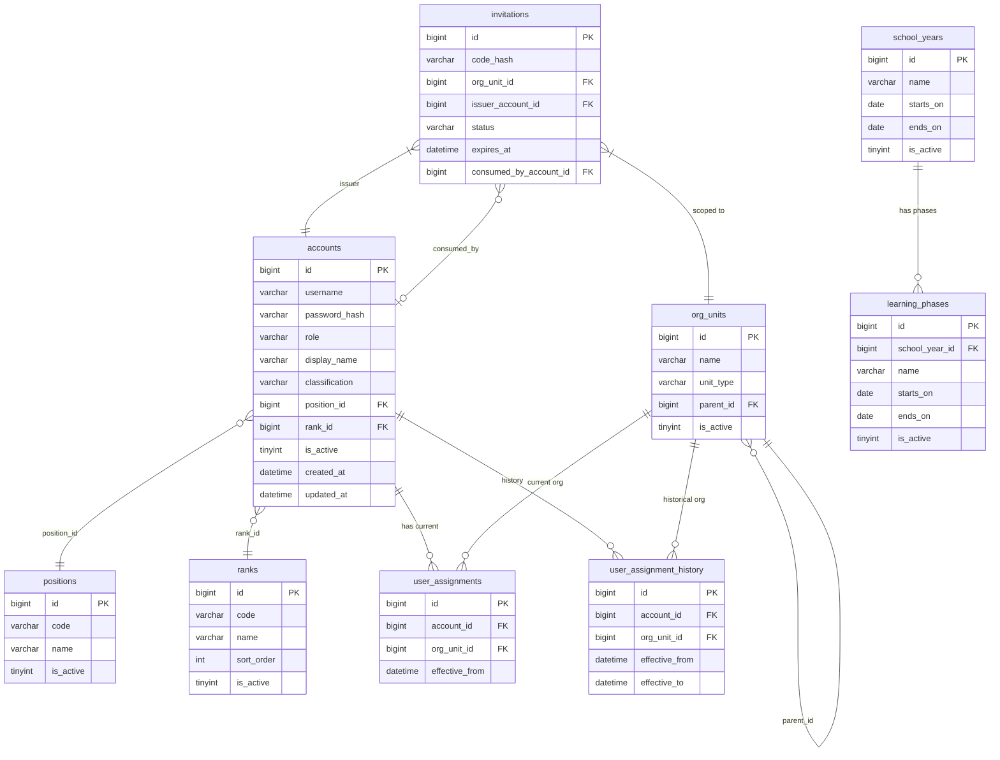
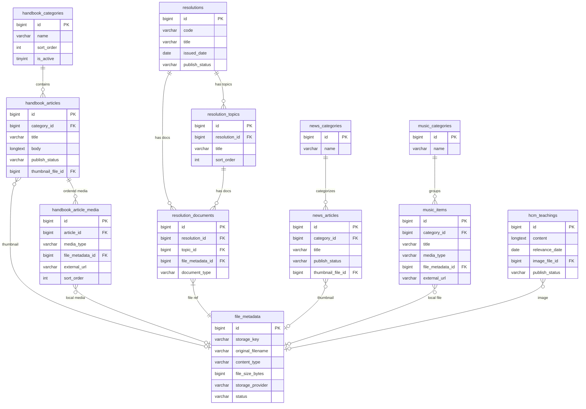
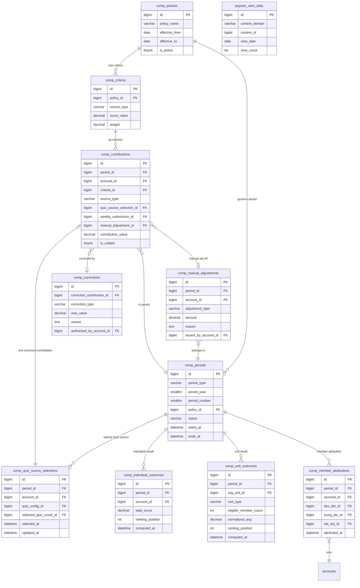

# DATABASE DESIGN — V0.4

**Document ID:** PES-DB-V0.4
**Version:** 0.4
**Date:** 2026-08-18
**Status:** Accepted
**Depends on:** V0.3 System Design Accepted; V0.4 Business Decisions Approved/Applied 2026-08-18
**Decision owner:** Project Owner

**Approval status:** `V0.4_DATABASE_DESIGN_ACCEPTED`
**Approved date:** 2026-08-18
**Accepted Technical Compatibility Amendment:** 2026-08-19 — MySQL 8.4 CHECK/FK referential-action compatibility

> **Approval gate:** This document is Accepted following the completed 08 → 08B → 08C → 08D → 08E review/fix chain and the Project Owner / System Analyst final review PASS. Flyway migrations and JPA entities remain separate implementation work; this approval does not create or approve implementation artifacts.

---

## Table of Contents

1. [Design Principles](#1-design-principles)
2. [Naming Conventions](#2-naming-conventions)
3. [ID Strategy](#3-id-strategy)
4. [Common Column Policy](#4-common-column-policy)
5. [Soft Delete / Lifecycle Policy](#5-soft-delete--lifecycle-policy)
6. [Enum / Lookup Policy](#6-enum--lookup-policy)
7. [Module / Table Ownership Map](#7-module--table-ownership-map)
8. [Physical Table Inventory](#8-physical-table-inventory)
9. [Column Dictionary](#9-column-dictionary)
10. [ERD — Diagrams](#10-erd--diagrams)
11. [FK / Constraint Catalog](#11-fk--constraint-catalog)
12. [Index Catalog](#12-index-catalog)
13. [Query Scenario Validation](#13-query-scenario-validation)
14. [Delete / Update Scenario Validation](#14-delete--update-scenario-validation)
15. [Concurrency Invariants](#15-concurrency-invariants)
16. [Normalization Review](#16-normalization-review)
17. [Time / Timezone Strategy](#17-time--timezone-strategy)
18. [Decimal / Score Types](#18-decimal--score-types)
19. [Rich Content / JSON Policy](#19-rich-content--json-policy)
20. [Handbook Search Strategy](#20-handbook-search-strategy)
21. [Popular View Counter Strategy](#21-popular-view-counter-strategy)
22. [Data Retention / History](#22-data-retention--history)
23. [Data Security Review](#23-data-security-review)
24. [Flyway Implementation Order](#24-flyway-implementation-order)
25. [Seed / Reference Data Notes](#25-seed--reference-data-notes)
26. [Open OI Impact](#26-open-oi-impact)
27. [Deferred Values](#27-deferred-values)
28. [Decision Traceability](#28-decision-traceability)

---

## 1. Design Principles

Source: AGENTS.md, `.cursor/rules/110-database-mysql-flyway.mdc`, PROMPT-PRINCIPLES.md

| Principle | Application |
|---|---|
| **MySQL 8.4 LTS** | All types, constraints, syntax must be MySQL 8.4 compatible |
| **Flyway owns migrations** | No DDL executed outside Flyway; migrations immutable once applied |
| **ddl-auto = validate** | Production; never `update` |
| **utf8mb4** | All tables/columns |
| **No BLOB storage** | Binary files stored outside MySQL; DB stores metadata/key only |
| **Relational integrity first** | FK constraints enforced where practical; application enforces where MySQL cannot |
| **Practical 3NF** | Normalized for correctness; intentional denormalization documented |
| **No speculative complexity** | ~500 users; avoid premature optimization |
| **Source-first** | No schema element without requirement/decision source |
| **Module ownership preserved** | Cross-module FK may exist; cross-module repository access does not |
| **No Docker / No Testcontainers** | Integration tests use dedicated MySQL test database |

---

## 2. Naming Conventions

| Object | Convention | Examples |
|---|---|---|
| Table name | `snake_case`, plural noun | `accounts`, `quiz_attempts`, `org_units` |
| Column name | `snake_case` | `created_at`, `question_text`, `pass_threshold` |
| Primary key | `id` (BIGINT) | `id BIGINT NOT NULL AUTO_INCREMENT` |
| Foreign key column | `<referenced_table_singular>_id` | `account_id`, `quiz_config_id` |
| FK constraint | `fk_<from_table>_<to_table>` | `fk_quiz_attempts_accounts` |
| Unique constraint | `uq_<table>_<columns>` | `uq_accounts_username`, `uq_invitations_code_hash` |
| Check constraint | `ck_<table>_<rule>` | `ck_org_units_type` |
| Index | `idx_<table>_<columns>` | `idx_quiz_attempts_account_config` |
| Unique index | `uidx_<table>_<columns>` | `uidx_quiz_attempts_active` |

Rules:
- No reserved words (e.g., avoid `rank`, `key`, `desc`; use `ranking_position`, `storage_key`, `description` instead).
- Abbreviate only when the full form exceeds 64 chars (MySQL limit) and abbreviation is obvious.
- Boolean columns: `is_<state>` or active/enabled/visible.

---

## 3. ID Strategy

**Decision: BIGINT AUTO_INCREMENT for all internal relational entities.**

Rationale:
- ~500 users, single MySQL instance, no distributed-write requirement.
- BIGINT AUTO_INCREMENT: simple, compact, sortable by insertion order, no UUID collision management.
- MySQL B-tree PKs: clustered index; integer PK has better sequential insert performance.
- UUID trade-off: no distributed-ID requirement justifies UUID fragmentation and storage overhead at this scale.

API exposure implication:
- Numeric IDs are exposed via REST API in V1.
- Future consideration: if opaque/non-guessable public resource IDs are needed, a `public_id` (UUID or encoded value) column may be added as a future enhancement without changing the internal PK strategy.
- Do **not** replace business identity (invitation code, username, week period) with DB ID in API responses.

---

## 4. Common Column Policy

Not all tables share the same audit columns. Assignment per table type:

| Column | Tables that MUST have it | Rationale |
|---|---|---|
| `created_at DATETIME(3) NOT NULL` | All domain tables | Insert timestamp; diagnostic baseline; verified against all 50 table dictionaries |
| `updated_at DATETIME(3) NOT NULL` | Tables where records mutate, including Admin-managed live question options | JPA `@LastModifiedDate`; not needed on immutable history/fact tables |
| `created_by BIGINT` | Admin-managed content tables | Accountability for content authorship |
| `updated_by BIGINT` | Admin-managed content tables | Last admin who changed the record |
| `is_active` / `status` | Tables with lifecycle | See per-table definition |

**Immutable fact tables** (competition contributions, weekly submissions, assignment history): do NOT add `updated_at` — updates are not allowed; record a new fact instead.

**`quiz_attempt_answers`** is NOT an immutable fact table for the full lifecycle:
- While attempt status is `ACTIVE`: selected answer may be saved/changed; resume requires persisted current selection; `updated_at` is valid.
- After attempt reaches terminal status (`SUBMITTED` or `TIMEOUT_FINALIZED`): answers become immutable; no further updates permitted.

`version` (optimistic locking): only if concurrency case identified. Currently designated for `quiz_configs` (config may change during active attempt period); the table dictionary includes a `version` column for this reason.

---

## 5. Soft Delete / Lifecycle Policy

| Entity group | Policy | Rationale |
|---|---|---|
| Reference/config data (positions, ranks, org units, quiz categories, competition criteria) | `is_active` flag; no hard delete while referenced | Config data may be superseded; referential safety required |
| Content (handbook articles, resolution, news, music, HCM teaching, EDU documents) | `publish_status` VARCHAR; hard delete allowed if no pending historical fact references | Admin manages lifecycle; no personal reading history to preserve |
| Quiz question bank | `is_active` flag; question soft-deactivated when referenced by past attempts (historical correctness) | See §9 quiz section |
| Quiz test config | `is_active` flag; history snapshot strategy | See §9 |
| Quiz attempts | Immutable once terminal; no delete of historical attempts | Historical correctness |
| Quiz attempt answers | Mutable while ACTIVE (save/change selection); immutable after SUBMITTED or TIMEOUT_FINALIZED | Resume correctness while active; historical correctness after terminal |
| Quiz results | Immutable; never deleted | Ranking and competition integrity |
| Weekly question / submissions | Application-enforced content freeze from `period_opens_at`; submitted facts remain immutable | Historical correctness without a Weekly snapshot table |
| Invitations | Lifecycle column `status`; no physical delete of consumed invitations | Audit trail of who was invited/consumed |
| User assignment history | Immutable rows; add new row for new assignment | See §14 BD-V04-014 |
| Competition contributions | Immutable historical facts; correction via authorized correction record | Closed period integrity |
| Competition periods | `status` column; closed = stable | Never lose closed period results |
| File metadata | `status` column; logical deletion before physical removal | Dangling ref prevention |
| Popular view daily counters | Retain; no cleanup policy | Supports day/week/month/year aggregation |

**Weekly content freeze (V1 application invariant):** No Weekly snapshot table is introduced. Before `period_opens_at`, Admin may edit `question_text`, the option set, option text/order/correct-answer flags, `correct_explanation`, and non-overlapping period boundaries. At or after `period_opens_at`, `question_text`, `weekly_question_options` rows (including text, order, and correct-answer flags), and `correct_explanation` are immutable; option insert/delete is prohibited. If any submission exists, period boundaries must not be shifted. After `period_closes_at`, Weekly Question business content remains immutable. This freeze keeps each persisted `weekly_submissions.selected_option_id` aligned with the meaning and grading captured at submission time.

---

## 6. Enum / Lookup Policy

| Value set | Type | Rationale |
|---|---|---|
| System role: `SUPER_ADMIN`, `ADMIN`, `USER` | Application-layer constant (VARCHAR(20) constrained by CHECK) | Fixed technical vocabulary; 3 stable values; no Admin config needed |
| Cán bộ / Chiến sĩ classification | Fixed constrained `VARCHAR(20) CHECK IN ('CAN_BO','CHIEN_SI')` on `accounts.classification`; nullable (NULL = not yet set) | Business classification; V1 vocabulary is fixed: `CAN_BO` and `CHIEN_SI` only; NOT Admin-extensible in V1; not a system role (ACT-004) |
| Organization unit type: `DAI_DOI`, `TRUNG_DOI`, `TIEU_DOI` | Application-layer constant (VARCHAR(20) CHECK constraint) | Fixed hierarchy; BD-V04-014 approved fixed 3-level |
| Position (chức vụ) | Lookup table `positions` | Admin-configurable per ADM-003 |
| Rank (cấp bậc) | Lookup table `ranks` | Admin-configurable per ADM-003 |
| Handbook category | Owned table `handbook_categories` | Per-module category ownership |
| News category | Owned table `news_categories` | Per-module category ownership |
| Music category | Owned table `music_categories` | Per-module category ownership |
| Quiz question type: `SINGLE_CHOICE`, `TRUE_FALSE` | VARCHAR(20) CHECK in `quiz_questions` | QUIZ-002; fixed 2 types in V1 |
| Quiz test type (loại bài kiểm tra) | Lookup table `quiz_test_types` | ADM-003: Admin-configurable |
| School year | Lookup table `school_years` | ADM-003 |
| Learning phase (đợt học) | Lookup table `learning_phases` | ADM-003 |
| Competition period type: `WEEKLY`, `MONTHLY`, `YEARLY` | VARCHAR(10) CHECK | BD-V04-002; fixed 3 types; not Admin-configurable |
| Competition criterion source type | VARCHAR(30) CHECK: `QUIZ_RESULT`, `WEEKLY_RESULT`, `MANUAL_ADJUSTMENT` | BD-V04-002 approved source classes |
| Invitation status | VARCHAR(20) CHECK: `ACTIVE`, `CONSUMED`, `DISABLED`, `EXPIRED` | BD-V04-006 lifecycle |
| Quiz attempt status | VARCHAR(20) CHECK: `ACTIVE`, `SUBMITTED`, `TIMEOUT_FINALIZED` | BD-V04-007/008 lifecycle; `ABANDONED` is NOT an approved V1 terminal state and is removed |
| Competition period status | VARCHAR(20) CHECK: `OPEN`, `CLOSED` | BD-V04-002 |
| Content publish status | VARCHAR(20) CHECK: `DRAFT`, `PUBLISHED` | MVP simplified two-state |
| Weekly question runtime lifecycle | Derived from `period_opens_at` / `period_closes_at` only: `UPCOMING`, `OPEN`, `CLOSED` | BD-V04-010; no stored lifecycle-status column or scheduler |

**No MySQL ENUM type used** — MySQL ENUM adds DDL complexity for Flyway ALTER TABLE; constrained VARCHAR with CHECK is preferred for V1.

---

## 7. Module / Table Ownership Map

Source: V0.3 §6, backend/AGENTS.md

| Module | Tables owned |
|---|---|
| `auth` | `invitations` |
| `user` | `accounts`, `org_units`, `user_assignments`, `user_assignment_history`, `positions`, `ranks`, `school_years`, `learning_phases` |
| `common` | (no domain tables; technical primitives only) |
| `handbook` | `handbook_categories`, `handbook_articles`, `handbook_article_media` |
| `resolution` | `resolutions`, `resolution_topics`, `resolution_documents` |
| `news` | `news_categories`, `news_articles` |
| `music` | `music_categories`, `music_items` |
| `quiz` | `quiz_questions`, `quiz_question_options`, `quiz_configs`, `quiz_config_snapshot`, `quiz_test_types`, `quiz_attempts`, `quiz_attempt_questions`, `quiz_attempt_question_options`, `quiz_attempt_answers`, `quiz_results` |
| `politicaleducation` | `edu_programs`, `edu_topics`, `edu_lectures`, `edu_documents`, `edu_lecture_quiz_ref` |
| `hochiminh` | `hcm_teachings` |
| `weeklyquestion` | `weekly_questions`, `weekly_question_options`, `weekly_submissions` |
| `competition` | `comp_policies`, `comp_criteria`, `comp_periods`, `comp_quiz_source_selections`, `comp_contributions`, `comp_manual_adjustments`, `comp_individual_outcomes`, `comp_unit_outcomes`, `comp_corrections`, `comp_member_attributions` |
| `file` | `file_metadata` |
| `dashboard` | `popular_view_daily` |

**Total: 50 physical tables.**

`common` owns no domain table — technical utilities are Spring/JPA helpers, not DB entities.

> Note: `user_classifications` removed. Classification vocabulary is fixed (`CAN_BO`/`CHIEN_SI`) and stored as a CHECK-constrained nullable column on `accounts`. It is NOT Admin-extensible in V1. `school_years` and `learning_phases` belong to `user` module as organization/personnel configuration (previously miscounted — corrected here).

---

## 8. Physical Table Inventory

| # | Table | Module | Purpose | Requirements / Decisions | Growth class | History-sensitive |
|---|---|---|---|---|---|---|
| 1 | `accounts` | `user` | User/admin credentials, profile-lite, inline classification (CAN_BO/CHIEN_SI CHECK) | USR-001..004, ADR-004, ACT-004 | Small (≤500) | No |
| ~~2~~ | ~~`user_classifications`~~ | ~~`user`~~ | **REMOVED** — Classification vocabulary (`CAN_BO`/`CHIEN_SI`) is fixed and moved to `accounts.classification` VARCHAR(20) CHECK. Not Admin-extensible in V1. | — | — | — |
| 3 | `positions` | `user` | Chức vụ lookup | ADM-003 | Small | No |
| 4 | `ranks` | `user` | Cấp bậc lookup | ADM-003 | Small | No |
| 5 | `org_units` | `user` | Organization units (Đại đội / Trung đội / Tiểu đội) | ADM-003, BD-V04-014 | Small-fixed | No |
| 6 | `user_assignments` | `user` | Current Tiểu đội assignment per user | BD-V04-014 | Small (≤500 rows) | No (view of current) |
| 7 | `user_assignment_history` | `user` | Full assignment history with effective dates | BD-V04-014 | Growing | Yes |
| 8 | `invitations` | `auth` | Invitation lifecycle and scoped Tiểu đội | USR-002/003, RULE-002, BD-V04-006 | Growing | Yes |
| 9 | `handbook_categories` | `handbook` | Handbook content categories | HAN-001 | Small | No |
| 10 | `handbook_articles` | `handbook` | Handbook articles with rich text body | HAN-002/003/004/005 | Medium | No |
| 10a | `handbook_article_media` | `handbook` | Image/video media attachments per article (ordered) | HAN-003 (image/video requirement) | Medium | No |
| 11 | `resolutions` | `resolution` | Resolution metadata | RES-001/002 | Medium | No |
| 12 | `resolution_topics` | `resolution` | Topics/lessons within a resolution | RES-003 | Medium | No |
| 13 | `resolution_documents` | `resolution` | File/video attachments to resolution/topic | RES-002 | Medium | No |
| 14 | `news_categories` | `news` | News categories | NEWS-003 | Small | No |
| 15 | `news_articles` | `news` | Admin-authored news items | NEWS-001/002 | Growing | No |
| 16 | `music_categories` | `music` | Music theme groups | MUS-001 | Small | No |
| 17 | `music_items` | `music` | Music/video entries (local or YouTube) | MUS-001/002 | Medium | No |
| 18 | `quiz_test_types` | `quiz` | Admin-configurable test type lookup | ADM-003, QUIZ-001 | Small | No |
| 19 | `quiz_questions` | `quiz` | Question bank entries | QUIZ-001/002/003 | Medium | No |
| 20 | `quiz_question_options` | `quiz` | Answer options per question | QUIZ-002 | Medium | No |
| 21 | `quiz_configs` | `quiz` | Test configuration (count, duration, threshold, limit) | QUIZ-004/005, BD-V04-007/008/009 | Small | No |
| 22 | `quiz_config_snapshot` | `quiz` | Immutable snapshot of config at attempt creation | BD-V04-007/008, historical correctness | Medium | Yes |
| 23 | `quiz_attempts` | `quiz` | Attempt identity, status, timing | BD-V04-007/008/009 | Growing-high | Yes |
| 24 | `quiz_attempt_questions` | `quiz` | Fixed ordered question set for an attempt (question text snapshot) | BD-V04-007 | Growing-high | Yes |
| 24a | `quiz_attempt_question_options` | `quiz` | Immutable per-attempt option snapshot (text, position, is_correct frozen at attempt creation) | BD-V04-007, Owner Clarification 2A | Growing-high | Yes |
| 25 | `quiz_attempt_answers` | `quiz` | User selected answers referencing attempt option snapshot (mutable while ACTIVE, immutable at terminal) | BD-V04-007/008 | Growing-high | Yes |
| 26 | `quiz_results` | `quiz` | Graded result (raw score, pass/fail, finalization source) | BD-V04-009 | Growing | Yes |
| 27 | `edu_programs` | `politicaleducation` | EDU Program | EDU-001 | Small | No |
| 28 | `edu_topics` | `politicaleducation` | EDU Topic within a program | EDU-001 | Small | No |
| 29 | `edu_lectures` | `politicaleducation` | EDU Lecture within a topic | EDU-001 | Small | No |
| 30 | `edu_documents` | `politicaleducation` | EDU Document / material attached to lecture | EDU-001/002 | Medium | No |
| 31 | `edu_lecture_quiz_ref` | `politicaleducation` | 0..1 Quiz config reference per Lecture | BD-V04-011 | Small | No |
| 32 | `hcm_teachings` | `hochiminh` | Ho Chi Minh teachings | HCM-001/002/003 | Medium | No |
| 33 | `weekly_questions` | `weeklyquestion` | Weekly question with period boundaries | BD-V04-010, WEEK-001..004 | Growing | No |
| 34 | `weekly_question_options` | `weeklyquestion` | Answer options for weekly question | WEEK-002 | Growing | No |
| 35 | `weekly_submissions` | `weeklyquestion` | One submission per user per weekly question | BD-V04-010, WEEK-003/005 | Growing-high | Yes |
| 36 | `comp_policies` | `competition` | Competition policy version with effective period | BD-V04-002, COMP-007 | Small | Yes |
| 37 | `comp_criteria` | `competition` | Criteria per policy (source type, value, weight) | BD-V04-002, ADM-003 | Small | No |
| 38 | `comp_periods` | `competition` | Competition period (weekly/monthly/yearly) | BD-V04-002, COMP-005 | Growing | Yes |
| 39 | `comp_quiz_source_selections` | `competition` | Canonical highest-PASS Quiz result selected once per period/user/test | COMP-003, Owner Clarification 2A | Growing | Yes |
| 40 | `comp_contributions` | `competition` | Eligible source fact ledger per user/period | BD-V04-002, COMP-003 | Growing-high | Yes |
| 41 | `comp_manual_adjustments` | `competition` | Admin manual bonus/penalty | BD-V04-002, COMP-004 | Growing | Yes |
| 42 | `comp_corrections` | `competition` | Authorized corrections to closed-period contributions | BD-V04-002 | Small | Yes |
| 43 | `comp_individual_outcomes` | `competition` | Computed individual score per period (snapshot for closed) | BD-V04-002 | Growing | Yes |
| 44 | `comp_unit_outcomes` | `competition` | Computed unit normalized score per period (snapshot) | BD-V04-002, BD-V04-014, Owner Clarification 1A | Growing | Yes |
| 44a | `comp_member_attributions` | `competition` | Period-end Tiểu đội attribution snapshot per user; (period_id, account_id) UNIQUE | BD-V04-014, Owner Clarification 1A | Growing | Yes |
| 44 | `school_years` | `user` | Admin-configurable school year lookup | ADM-003 | Small | No |
| 45 | `learning_phases` | `user` | Admin-configurable learning phase (đợt học) | ADM-003 | Small | No |
| 46 | `file_metadata` | `file` | Storage metadata for uploaded/managed files | FILE-001..005, OI-005 | Growing | No |
| 47 | `popular_view_daily` | `dashboard` | Daily aggregate view counter per content item | BD-V04-013, REP-004 | Growing | No |

**Total: 50 physical tables.**

> Note: `user_classifications` removed — V1 classification vocabulary is fixed (`CAN_BO`/`CHIEN_SI`) and stored as a nullable CHECK-constrained column on `accounts`; it is NOT Admin-extensible in V1. Four review-added tables: `handbook_article_media` (article image/video), `quiz_attempt_question_options` (immutable option snapshot), `comp_member_attributions` (period-end attribution), and `comp_quiz_source_selections` (canonical Quiz source per period/user/test). `school_years` and `learning_phases` remain owned by `user` module as organization/personnel configuration.

---

## 9. Column Dictionary

### 9.1 `accounts`

| Column | MySQL type | Null | Default | Key/Constraint | Meaning |
|---|---|---|---|---|---|
| `id` | BIGINT | NOT NULL | AUTO_INCREMENT | PK | Internal identifier |
| `username` | VARCHAR(100) | NOT NULL | — | UQ `uq_accounts_username` | Login name; business identity |
| `password_hash` | VARCHAR(255) | NOT NULL | — | — | BCrypt or Argon2 hash; never plaintext |
| `role` | VARCHAR(20) | NOT NULL | — | CK `ck_accounts_role` IN ('SUPER_ADMIN','ADMIN','USER') | System role; ADR-004 |
| `display_name` | VARCHAR(200) | NOT NULL | — | — | Full name or display name |
| `classification` | VARCHAR(20) | NULL | NULL | CK `ck_accounts_classification` IN ('CAN_BO','CHIEN_SI') | Cán bộ/Chiến sĩ business classification; NULL until Admin sets; fixed V1 vocabulary; NOT Admin-extensible; ACT-004 |
| `position_id` | BIGINT | NULL | NULL | FK → `positions.id` RESTRICT | Chức vụ; NULL until Admin sets |
| `rank_id` | BIGINT | NULL | NULL | FK → `ranks.id` RESTRICT | Cấp bậc; NULL until Admin sets |
| `is_active` | TINYINT(1) | NOT NULL | 1 | — | Account enabled flag |
| `created_at` | DATETIME(3) | NOT NULL | — | — | Registration timestamp |
| `updated_at` | DATETIME(3) | NOT NULL | — | — | Last profile update |

> **Classification design note:** `user_classifications` table is REMOVED. V1 has exactly two business classifications (`CAN_BO`, `CHIEN_SI`). The value is stored directly on `accounts.classification` as a CHECK-constrained nullable VARCHAR. This is NOT Admin-CRUD/extensible. Positions and ranks remain Admin-configurable via their lookup tables.

### 9.2 `positions`

| Column | MySQL type | Null | Default | Key/Constraint | Meaning |
|---|---|---|---|---|---|
| `id` | BIGINT | NOT NULL | AUTO_INCREMENT | PK | — |
| `code` | VARCHAR(50) | NOT NULL | — | UQ `uq_positions_code` | Chức vụ code |
| `name` | VARCHAR(200) | NOT NULL | — | — | Display name |
| `is_active` | TINYINT(1) | NOT NULL | 1 | — | — |
| `created_at` | DATETIME(3) | NOT NULL | — | — | — |
| `updated_at` | DATETIME(3) | NOT NULL | — | — | — |

### 9.4 `ranks`

| Column | MySQL type | Null | Default | Key/Constraint | Meaning |
|---|---|---|---|---|---|
| `id` | BIGINT | NOT NULL | AUTO_INCREMENT | PK | — |
| `code` | VARCHAR(50) | NOT NULL | — | UQ `uq_ranks_code` | Cấp bậc code |
| `name` | VARCHAR(200) | NOT NULL | — | — | Display name |
| `sort_order` | INT | NOT NULL | 0 | — | Display ordering |
| `is_active` | TINYINT(1) | NOT NULL | 1 | — | — |
| `created_at` | DATETIME(3) | NOT NULL | — | — | — |
| `updated_at` | DATETIME(3) | NOT NULL | — | — | — |

### 9.5 `org_units`

| Column | MySQL type | Null | Default | Key/Constraint | Meaning |
|---|---|---|---|---|---|
| `id` | BIGINT | NOT NULL | AUTO_INCREMENT | PK | — |
| `name` | VARCHAR(200) | NOT NULL | — | — | Display name of the unit |
| `unit_type` | VARCHAR(20) | NOT NULL | — | CK `ck_org_units_type` IN ('DAI_DOI','TRUNG_DOI','TIEU_DOI') | Fixed 3-level hierarchy; BD-V04-014 |
| `parent_id` | BIGINT | NULL | NULL | FK → `org_units.id` RESTRICT | NULL for Đại đội; set for Trung đội (→Đại đội) and Tiểu đội (→Trung đội) |
| `is_active` | TINYINT(1) | NOT NULL | 1 | — | Logical active state |
| `created_at` | DATETIME(3) | NOT NULL | — | — | — |
| `updated_at` | DATETIME(3) | NOT NULL | — | — | — |

**Hierarchy enforcement:** MySQL CHECK constraints cannot enforce cross-row hierarchy rules (e.g., Tiểu đội parent must be Trung đội). Application must validate:
- `DAI_DOI`: `parent_id` must be NULL.
- `TRUNG_DOI`: `parent_id` must reference a `DAI_DOI` unit.
- `TIEU_DOI`: `parent_id` must reference a `TRUNG_DOI` unit.

This validation is application-enforced in the use-case layer. The FK constraint prevents referencing a non-existent parent. The type constraint at DB level is enforced for valid type values only.

### 9.6 `user_assignments`

Current assignment — one row per user (invariant: at most one current Tiểu đội per user).

| Column | MySQL type | Null | Default | Key/Constraint | Meaning |
|---|---|---|---|---|---|
| `id` | BIGINT | NOT NULL | AUTO_INCREMENT | PK | — |
| `account_id` | BIGINT | NOT NULL | — | UQ `uq_user_assignments_account` FK → `accounts.id` RESTRICT | One current assignment per user |
| `org_unit_id` | BIGINT | NOT NULL | — | FK → `org_units.id` RESTRICT; unit_type must be TIEU_DOI (application-enforced) | Current Tiểu đội |
| `effective_from` | DATETIME(3) | NOT NULL | — | — | UTC-compatible instant this assignment became current |
| `created_at` | DATETIME(3) | NOT NULL | — | — | Record creation timestamp |

**Note:** The UNIQUE constraint `uq_user_assignments_account` on `account_id` enforces one-current-assignment invariant at DB level.

### 9.7 `user_assignment_history`

Append-only. Each assignment generates a row here and a row in `user_assignments` (replacing old row).

| Column | MySQL type | Null | Default | Key/Constraint | Meaning |
|---|---|---|---|---|---|
| `id` | BIGINT | NOT NULL | AUTO_INCREMENT | PK | — |
| `account_id` | BIGINT | NOT NULL | — | FK → `accounts.id` RESTRICT | — |
| `org_unit_id` | BIGINT | NOT NULL | — | FK → `org_units.id` RESTRICT | Tiểu đội assigned |
| `effective_from` | DATETIME(3) | NOT NULL | — | — | UTC-compatible instant at which this half-open assignment interval begins |
| `effective_to` | DATETIME(3) | NULL | NULL | — | Exclusive UTC-compatible end instant; NULL = open (current) |
| `created_at` | DATETIME(3) | NOT NULL | — | — | When this history row was recorded |

**Interval and transfer invariant:** Assignment history uses half-open intervals `[effective_from, effective_to)`. A period-end lookup at `:periodEndsAt` is valid exactly when `effective_from <= :periodEndsAt AND (effective_to IS NULL OR :periodEndsAt < effective_to)`. This supports same-day transfers without ambiguity and avoids two rows being valid at the exact boundary.

**Overlap prevention:** Application-enforced in one transaction:
1. Lock the account's open/current assignment history row.
2. Set its `effective_to` to the transfer instant.
3. Insert the new row with the same instant as `effective_from` and `effective_to = NULL`.
4. Upsert `user_assignments` using that same `effective_from`.

MySQL does not support partial unique indexes for NULL values sufficient to enforce non-overlapping open rows. Transaction + application logic is the enforcement mechanism. Index `idx_user_assignment_history_account_from` supports lookups.

### 9.8 `invitations`

| Column | MySQL type | Null | Default | Key/Constraint | Meaning |
|---|---|---|---|---|---|
| `id` | BIGINT | NOT NULL | AUTO_INCREMENT | PK | — |
| `code_hash` | BINARY(32) | NOT NULL | — | UQ `uq_invitations_code_hash` | Deterministic SHA-256 digest of raw bearer code; raw code never persisted; lookup hashes presented code and compares digest |
| `org_unit_id` | BIGINT | NOT NULL | — | FK → `org_units.id` RESTRICT; must be TIEU_DOI (application-enforced) | Scoped Tiểu đội; BD-V04-006 |
| `issuer_account_id` | BIGINT | NOT NULL | — | FK → `accounts.id` RESTRICT | Admin who created this invitation |
| `status` | VARCHAR(20) | NOT NULL | 'ACTIVE' | CK `ck_invitations_status` IN ('ACTIVE','CONSUMED','DISABLED','EXPIRED') | Lifecycle; BD-V04-006 |
| `expires_at` | DATETIME(3) | NULL | NULL | — | NULL if no expiry configured; exact default duration deferred to BD-V04-006/configuration |
| `consumed_by_account_id` | BIGINT | NULL | NULL | FK → `accounts.id` SET NULL | Account that consumed this code; NULL until consumed |
| `consumed_at` | DATETIME(3) | NULL | NULL | — | Consumption timestamp |
| `created_at` | DATETIME(3) | NOT NULL | — | — | — |
| `updated_at` | DATETIME(3) | NOT NULL | — | — | — |

**Security note:** The invitation code is a bearer credential. A deterministic SHA-256 digest is stored in `code_hash BINARY(32)` instead of plaintext. The raw code is generated with high entropy and communicated out-of-band (printed, distributed by Admin). On validation, the application hashes the presented raw code and compares against `code_hash`. The raw code is never persisted. **BCrypt / password-hash semantics are NOT used** for invitation lookup — SHA-256 is deterministic and thus suitable for indexed direct lookup. Password hashing (`BCrypt`/`Argon2`) remains separate for `accounts.password_hash`. UQ on `code_hash` enforces uniqueness.

**Atomic consumption:** Successful registration executes one DB transaction under `READ COMMITTED`: (1) `SELECT FOR UPDATE` the invitation; (2) validate `ACTIVE`, not expired, and not consumed; (3) create the account; (4) create its current `user_assignments` row scoped to the invitation Tiểu đội; (5) create the initial `user_assignment_history` row for the same account and Tiểu đội with the identical `effective_from` instant and `effective_to = NULL`; (6) set the invitation to `CONSUMED` with `consumed_by_account_id` and `consumed_at`; (7) commit. Failure of any step rolls back all steps. The initial history row is mandatory so assignment history begins at registration, not only on a later transfer. The explicit row lock is sufficient; SERIALIZABLE isolation is not required.

### 9.9 `handbook_categories`

| Column | MySQL type | Null | Default | Key/Constraint | Meaning |
|---|---|---|---|---|---|
| `id` | BIGINT | NOT NULL | AUTO_INCREMENT | PK | — |
| `name` | VARCHAR(200) | NOT NULL | — | UQ `uq_handbook_categories_name` | Category name; HAN-001 |
| `sort_order` | INT | NOT NULL | 0 | — | Display ordering |
| `is_active` | TINYINT(1) | NOT NULL | 1 | — | — |
| `created_at` | DATETIME(3) | NOT NULL | — | — | — |
| `updated_at` | DATETIME(3) | NOT NULL | — | — | — |

### 9.10 `handbook_articles`

| Column | MySQL type | Null | Default | Key/Constraint | Meaning |
|---|---|---|---|---|---|
| `id` | BIGINT | NOT NULL | AUTO_INCREMENT | PK | — |
| `category_id` | BIGINT | NOT NULL | — | FK → `handbook_categories.id` RESTRICT | HAN-001 |
| `title` | VARCHAR(500) | NOT NULL | — | — | Article title |
| `body` | LONGTEXT | NULL | NULL | — | Rich text/HTML body; HAN-003; sanitized at application layer |
| `publish_status` | VARCHAR(20) | NOT NULL | 'DRAFT' | CK IN ('DRAFT','PUBLISHED') | HAN-002 |
| `thumbnail_file_id` | BIGINT | NULL | NULL | FK → `file_metadata.id` SET NULL | Optional cover image |
| `sort_order` | INT | NOT NULL | 0 | — | Within category ordering |
| `created_at` | DATETIME(3) | NOT NULL | — | — | — |
| `updated_at` | DATETIME(3) | NOT NULL | — | — | — |
| `created_by` | BIGINT | NULL | NULL | FK → `accounts.id` SET NULL | Admin author |
| `updated_by` | BIGINT | NULL | NULL | FK → `accounts.id` SET NULL | Last Admin editor |

**Full text search:** See §20. A FULLTEXT index on `title` + `body` may be added for Handbook local search (HAN-005). Risk noted.

### 9.10a `handbook_article_media`

Per-article ordered media attachments (images and videos). Supports HAN-003 requirement for text + image + video content. Designed to allow an article to have multiple ordered media items.

| Column | MySQL type | Null | Default | Key/Constraint | Meaning |
|---|---|---|---|---|---|
| `id` | BIGINT | NOT NULL | AUTO_INCREMENT | PK | — |
| `article_id` | BIGINT | NOT NULL | — | FK → `handbook_articles.id` RESTRICT | Parent article; HAN-003 |
| `media_type` | VARCHAR(20) | NOT NULL | — | CK `ck_hkm_media_type` IN ('IMAGE','VIDEO','EXTERNAL_VIDEO') | Type of media |
| `file_metadata_id` | BIGINT | NULL | NULL | FK → `file_metadata.id` SET NULL | For IMAGE / local VIDEO upload; NULL for external |
| `external_url` | VARCHAR(2000) | NULL | NULL | — | For EXTERNAL_VIDEO (e.g. YouTube link); NULL for local |
| `sort_order` | INT | NOT NULL | 0 | — | Display order within article |
| `created_at` | DATETIME(3) | NOT NULL | — | — | — |

**Source consistency rules:**
- `IMAGE`: `file_metadata_id` required; `external_url` must be NULL. Application enforces.
- `VIDEO` (local upload): `file_metadata_id` required; `external_url` must be NULL. Application enforces.
- `EXTERNAL_VIDEO`: `external_url` required; `file_metadata_id` must be NULL. Application enforces.

DB CHECK: `(media_type = 'EXTERNAL_VIDEO' AND external_url IS NOT NULL AND file_metadata_id IS NULL) OR (media_type IN ('IMAGE','VIDEO') AND file_metadata_id IS NOT NULL AND external_url IS NULL)` — enforced at application layer; DB CHECK optional per MySQL capability.

### 9.11 `resolutions`

| Column | MySQL type | Null | Default | Key/Constraint | Meaning |
|---|---|---|---|---|---|
| `id` | BIGINT | NOT NULL | AUTO_INCREMENT | PK | — |
| `code` | VARCHAR(100) | NOT NULL | — | UQ `uq_resolutions_code` | Số/ký hiệu nghị quyết; RES-001 |
| `title` | VARCHAR(500) | NOT NULL | — | — | — |
| `issuing_body` | VARCHAR(200) | NULL | NULL | — | Cơ quan ban hành |
| `issued_date` | DATE | NULL | NULL | — | Ngày ban hành |
| `summary` | TEXT | NULL | NULL | — | Optional summary |
| `body` | LONGTEXT | NULL | NULL | — | Rich text body |
| `publish_status` | VARCHAR(20) | NOT NULL | 'DRAFT' | CK IN ('DRAFT','PUBLISHED') | — |
| `created_at` | DATETIME(3) | NOT NULL | — | — | — |
| `updated_at` | DATETIME(3) | NOT NULL | — | — | — |
| `created_by` | BIGINT | NULL | NULL | FK → `accounts.id` SET NULL | — |
| `updated_by` | BIGINT | NULL | NULL | FK → `accounts.id` SET NULL | — |

### 9.12 `resolution_topics`

| Column | MySQL type | Null | Default | Key/Constraint | Meaning |
|---|---|---|---|---|---|
| `id` | BIGINT | NOT NULL | AUTO_INCREMENT | PK | — |
| `resolution_id` | BIGINT | NOT NULL | — | FK → `resolutions.id` RESTRICT | Parent resolution; RES-003 |
| `title` | VARCHAR(500) | NOT NULL | — | — | Chuyên đề/bài học title |
| `body` | LONGTEXT | NULL | NULL | — | Content |
| `sort_order` | INT | NOT NULL | 0 | — | — |
| `created_at` | DATETIME(3) | NOT NULL | — | — | — |
| `updated_at` | DATETIME(3) | NOT NULL | — | — | — |

### 9.13 `resolution_documents`

| Column | MySQL type | Null | Default | Key/Constraint | Meaning |
|---|---|---|---|---|---|
| `id` | BIGINT | NOT NULL | AUTO_INCREMENT | PK | — |
| `resolution_id` | BIGINT | NULL | NULL | FK → `resolutions.id` RESTRICT | Parent resolution (NULL if attached to topic) |
| `topic_id` | BIGINT | NULL | NULL | FK → `resolution_topics.id` RESTRICT | Parent topic (NULL if attached to resolution) |
| `file_metadata_id` | BIGINT | NULL | NULL | FK → `file_metadata.id` RESTRICT | Required for FILE type; NULL for LINK/external VIDEO |
| `document_type` | VARCHAR(30) | NOT NULL | — | CK IN ('FILE','VIDEO','LINK') | Kind of attachment |
| `external_url` | VARCHAR(2000) | NULL | NULL | — | Required for LINK and external VIDEO type; NULL for FILE |
| `sort_order` | INT | NOT NULL | 0 | — | — |
| `created_at` | DATETIME(3) | NOT NULL | — | — | — |

**Attachment parent constraint:** Exactly one of `resolution_id` or `topic_id` must be non-NULL; DB CHECK (MySQL 8.4-compatible): `CHECK ((resolution_id IS NOT NULL) + (topic_id IS NOT NULL) = 1)`. A document cannot be dual-parented unless a future approved requirement changes this rule.

**Source consistency rules:**
- `FILE`: `file_metadata_id` required (NOT NULL); `external_url` must be NULL. DB RESTRICT enforces file exists.
- `LINK`: `external_url` required; `file_metadata_id` must be NULL. No dummy file row required.
- `VIDEO`: May be local upload (`file_metadata_id` required, `external_url` NULL) OR external URL (`external_url` required, `file_metadata_id` NULL). Application enforces exactly one source. Do NOT require a dummy file row for an external video URL.

### 9.14 `news_categories`

| Column | MySQL type | Null | Default | Key/Constraint | Meaning |
|---|---|---|---|---|---|
| `id` | BIGINT | NOT NULL | AUTO_INCREMENT | PK | — |
| `name` | VARCHAR(200) | NOT NULL | — | UQ `uq_news_categories_name` | NEWS-003 |
| `sort_order` | INT | NOT NULL | 0 | — | — |
| `is_active` | TINYINT(1) | NOT NULL | 1 | — | — |
| `created_at` | DATETIME(3) | NOT NULL | — | — | — |
| `updated_at` | DATETIME(3) | NOT NULL | — | — | — |

### 9.15 `news_articles`

| Column | MySQL type | Null | Default | Key/Constraint | Meaning |
|---|---|---|---|---|---|
| `id` | BIGINT | NOT NULL | AUTO_INCREMENT | PK | — |
| `category_id` | BIGINT | NOT NULL | — | FK → `news_categories.id` RESTRICT | NEWS-003 |
| `title` | VARCHAR(500) | NOT NULL | — | — | — |
| `body` | LONGTEXT | NULL | NULL | — | Rich text content |
| `video_url` | VARCHAR(2000) | NULL | NULL | — | Optional video link; NEWS-002 |
| `external_link` | VARCHAR(2000) | NULL | NULL | — | Optional source link; NEWS-002 |
| `source_origin` | VARCHAR(50) | NULL | NULL | — | 'ADMIN' or future provider code (OI-001); no provider-specific fields yet |
| `publish_status` | VARCHAR(20) | NOT NULL | 'DRAFT' | CK IN ('DRAFT','PUBLISHED') | — |
| `thumbnail_file_id` | BIGINT | NULL | NULL | FK → `file_metadata.id` SET NULL | — |
| `published_at` | DATETIME(3) | NULL | NULL | — | Business publish timestamp |
| `created_at` | DATETIME(3) | NOT NULL | — | — | — |
| `updated_at` | DATETIME(3) | NOT NULL | — | — | — |
| `created_by` | BIGINT | NULL | NULL | FK → `accounts.id` SET NULL | — |

### 9.16 `music_categories`

| Column | MySQL type | Null | Default | Key/Constraint | Meaning |
|---|---|---|---|---|---|
| `id` | BIGINT | NOT NULL | AUTO_INCREMENT | PK | — |
| `name` | VARCHAR(200) | NOT NULL | — | UQ `uq_music_categories_name` | MUS-001 |
| `sort_order` | INT | NOT NULL | 0 | — | — |
| `is_active` | TINYINT(1) | NOT NULL | 1 | — | — |
| `created_at` | DATETIME(3) | NOT NULL | — | — | — |
| `updated_at` | DATETIME(3) | NOT NULL | — | — | — |

### 9.17 `music_items`

| Column | MySQL type | Null | Default | Key/Constraint | Meaning |
|---|---|---|---|---|---|
| `id` | BIGINT | NOT NULL | AUTO_INCREMENT | PK | — |
| `category_id` | BIGINT | NOT NULL | — | FK → `music_categories.id` RESTRICT | MUS-001 |
| `title` | VARCHAR(500) | NOT NULL | — | — | — |
| `media_type` | VARCHAR(20) | NOT NULL | — | CK IN ('LOCAL_UPLOAD','YOUTUBE','LINK') | MUS-002 |
| `file_metadata_id` | BIGINT | NULL | NULL | FK → `file_metadata.id` SET NULL | Required for LOCAL_UPLOAD; must be NULL for YOUTUBE/LINK |
| `external_url` | VARCHAR(2000) | NULL | NULL | — | Required for YOUTUBE/LINK; must be NULL for LOCAL_UPLOAD; MUS-002 |
| `description` | TEXT | NULL | NULL | — | — |
| `publish_status` | VARCHAR(20) | NOT NULL | 'DRAFT' | CK IN ('DRAFT','PUBLISHED') | — |
| `sort_order` | INT | NOT NULL | 0 | — | — |
| `created_at` | DATETIME(3) | NOT NULL | — | — | — |
| `updated_at` | DATETIME(3) | NOT NULL | — | — | — |
| `created_by` | BIGINT | NULL | NULL | FK → `accounts.id` SET NULL | — |

**Music source consistency rules:**
- `LOCAL_UPLOAD`: `file_metadata_id` required; `external_url` must be NULL. Application + FK enforces.
- `YOUTUBE` / `LINK`: `external_url` required; `file_metadata_id` must be NULL. No dummy file row.
- Contradictory dual-source rows (both non-NULL) are not permitted; application enforces single source.

### 9.18 `quiz_test_types`

| Column | MySQL type | Null | Default | Key/Constraint | Meaning |
|---|---|---|---|---|---|
| `id` | BIGINT | NOT NULL | AUTO_INCREMENT | PK | — |
| `code` | VARCHAR(50) | NOT NULL | — | UQ `uq_quiz_test_types_code` | ADM-003 |
| `name` | VARCHAR(200) | NOT NULL | — | — | — |
| `is_active` | TINYINT(1) | NOT NULL | 1 | — | — |
| `created_at` | DATETIME(3) | NOT NULL | — | — | — |
| `updated_at` | DATETIME(3) | NOT NULL | — | — | — |

### 9.19 `quiz_questions`

| Column | MySQL type | Null | Default | Key/Constraint | Meaning |
|---|---|---|---|---|---|
| `id` | BIGINT | NOT NULL | AUTO_INCREMENT | PK | — |
| `question_type` | VARCHAR(20) | NOT NULL | — | CK IN ('SINGLE_CHOICE','TRUE_FALSE') | QUIZ-002 |
| `question_text` | TEXT | NOT NULL | — | — | Question wording; QUIZ-001 |
| `topic_tag` | VARCHAR(200) | NULL | NULL | — | Topic/category label; QUIZ-003 |
| `is_active` | TINYINT(1) | NOT NULL | 1 | — | Deactivate to prevent new attempts; historical attempts unaffected |
| `created_at` | DATETIME(3) | NOT NULL | — | — | — |
| `updated_at` | DATETIME(3) | NOT NULL | — | — | — |
| `created_by` | BIGINT | NULL | NULL | FK → `accounts.id` SET NULL | — |

**Historical correctness strategy:**
When Admin edits a question or option AFTER attempts exist, `quiz_attempt_questions`, `quiz_attempt_question_options`, and `quiz_attempt_answers` retain question type/text plus the complete option set, order, text, and correctness from attempt creation. Therefore **Strategy B — Immutable attempt snapshot** is used. The current `quiz_questions` / `quiz_question_options` are the live bank only. Admin may deactivate a question (`is_active = 0`) to exclude it from future random generation without invalidating historical attempts.

### 9.20 `quiz_question_options`

| Column | MySQL type | Null | Default | Key/Constraint | Meaning |
|---|---|---|---|---|---|
| `id` | BIGINT | NOT NULL | AUTO_INCREMENT | PK | — |
| `question_id` | BIGINT | NOT NULL | — | FK → `quiz_questions.id` RESTRICT | — |
| `option_text` | TEXT | NOT NULL | — | — | Answer option text |
| `is_correct` | TINYINT(1) | NOT NULL | 0 | — | Correct answer flag; NEVER exposed to client before allowed |
| `sort_order` | INT | NOT NULL | 0 | — | Order for display (shuffled per attempt in attempt snapshot) |
| `created_at` | DATETIME(3) | NOT NULL | — | — | Creation timestamp for mutable Admin-managed option |
| `updated_at` | DATETIME(3) | NOT NULL | — | — | Last Admin edit timestamp |

### 9.21 `quiz_configs`

| Column | MySQL type | Null | Default | Key/Constraint | Meaning |
|---|---|---|---|---|---|
| `id` | BIGINT | NOT NULL | AUTO_INCREMENT | PK | — |
| `title` | VARCHAR(300) | NOT NULL | — | — | Test name |
| `test_type_id` | BIGINT | NULL | NULL | FK → `quiz_test_types.id` RESTRICT | ADM-003; optional type classification |
| `question_count` | INT | NOT NULL | — | CK > 0 | QUIZ-004/005 |
| `duration_seconds` | INT | NOT NULL | — | CK > 0 | BD-V04-008; backend authoritative |
| `pass_threshold` | DECIMAL(5,2) | NOT NULL | — | CK >= 0 | Admin-configured pass threshold in whatever grading scale applies; exact scale is deferred — do not assume percentage 0–100; QUIZ-005 |
| `attempt_limit` | INT | NOT NULL | — | CK > 0 | BD-V04-007; Admin-configurable; exact default deferred |
| `shuffle_questions` | TINYINT(1) | NOT NULL | 1 | — | QUIZ-006 |
| `shuffle_answers` | TINYINT(1) | NOT NULL | 1 | — | QUIZ-006 |
| `is_active` | TINYINT(1) | NOT NULL | 1 | — | Available for attempts |
| `version` | INT | NOT NULL | 0 | — | Optimistic locking version; incremented on each update to detect concurrent config changes during active attempts |
| `created_at` | DATETIME(3) | NOT NULL | — | — | — |
| `updated_at` | DATETIME(3) | NOT NULL | — | — | — |
| `created_by` | BIGINT | NULL | NULL | FK → `accounts.id` SET NULL | — |

### 9.22 `quiz_config_snapshot`

Immutable snapshot of `quiz_configs` fields at the time an attempt is created. Ensures that if Admin changes config, historical attempt semantics (duration, threshold, limit) are preserved.

| Column | MySQL type | Null | Default | Key/Constraint | Meaning |
|---|---|---|---|---|---|
| `id` | BIGINT | NOT NULL | AUTO_INCREMENT | PK | — |
| `quiz_config_id` | BIGINT | NOT NULL | — | FK → `quiz_configs.id` RESTRICT | Source config |
| `question_count` | INT | NOT NULL | — | — | Snapshot of count |
| `duration_seconds` | INT | NOT NULL | — | — | Snapshot of duration |
| `pass_threshold` | DECIMAL(5,2) | NOT NULL | — | — | Snapshot of threshold |
| `attempt_limit` | INT | NOT NULL | — | — | Snapshot of limit at time of attempt |
| `created_at` | DATETIME(3) | NOT NULL | — | — | Snapshot creation time = attempt creation time |

**Association:** `quiz_attempts.config_snapshot_id` references this table.

### 9.23 `quiz_attempts`

| Column | MySQL type | Null | Default | Key/Constraint | Meaning |
|---|---|---|---|---|---|
| `id` | BIGINT | NOT NULL | AUTO_INCREMENT | PK | — |
| `account_id` | BIGINT | NOT NULL | — | FK → `accounts.id` RESTRICT | The user attempting |
| `quiz_config_id` | BIGINT | NOT NULL | — | FK → `quiz_configs.id` RESTRICT | Which test |
| `config_snapshot_id` | BIGINT | NOT NULL | — | FK → `quiz_config_snapshot.id` RESTRICT | Config at attempt start |
| `attempt_number` | INT | NOT NULL | — | — | Sequence: 1st, 2nd, … attempt by this user for this test |
| `status` | VARCHAR(20) | NOT NULL | 'ACTIVE' | CK IN ('ACTIVE','SUBMITTED','TIMEOUT_FINALIZED') | BD-V04-007/008; ABANDONED is NOT an approved V1 terminal state |
| `finalization_source` | VARCHAR(20) | NULL | NULL | CK IN ('MANUAL','TIMEOUT') | Distinguishes submit vs timeout; BD-V04-008 |
| `started_at` | DATETIME(3) | NOT NULL | — | — | Attempt start timestamp; backend authority |
| `expires_at` | DATETIME(3) | NOT NULL | — | — | `started_at` + `duration_seconds`; backend enforces |
| `finalized_at` | DATETIME(3) | NULL | NULL | — | When finalized; NULL if still ACTIVE |
| `created_at` | DATETIME(3) | NOT NULL | — | — | — |

**Max-one-active invariant (BD-V04-007) — DB-backed guard:**

MySQL 8.4 does not support partial unique indexes, but a generated column strategy provides DB-level enforcement:

Generated column (conceptual):
```
active_guard TINYINT AS (CASE WHEN status = 'ACTIVE' THEN 1 ELSE NULL END) STORED
```
With UNIQUE constraint `uidx_quiz_attempts_active_guard` ON `(account_id, quiz_config_id, active_guard)`.

This permits multiple terminal rows (NULL values are distinct in MySQL UNIQUE), while allowing at most one ACTIVE row per (account_id, quiz_config_id).

Additionally: `uq_quiz_attempts_account_config_number` ON `(account_id, quiz_config_id, attempt_number)` enforces uniqueness of attempt sequence numbers.

Application must still:
1. Begin transaction.
2. SELECT FOR UPDATE any ACTIVE attempt for (account_id, quiz_config_id) to handle first-concurrent-attempt race.
3. If none found and limit not exceeded, INSERT new attempt.
4. The DB UNIQUE on active_guard provides a safety net for the concurrent INSERT case.

### 9.24 `quiz_attempt_questions`

Fixed, ordered question set captured at attempt creation (immutable after creation). Snapshot of question text and all options at that moment.

| Column | MySQL type | Null | Default | Key/Constraint | Meaning |
|---|---|---|---|---|---|
| `id` | BIGINT | NOT NULL | AUTO_INCREMENT | PK | — |
| `attempt_id` | BIGINT | NOT NULL | — | FK → `quiz_attempts.id` RESTRICT | — |
| `question_id` | BIGINT | NOT NULL | — | FK → `quiz_questions.id` RESTRICT | Source question (for admin reference) |
| `position` | INT | NOT NULL | — | — | Fixed display order for this attempt; QUIZ-006 |
| `question_type_snapshot` | VARCHAR(20) | NOT NULL | — | CK IN ('SINGLE_CHOICE','TRUE_FALSE') | Question type at attempt creation; preserves complete grading/display semantics |
| `question_text_snapshot` | TEXT | NOT NULL | — | — | Text at attempt creation time |
| `created_at` | DATETIME(3) | NOT NULL | — | — | — |
| UQ | `uq_quiz_attempt_questions_attempt_pos` | ON (attempt_id, position) | — | Unique position within attempt |

### 9.24a `quiz_attempt_question_options`

Immutable per-attempt option snapshot. Created when the attempt question set is created. Entire option set, order, and correctness are frozen at that point. Historical grading never requires current mutable `quiz_question_options` content.

| Column | MySQL type | Null | Default | Key/Constraint | Meaning |
|---|---|---|---|---|---|
| `id` | BIGINT | NOT NULL | AUTO_INCREMENT | PK | — |
| `attempt_question_id` | BIGINT | NOT NULL | — | FK → `quiz_attempt_questions.id` RESTRICT | Parent attempt question slot |
| `source_option_id` | BIGINT | NULL | NULL | FK → `quiz_question_options.id` SET NULL | Optional trace reference to original live option; never drives historical correctness |
| `position` | INT | NOT NULL | — | — | Fixed shuffled display position within this question's option set |
| `option_text_snapshot` | TEXT | NOT NULL | — | — | Option text at attempt creation time; immutable |
| `is_correct_snapshot` | TINYINT(1) | NOT NULL | — | — | Correct-answer flag at attempt creation time; immutable; NEVER sent to client before reveal |
| `created_at` | DATETIME(3) | NOT NULL | — | — | Snapshot creation time = attempt creation time |
| UQ | `uq_quiz_aqo_question_position` | ON (attempt_question_id, position) | — | Unique position within question for this attempt |
| UQ | `uq_quiz_aqo_question_id` | ON (attempt_question_id, id) | — | Deterministic composite parent key for answer-slot FK |

**Immutability:** No UPDATE or DELETE is permitted after creation. This table is a historical fact table.

**Question type snapshot:** `quiz_attempt_questions.question_type_snapshot`, together with this table's frozen option values, provides self-contained grading and display semantics. No runtime reference to live question-bank data is needed.

### 9.25 `quiz_attempt_answers`

User's selected answer per question slot within an attempt. References the immutable `quiz_attempt_question_options` snapshot — NOT the mutable live `quiz_question_options`. Unanswered = NULL `selected_attempt_option_id`. Updated on save/auto-save while attempt is ACTIVE; immutable after SUBMITTED or TIMEOUT_FINALIZED.

| Column | MySQL type | Null | Default | Key/Constraint | Meaning |
|---|---|---|---|---|---|
| `id` | BIGINT | NOT NULL | AUTO_INCREMENT | PK | — |
| `attempt_question_id` | BIGINT | NOT NULL | — | FK → `quiz_attempt_questions.id` RESTRICT; UQ `uq_quiz_attempt_answers_slot`; composite FK parent component | One answer slot per question in attempt |
| `selected_attempt_option_id` | BIGINT | NULL | NULL | Composite FK `(attempt_question_id, selected_attempt_option_id)` → `quiz_attempt_question_options(attempt_question_id, id)` RESTRICT | References a snapshot option in the same attempt-question slot; NULL if unanswered; a non-NULL historical selection must never be erased |
| `created_at` | DATETIME(3) | NOT NULL | — | — | Answer-slot creation timestamp |
| `updated_at` | DATETIME(3) | NOT NULL | — | — | Last save timestamp; valid while ACTIVE; no further update after terminal status |

**Design change from prior draft:** `selected_option_id` (FK to live `quiz_question_options`) and `selected_option_text_snapshot` / `is_correct_snapshot` columns on this table are REMOVED. Correctness semantics live in `quiz_attempt_question_options.is_correct_snapshot`. The grading process reads `quiz_attempt_question_options` for the selected option — not the mutable live bank.

**Lifecycle:**
- ACTIVE: `selected_attempt_option_id` and `updated_at` may be updated on each save/auto-save.
- SUBMITTED or TIMEOUT_FINALIZED: row becomes immutable. No UPDATE permitted.

**Grading:** At finalization, for each answer slot: `is_correct = (selected_attempt_option_id IS NOT NULL) AND (quiz_attempt_question_options.is_correct_snapshot = 1)` where the option is looked up from the same attempt-question slot's frozen snapshot. The composite FK prevents selecting an option snapshot that belongs to a different question. It is RESTRICT (not SET NULL): NULL represents unanswered, while a non-NULL historical selection must remain linked to its immutable snapshot. Answer text is also available from `quiz_attempt_question_options.option_text_snapshot` for display after reveal.

### 9.26 `quiz_results`

One per finalized attempt.

| Column | MySQL type | Null | Default | Key/Constraint | Meaning |
|---|---|---|---|---|---|
| `id` | BIGINT | NOT NULL | AUTO_INCREMENT | PK | — |
| `attempt_id` | BIGINT | NOT NULL | — | FK → `quiz_attempts.id` RESTRICT; UQ `uq_quiz_results_attempt` | One result per attempt |
| `account_id` | BIGINT | NOT NULL | — | FK → `accounts.id` RESTRICT | Denormalized for fast ranking query |
| `quiz_config_id` | BIGINT | NOT NULL | — | FK → `quiz_configs.id` RESTRICT | Denormalized for fast ranking query |
| `raw_score` | DECIMAL(6,2) | NOT NULL | — | — | Calculated score; BD-V04-009; NOT exposed to USER via API; scale determined by grading logic (not assumed to be percentage 0–100) |
| `total_questions` | INT | NOT NULL | — | — | Snapshot of question count at grading |
| `correct_count` | INT | NOT NULL | — | — | Number of correctly answered questions |
| `is_passed` | TINYINT(1) | NOT NULL | — | — | Pass/fail per configured threshold; exposed to USER (Đạt/Không đạt) |
| `finalization_source` | VARCHAR(20) | NOT NULL | — | CK IN ('MANUAL','TIMEOUT') | From attempt |
| `graded_at` | DATETIME(3) | NOT NULL | — | — | When grading completed |
| `created_at` | DATETIME(3) | NOT NULL | — | — | — |

> **is_competition_eligible REMOVED.** Quiz module does not own competition eligibility. Competition selects a highest PASS source only for a competition period; this keeps Quiz ranking independent of Competition processing.

**Quiz Ranking (BD-V04-009):** Best result per user per test = highest **valid final graded** result for the given `quiz_config_id`, ordered by `raw_score DESC`. `is_passed` is not a Quiz ranking gate; a timeout-finalized graded result participates when otherwise valid. Quiz ranking operates independently of any Competition rows.

**Competition source selection (Owner Clarification 2A):** Competition module selects the highest PASS final graded result from `quiz_results` for a given `(period, account, quiz_config)` and persists it through `comp_quiz_source_selections`. The selection, not a raw result row, owns the one canonical Quiz contribution. Competition owns this selection; Quiz owns its results and ranking.

### 9.27 `edu_programs`

| Column | MySQL type | Null | Default | Key/Constraint | Meaning |
|---|---|---|---|---|---|
| `id` | BIGINT | NOT NULL | AUTO_INCREMENT | PK | — |
| `title` | VARCHAR(500) | NOT NULL | — | — | EDU-001 |
| `description` | TEXT | NULL | NULL | — | — |
| `publish_status` | VARCHAR(20) | NOT NULL | 'DRAFT' | CK IN ('DRAFT','PUBLISHED') | — |
| `sort_order` | INT | NOT NULL | 0 | — | — |
| `created_at` | DATETIME(3) | NOT NULL | — | — | — |
| `updated_at` | DATETIME(3) | NOT NULL | — | — | — |
| `created_by` | BIGINT | NULL | NULL | FK → `accounts.id` SET NULL | — |

### 9.28 `edu_topics`

| Column | MySQL type | Null | Default | Key/Constraint | Meaning |
|---|---|---|---|---|---|
| `id` | BIGINT | NOT NULL | AUTO_INCREMENT | PK | — |
| `program_id` | BIGINT | NOT NULL | — | FK → `edu_programs.id` RESTRICT | EDU-001 |
| `title` | VARCHAR(500) | NOT NULL | — | — | — |
| `description` | TEXT | NULL | NULL | — | — |
| `sort_order` | INT | NOT NULL | 0 | — | — |
| `created_at` | DATETIME(3) | NOT NULL | — | — | — |
| `updated_at` | DATETIME(3) | NOT NULL | — | — | — |

### 9.29 `edu_lectures`

| Column | MySQL type | Null | Default | Key/Constraint | Meaning |
|---|---|---|---|---|---|
| `id` | BIGINT | NOT NULL | AUTO_INCREMENT | PK | — |
| `topic_id` | BIGINT | NOT NULL | — | FK → `edu_topics.id` RESTRICT | EDU-001 |
| `title` | VARCHAR(500) | NOT NULL | — | — | — |
| `body` | LONGTEXT | NULL | NULL | — | Rich text content; EDU-002 |
| `publish_status` | VARCHAR(20) | NOT NULL | 'DRAFT' | CK IN ('DRAFT','PUBLISHED') | — |
| `sort_order` | INT | NOT NULL | 0 | — | — |
| `created_at` | DATETIME(3) | NOT NULL | — | — | — |
| `updated_at` | DATETIME(3) | NOT NULL | — | — | — |
| `created_by` | BIGINT | NULL | NULL | FK → `accounts.id` SET NULL | — |

### 9.30 `edu_documents`

| Column | MySQL type | Null | Default | Key/Constraint | Meaning |
|---|---|---|---|---|---|
| `id` | BIGINT | NOT NULL | AUTO_INCREMENT | PK | — |
| `lecture_id` | BIGINT | NOT NULL | — | FK → `edu_lectures.id` RESTRICT | EDU-001 |
| `file_metadata_id` | BIGINT | NULL | NULL | FK → `file_metadata.id` SET NULL | Required for FILE/POWERPOINT types; NULL for external LINK/VIDEO; EDU-002; OI-015 preview |
| `document_type` | VARCHAR(30) | NOT NULL | — | CK IN ('FILE','VIDEO','LINK','POWERPOINT') | EDU-002 |
| `external_url` | VARCHAR(2000) | NULL | NULL | — | Required for external VIDEO/LINK; NULL for local FILE/POWERPOINT |
| `title` | VARCHAR(300) | NULL | NULL | — | — |
| `sort_order` | INT | NOT NULL | 0 | — | — |
| `created_at` | DATETIME(3) | NOT NULL | — | — | — |

**EDU document source consistency rules:**
- `FILE` / `POWERPOINT`: `file_metadata_id` required; `external_url` must be NULL.
- `LINK`: `external_url` required; `file_metadata_id` must be NULL.
- `VIDEO`: local upload (`file_metadata_id` required) OR external URL (`external_url` required) — application enforces exactly one source. No dummy file row for external video.

### 9.31 `edu_lecture_quiz_ref`

0..1 Quiz configuration reference per Lecture. BD-V04-011.

| Column | MySQL type | Null | Default | Key/Constraint | Meaning |
|---|---|---|---|---|---|
| `id` | BIGINT | NOT NULL | AUTO_INCREMENT | PK | — |
| `lecture_id` | BIGINT | NOT NULL | — | FK → `edu_lectures.id` RESTRICT; UQ `uq_edu_lecture_quiz_ref_lecture` | One quiz per lecture max |
| `quiz_config_id` | BIGINT | NOT NULL | — | FK → `quiz_configs.id` RESTRICT | References the quiz config; EDU module does NOT own quiz tables |
| `created_at` | DATETIME(3) | NOT NULL | — | — | — |
| `created_by` | BIGINT | NULL | NULL | FK → `accounts.id` SET NULL | — |

**Cross-module FK note:** `edu_lecture_quiz_ref.quiz_config_id` references `quiz_configs` owned by the `quiz` module. The FK at DB level is valid. Application access to Quiz tables is still only through the public Quiz capability interface per V0.3 §7 module boundaries.

### 9.32 `hcm_teachings`

| Column | MySQL type | Null | Default | Key/Constraint | Meaning |
|---|---|---|---|---|---|
| `id` | BIGINT | NOT NULL | AUTO_INCREMENT | PK | — |
| `content` | LONGTEXT | NOT NULL | — | — | Teaching text; HCM-001/002 |
| `relevance_date` | DATE | NULL | NULL | — | Date/time relevance for "today" display; HCM-002/003 |
| `source_citation` | VARCHAR(500) | NULL | NULL | — | Source attribution; HCM-002 |
| `context` | TEXT | NULL | NULL | — | Historical context; HCM-002 |
| `meaning` | TEXT | NULL | NULL | — | Ý nghĩa; HCM-002 |
| `image_file_id` | BIGINT | NULL | NULL | FK → `file_metadata.id` SET NULL | HCM-002 |
| `related_content_refs` | TEXT | NULL | NULL | — | Free-text related content notes (not FK-linked in V1) |
| `publish_status` | VARCHAR(20) | NOT NULL | 'DRAFT' | CK IN ('DRAFT','PUBLISHED') | — |
| `created_at` | DATETIME(3) | NOT NULL | — | — | — |
| `updated_at` | DATETIME(3) | NOT NULL | — | — | — |
| `created_by` | BIGINT | NULL | NULL | FK → `accounts.id` SET NULL | — |

**"Today" query:** `SELECT * FROM hcm_teachings WHERE relevance_date = :businessDate AND publish_status = 'PUBLISHED' ORDER BY id ASC LIMIT 1`. Application computes `businessDate` using the configured business timezone (`Asia/Ho_Chi_Minh`); database `CURDATE()` is NOT used (DB session timezone is not the business time authority). No unique constraint on `relevance_date` — Admin may have multiple entries. `id ASC` provides deterministic technical display ordering only; it does not establish a business ranking rule.

### 9.33 `weekly_questions`

| Column | MySQL type | Null | Default | Key/Constraint | Meaning |
|---|---|---|---|---|---|
| `id` | BIGINT | NOT NULL | AUTO_INCREMENT | PK | — |
| `period_opens_at` | DATETIME(3) | NOT NULL | — | — | Authoritative business-week open boundary (timezone-aware via app config); BD-V04-010 |
| `period_closes_at` | DATETIME(3) | NOT NULL | — | — | Authoritative business-week close boundary; BD-V04-010; correct answer revealed after this time |
| `period_year` | SMALLINT | NULL | NULL | — | Optional display label: business calendar year; does NOT define ISO-8601 week semantics |
| `period_week_label` | SMALLINT | NULL | NULL | — | Optional display label: business week number within year; does NOT define ISO week boundary; exact boundary is deferred to implementation/configuration |
| `question_text` | TEXT | NOT NULL | — | — | WEEK-001/002 |
| `correct_explanation` | TEXT | NULL | NULL | — | Revealed after `period_closes_at`; BD-V04-010; WEEK-004; this is a mandatory business rule, not a configurable toggle |
| `created_at` | DATETIME(3) | NOT NULL | — | — | — |
| `updated_at` | DATETIME(3) | NOT NULL | — | — | — |
| `created_by` | BIGINT | NULL | NULL | FK → `accounts.id` SET NULL | — |
| UQ | `uq_weekly_questions_opens_at` | ON (period_opens_at) | — | Prevents exact duplicate business-period opening instant |

**Derived runtime lifecycle:** no stored status column. Given `:nowUtc`: `UPCOMING` when `:nowUtc < period_opens_at`; `OPEN` when `period_opens_at <= :nowUtc AND :nowUtc < period_closes_at`; `CLOSED` when `:nowUtc >= period_closes_at`. No scheduler is required.

**Period-overlap invariant (application-enforced):** Before creating or updating a Weekly Question period, reject an existing row where `existing.period_opens_at < :newClosesAt AND :newOpensAt < existing.period_closes_at`. This prevents overlapping business-week periods without inventing ISO-8601 semantics.

**Content-freeze invariant (application-enforced):** Before `period_opens_at`, Admin may edit question text, option set/text/order/correct flags, correct explanation, and boundaries subject to the non-overlap invariant. At or after `period_opens_at`, `question_text`, `correct_explanation`, and all `weekly_question_options` business fields are immutable; no option insert/delete is permitted. If a submission exists, neither boundary may shift. After `period_closes_at`, business content remains immutable. These rules preserve the submitted option's meaning and graded correctness without introducing a Weekly snapshot table.

### 9.34 `weekly_question_options`

| Column | MySQL type | Null | Default | Key/Constraint | Meaning |
|---|---|---|---|---|---|
| `id` | BIGINT | NOT NULL | AUTO_INCREMENT | PK | — |
| `weekly_question_id` | BIGINT | NOT NULL | — | FK → `weekly_questions.id` RESTRICT | — |
| `option_text` | TEXT | NOT NULL | — | — | WEEK-002 |
| `is_correct` | TINYINT(1) | NOT NULL | 0 | — | Correct flag; revealed after close; WEEK-004 |
| `sort_order` | INT | NOT NULL | 0 | — | — |
| `created_at` | DATETIME(3) | NOT NULL | — | — | Creation timestamp for mutable Admin-managed option |
| `updated_at` | DATETIME(3) | NOT NULL | — | — | Last Admin edit timestamp |
| UQ | `uq_weekly_question_options_question_id` | ON (weekly_question_id, id) | — | Deterministic composite parent key for submission FK |

**Freeze boundary:** This row may be created, deleted, or edited only before its parent `weekly_questions.period_opens_at`. At or after opening, option text, sort order, and `is_correct` are immutable, and no option row may be inserted or deleted. The parent-level invariant in §9.33 enforces this as application logic.

### 9.35 `weekly_submissions`

One submission per user per weekly question. BD-V04-010.

| Column | MySQL type | Null | Default | Key/Constraint | Meaning |
|---|---|---|---|---|---|
| `id` | BIGINT | NOT NULL | AUTO_INCREMENT | PK | — |
| `account_id` | BIGINT | NOT NULL | — | FK → `accounts.id` RESTRICT | WEEK-003 |
| `weekly_question_id` | BIGINT | NOT NULL | — | FK → `weekly_questions.id` RESTRICT; composite FK parent component | — |
| `selected_option_id` | BIGINT | NOT NULL | — | Composite FK `(weekly_question_id, selected_option_id)` → `weekly_question_options(weekly_question_id, id)` RESTRICT | Required chosen option from the same Weekly Question |
| `is_correct` | TINYINT(1) | NOT NULL | — | — | Server-graded at submission; WEEK-003 |
| `submitted_at` | DATETIME(3) | NOT NULL | — | — | Server timestamp |
| `created_at` | DATETIME(3) | NOT NULL | — | — | — |
| UQ | `uq_weekly_submissions_account_question` | ON (account_id, weekly_question_id) | — | One submission per user per question; BD-V04-010 |

> **is_competition_eligible REMOVED.** Weekly module does not own competition eligibility. Competition module derives eligibility from: submission is final + `is_correct = 1` (correct answer) + belongs to the applicable competition period. This keeps Weekly module boundary clean — it does not need to know about Competition policy.

### 9.36 `comp_policies`

| Column | MySQL type | Null | Default | Key/Constraint | Meaning |
|---|---|---|---|---|---|
| `id` | BIGINT | NOT NULL | AUTO_INCREMENT | PK | — |
| `policy_name` | VARCHAR(200) | NOT NULL | — | — | Admin name for this policy version |
| `effective_from` | DATE | NOT NULL | — | — | BD-V04-002 effective period start |
| `effective_to` | DATE | NULL | NULL | — | NULL = currently active / not yet superseded |
| `is_active` | TINYINT(1) | NOT NULL | 1 | — | Soft deactivation after superseded |
| `created_at` | DATETIME(3) | NOT NULL | — | — | — |
| `updated_at` | DATETIME(3) | NOT NULL | — | — | — |
| `created_by` | BIGINT | NULL | NULL | FK → `accounts.id` SET NULL | — |

**Policy immutability rule:** Once a `comp_policies` row is referenced by a `comp_periods` row (i.e., a competition period has started using this policy), the scoring semantics of its criteria must not be mutated in place. Changes to criteria value/weight for future use must create a NEW `comp_policies` version (new row with new `effective_from`). Closed periods continue referencing their original policy version. The old policy's `effective_to` is set when superseded. This ensures closed-period historical scoring semantics are preserved.

### 9.37 `comp_criteria`

| Column | MySQL type | Null | Default | Key/Constraint | Meaning |
|---|---|---|---|---|---|
| `id` | BIGINT | NOT NULL | AUTO_INCREMENT | PK | — |
| `policy_id` | BIGINT | NOT NULL | — | FK → `comp_policies.id` RESTRICT | BD-V04-002 |
| `source_type` | VARCHAR(30) | NOT NULL | — | CK IN ('QUIZ_RESULT','WEEKLY_RESULT','MANUAL_ADJUSTMENT') | Eligible source class |
| `score_value` | DECIMAL(8,4) | NOT NULL | — | — | Score awarded per qualifying event; BD-V04-002; no default value — Admin must configure |
| `weight` | DECIMAL(8,4) | NOT NULL | — | — | Weighting factor; no default value — exact numeric weights are deferred to Owner approval and Admin configuration; do NOT silently assign 1.0 |
| `description` | TEXT | NULL | NULL | — | Admin notes |
| `created_at` | DATETIME(3) | NOT NULL | — | — | — |
| UQ | `uq_comp_criteria_policy_source_type` | ON (policy_id, source_type) | — | Exactly one criterion per approved source class in a policy version |

**Deterministic criterion resolution:** V1 has no approved per-Quiz/per-Weekly selector. Therefore each policy version has at most one criterion for each approved source class (`QUIZ_RESULT`, `WEEKLY_RESULT`, `MANUAL_ADJUSTMENT`), enforced by UNIQUE `(policy_id, source_type)`. `score_value` and `weight` use DECIMAL(8,4); exact numeric values remain deferred per BD-V04-002. No per-Quiz scoring mapping, tag/selector, formula builder, or additional source type is introduced.

### 9.38 `comp_periods`

| Column | MySQL type | Null | Default | Key/Constraint | Meaning |
|---|---|---|---|---|---|
| `id` | BIGINT | NOT NULL | AUTO_INCREMENT | PK | — |
| `period_type` | VARCHAR(10) | NOT NULL | — | CK IN ('WEEKLY','MONTHLY','YEARLY') | BD-V04-002 |
| `period_year` | SMALLINT | NOT NULL | — | — | Calendar year |
| `period_number` | SMALLINT | NOT NULL | — | — | Week number (1-53 for WEEKLY), month (1-12 for MONTHLY), 1 for YEARLY |
| `policy_id` | BIGINT | NOT NULL | — | FK → `comp_policies.id` RESTRICT | Policy applied in this period |
| `status` | VARCHAR(10) | NOT NULL | 'OPEN' | CK IN ('OPEN','CLOSED') | BD-V04-002 |
| `starts_at` | DATETIME(3) | NOT NULL | — | — | Period start |
| `ends_at` | DATETIME(3) | NOT NULL | — | — | Period end |
| `closed_at` | DATETIME(3) | NULL | NULL | — | When CLOSED was set |
| `created_at` | DATETIME(3) | NOT NULL | — | — | — |
| UQ | `uq_comp_periods_type_year_number` | ON (period_type, period_year, period_number) | — | One period per type/year/number |

### 9.39 `comp_quiz_source_selections`

Competition-owned canonical Quiz source selection. One row represents the only eligible Quiz result selected for one `(period, account, Quiz/Test)`.

| Column | MySQL type | Null | Default | Key/Constraint | Meaning |
|---|---|---|---|---|---|
| `id` | BIGINT | NOT NULL | AUTO_INCREMENT | PK | — |
| `period_id` | BIGINT | NOT NULL | — | FK → `comp_periods.id` RESTRICT | Applicable competition period |
| `account_id` | BIGINT | NOT NULL | — | FK → `accounts.id` RESTRICT | User owning the selected result |
| `quiz_config_id` | BIGINT | NOT NULL | — | FK → `quiz_configs.id` RESTRICT | Quiz/Test identity |
| `selected_quiz_result_id` | BIGINT | NOT NULL | — | FK → `quiz_results.id` RESTRICT | Canonical highest PASS final graded result |
| `selected_at` | DATETIME(3) | NOT NULL | — | — | Initial selection instant |
| `updated_at` | DATETIME(3) | NOT NULL | — | — | Last OPEN-period reselection instant |
| `created_at` | DATETIME(3) | NOT NULL | — | — | — |
| UQ | `uq_comp_quiz_source_period_account_config` | ON (period_id, account_id, quiz_config_id) | — | Exactly one canonical Quiz source per period/user/test |
| UQ | `uq_comp_quiz_source_period_result` | ON (period_id, selected_quiz_result_id) | — | A result cannot be selected twice in the same period |

**Eligibility/ownership validation (application-enforced):** `selected_quiz_result_id` must reference a finalized graded result whose `account_id` and `quiz_config_id` equal this row, whose `is_passed = 1`, and whose `graded_at` falls in the applicable competition period under the approved source-timing rule. For an OPEN period, replace the selected result only when a newly available PASS result has a higher `raw_score`; update the same selection and its one associated contribution rather than inserting another score event. For CLOSED periods, the selection is immutable except through explicit authorized correction semantics.

### 9.40 `comp_contributions`

Eligible source fact ledger. Each contribution ties an approved source event to a user and period.

| Column | MySQL type | Null | Default | Key/Constraint | Meaning |
|---|---|---|---|---|---|
| `id` | BIGINT | NOT NULL | AUTO_INCREMENT | PK | — |
| `period_id` | BIGINT | NOT NULL | — | FK → `comp_periods.id` RESTRICT | Which period |
| `account_id` | BIGINT | NOT NULL | — | FK → `accounts.id` RESTRICT | Who earns it |
| `criteria_id` | BIGINT | NOT NULL | — | FK → `comp_criteria.id` RESTRICT | Which criterion/source type |
| `source_type` | VARCHAR(30) | NOT NULL | — | CK IN ('QUIZ_RESULT','WEEKLY_RESULT','MANUAL_ADJUSTMENT') | Redundant with criteria for query convenience |
| `quiz_source_selection_id` | BIGINT | NULL | NULL | FK → `comp_quiz_source_selections.id` RESTRICT | Set when source_type = QUIZ_RESULT; canonical selection, not a raw attempt/result |
| `weekly_submission_id` | BIGINT | NULL | NULL | FK → `weekly_submissions.id` RESTRICT | Set when source_type = WEEKLY_RESULT |
| `manual_adjustment_id` | BIGINT | NULL | NULL | FK → `comp_manual_adjustments.id` RESTRICT | Set when source_type = MANUAL_ADJUSTMENT |
| `contribution_value` | DECIMAL(10,4) | NOT NULL | — | — | Final contribution-value snapshot. Quiz/Weekly follow approved criterion/value/weight policy; Manual Adjustment uses its explicit amount/type under approved source-specific semantics — no generic multiplier/default is implied |
| `is_voided` | TINYINT(1) | NOT NULL | 0 | — | For open-period correction; immutable via new correction row for closed periods |
| `created_at` | DATETIME(3) | NOT NULL | — | — | — |
| UQ | `uq_comp_contributions_quiz_selection` | ON (quiz_source_selection_id) | — | One canonical contribution per Quiz source selection; MySQL nullable UNIQUE permits non-Quiz rows |
| UQ | `uq_comp_contributions_period_weekly_submission` | ON (period_id, weekly_submission_id) | — | MySQL nullable UNIQUE prevents duplicate non-NULL Weekly source per period while allowing unrelated NULLs |
| UQ | `uq_comp_contributions_manual_adjustment` | ON (manual_adjustment_id) | — | One manual-adjustment fact cannot generate multiple canonical contribution rows |

**Source reference design:** Dedicated nullable FKs per source type preserve referential integrity without a weak polymorphic `source_type + source_id` approach. Exactly one of the three FK columns will be non-NULL per row; the other two must be NULL.

**Source constraints (DB CHECK, MySQL 8.4-compatible):**
```sql
CHECK (
    (quiz_source_selection_id IS NOT NULL)
  + (weekly_submission_id IS NOT NULL)
  + (manual_adjustment_id IS NOT NULL) = 1
)
CHECK (
  (source_type = 'QUIZ_RESULT' AND quiz_source_selection_id IS NOT NULL AND weekly_submission_id IS NULL AND manual_adjustment_id IS NULL)
  OR (source_type = 'WEEKLY_RESULT' AND weekly_submission_id IS NOT NULL AND quiz_source_selection_id IS NULL AND manual_adjustment_id IS NULL)
  OR (source_type = 'MANUAL_ADJUSTMENT' AND manual_adjustment_id IS NOT NULL AND quiz_source_selection_id IS NULL AND weekly_submission_id IS NULL)
)
```

**Source type consistency (DB-enforced by the above CHECK constraints):**
- `source_type = 'QUIZ_RESULT'`: `quiz_source_selection_id` NOT NULL; `weekly_submission_id` NULL; `manual_adjustment_id` NULL.
- `source_type = 'WEEKLY_RESULT'`: `weekly_submission_id` NOT NULL; `quiz_source_selection_id` NULL; `manual_adjustment_id` NULL.
- `source_type = 'MANUAL_ADJUSTMENT'`: `manual_adjustment_id` NOT NULL; `quiz_source_selection_id` NULL; `weekly_submission_id` NULL.

**Source uniqueness (Owner Clarification 2A):** `comp_quiz_source_selections` enforces exactly one highest PASS result per `(period, user, Quiz/Test)` and `uq_comp_contributions_quiz_selection` allows it to produce exactly one canonical contribution. This, rather than a UNIQUE on a raw result row, prevents attempt farming. The Weekly and Manual constraints prevent one source fact from being counted repeatedly. MySQL nullable UNIQUE semantics deliberately permit unrelated source types to remain NULL.

### 9.41 `comp_manual_adjustments`

| Column | MySQL type | Null | Default | Key/Constraint | Meaning |
|---|---|---|---|---|---|
| `id` | BIGINT | NOT NULL | AUTO_INCREMENT | PK | — |
| `period_id` | BIGINT | NOT NULL | — | FK → `comp_periods.id` RESTRICT | BD-V04-002 |
| `account_id` | BIGINT | NOT NULL | — | FK → `accounts.id` RESTRICT | Target user |
| `adjustment_type` | VARCHAR(10) | NOT NULL | — | CK IN ('BONUS','PENALTY') | BD-V04-002 |
| `amount` | DECIMAL(10,4) | NOT NULL | — | CK > 0 | Absolute value; sign implied by type |
| `reason` | TEXT | NOT NULL | — | — | Reason required; BD-V04-002 |
| `issued_by_account_id` | BIGINT | NOT NULL | — | FK → `accounts.id` RESTRICT | Admin actor; BD-V04-002 |
| `created_at` | DATETIME(3) | NOT NULL | — | — | — |

### 9.42 `comp_corrections`

Authorized correction to a closed-period contribution (BD-V04-002: closed period is stable; correction requires explicit authorized path).

| Column | MySQL type | Null | Default | Key/Constraint | Meaning |
|---|---|---|---|---|---|
| `id` | BIGINT | NOT NULL | AUTO_INCREMENT | PK | — |
| `corrected_contribution_id` | BIGINT | NOT NULL | — | FK → `comp_contributions.id` RESTRICT | Original contribution being corrected |
| `correction_type` | VARCHAR(20) | NOT NULL | — | CK IN ('VOID','ADJUST_VALUE') | Kind of correction |
| `new_value` | DECIMAL(10,4) | NULL | NULL | — | New value if ADJUST_VALUE |
| `reason` | TEXT | NOT NULL | — | — | Reason required |
| `authorized_by_account_id` | BIGINT | NOT NULL | — | FK → `accounts.id` RESTRICT | Authorizing Admin |
| `created_at` | DATETIME(3) | NOT NULL | — | — | — |

### 9.43 `comp_individual_outcomes`

Computed individual sum per period. Snapshot for closed periods; may be recalculated for open.

| Column | MySQL type | Null | Default | Key/Constraint | Meaning |
|---|---|---|---|---|---|
| `id` | BIGINT | NOT NULL | AUTO_INCREMENT | PK | — |
| `period_id` | BIGINT | NOT NULL | — | FK → `comp_periods.id` RESTRICT | BD-V04-002 |
| `account_id` | BIGINT | NOT NULL | — | FK → `accounts.id` RESTRICT | Individual |
| `total_score` | DECIMAL(12,4) | NOT NULL | — | — | Sum of contributions |
| `ranking_position` | INT | NULL | NULL | — | Computed rank; NULL if not yet ranked |
| `computed_at` | DATETIME(3) | NOT NULL | — | — | When this snapshot was computed |
| `created_at` | DATETIME(3) | NOT NULL | — | — | Outcome-row creation timestamp |
| UQ | `uq_comp_individual_outcomes_period_account` | ON (period_id, account_id) | — | One current outcome row per user/period |

### 9.44 `comp_unit_outcomes`

Computed unit normalized average per period. BD-V04-002 unit aggregation.

| Column | MySQL type | Null | Default | Key/Constraint | Meaning |
|---|---|---|---|---|---|
| `id` | BIGINT | NOT NULL | AUTO_INCREMENT | PK | — |
| `period_id` | BIGINT | NOT NULL | — | FK → `comp_periods.id` RESTRICT | — |
| `org_unit_id` | BIGINT | NOT NULL | — | FK → `org_units.id` RESTRICT | Tiểu đội/Trung đội/Đại đội |
| `unit_type` | VARCHAR(20) | NOT NULL | — | CK IN ('DAI_DOI','TRUNG_DOI','TIEU_DOI') | Scope of this outcome |
| `eligible_member_count` | INT | NOT NULL | — | — | Number of eligible members in this period |
| `total_score_sum` | DECIMAL(14,4) | NOT NULL | — | — | Sum of eligible member individual scores |
| `normalized_avg` | DECIMAL(12,6) | NOT NULL | — | — | `total_score_sum / eligible_member_count`; ranking metric |
| `ranking_position` | INT | NULL | NULL | — | Rank within same unit_type and period |
| `computed_at` | DATETIME(3) | NOT NULL | — | — | — |
| `created_at` | DATETIME(3) | NOT NULL | — | — | Outcome-row creation timestamp |
| UQ | `uq_comp_unit_outcomes_period_unit` | ON (period_id, org_unit_id) | — | One outcome per org_unit per period |

**Historical attribution (Owner Clarification 1A):** Eligible member assignment is determined from `comp_member_attributions` where (period_id, account_id) is UNIQUE and the attribution reflects the assignment effective at `comp_periods.ends_at`. The old overlap query `effective_from <= period_end AND effective_to >= period_start` is FORBIDDEN as it can select two Tiểu đội for a user who transferred mid-period. Use `comp_member_attributions` for all period-scoped attribution lookups.

**Aggregation path:**
- Tiểu đội normalized_avg = SUM(individual_scores of attributed members) / COUNT(attributed members) from `comp_member_attributions`.
- Trung đội normalized_avg = SUM(individual_scores of ALL members attributed to any Tiểu đội that is a child of this Trung đội) / COUNT(those distinct members).
- Đại đội normalized_avg = similarly derived from all attributed leaf members.
- **Double-counting prevention:** Each member is counted exactly once in the attribution population for their attributed Tiểu đội → Trung đội → Đại đội. Do NOT sum Tiểu đội totals into Trung đội totals; re-compute from member population.

Closed period outcomes snapshot `eligible_member_count` and `total_score_sum` from `comp_member_attributions` so results do not change after reassignment. BD-V04-014, Owner Clarification 1A.

### 9.44a `comp_member_attributions`

Period-end Tiểu đội attribution snapshot. One row per (period_id, account_id) — exactly one Tiểu đội attribution per user per competition period, based on assignment effective at `comp_periods.ends_at`. Created when a period is being finalized or calculated.

| Column | MySQL type | Null | Default | Key/Constraint | Meaning |
|---|---|---|---|---|---|
| `id` | BIGINT | NOT NULL | AUTO_INCREMENT | PK | — |
| `period_id` | BIGINT | NOT NULL | — | FK → `comp_periods.id` RESTRICT | Competition period |
| `account_id` | BIGINT | NOT NULL | — | FK → `accounts.id` RESTRICT | User being attributed |
| `tieu_doi_id` | BIGINT | NOT NULL | — | FK → `org_units.id` RESTRICT | Tiểu đội assignment effective at period.ends_at |
| `trung_doi_id` | BIGINT | NOT NULL | — | FK → `org_units.id` RESTRICT | Parent Trung đội (derived) |
| `dai_doi_id` | BIGINT | NOT NULL | — | FK → `org_units.id` RESTRICT | Parent Đại đội (derived) |
| `source_assignment_history_id` | BIGINT | NULL | NULL | FK → `user_assignment_history.id` SET NULL | Trace reference to the assignment row used for attribution; attribution remains stable if source trace is removed |
| `attributed_at` | DATETIME(3) | NOT NULL | — | — | When this attribution was computed/stabilized |
| `created_at` | DATETIME(3) | NOT NULL | — | — | — |
| UQ | `uq_comp_member_attr_period_account` | ON (period_id, account_id) | — | One Tiểu đội attribution per user per period |

**Attribution invariant:** Once a period is CLOSED, rows in this table must not be modified. Open periods may be recalculated (rows deleted and reinserted). If no valid Tiểu đội assignment exists at `period.ends_at` (pathological edge case), the user is not attributed; do NOT invent business eligibility.

### 9.45 `school_years`

| Column | MySQL type | Null | Default | Key/Constraint | Meaning |
|---|---|---|---|---|---|
| `id` | BIGINT | NOT NULL | AUTO_INCREMENT | PK | — |
| `label` | VARCHAR(100) | NOT NULL | — | UQ `uq_school_years_label` | e.g. "2026-2027" |
| `start_date` | DATE | NOT NULL | — | — | — |
| `end_date` | DATE | NOT NULL | — | — | — |
| `is_active` | TINYINT(1) | NOT NULL | 1 | — | — |
| `created_at` | DATETIME(3) | NOT NULL | — | — | — |

### 9.46 `learning_phases`

| Column | MySQL type | Null | Default | Key/Constraint | Meaning |
|---|---|---|---|---|---|
| `id` | BIGINT | NOT NULL | AUTO_INCREMENT | PK | — |
| `school_year_id` | BIGINT | NOT NULL | — | FK → `school_years.id` RESTRICT | ADM-003 |
| `label` | VARCHAR(100) | NOT NULL | — | — | e.g. "Đợt 1 Quý 1" |
| `start_date` | DATE | NOT NULL | — | — | — |
| `end_date` | DATE | NOT NULL | — | — | — |
| `is_active` | TINYINT(1) | NOT NULL | 1 | — | — |
| `created_at` | DATETIME(3) | NOT NULL | — | — | — |

### 9.47 `file_metadata`

Owned by `file` module. Binary data is NOT in MySQL.

| Column | MySQL type | Null | Default | Key/Constraint | Meaning |
|---|---|---|---|---|---|
| `id` | BIGINT | NOT NULL | AUTO_INCREMENT | PK | — |
| `storage_key` | VARCHAR(500) | NOT NULL | — | UQ `uq_file_metadata_storage_key` | Logical key/path relative to storage root; not absolute machine path (OI-003 deployment portability) |
| `original_filename` | VARCHAR(500) | NOT NULL | — | — | Original user-uploaded filename |
| `content_type` | VARCHAR(100) | NOT NULL | — | — | MIME type |
| `file_size_bytes` | BIGINT | NOT NULL | — | CK > 0 | OI-005: limit enforced at application layer |
| `storage_provider` | VARCHAR(30) | NOT NULL | 'LOCAL' | CK IN ('LOCAL') | V1 local; future S3-compatible via StorageService |
| `status` | VARCHAR(20) | NOT NULL | 'ACTIVE' | CK IN ('ACTIVE','DELETED') | Logical deletion before physical removal |
| `created_at` | DATETIME(3) | NOT NULL | — | — | — |
| `created_by` | BIGINT | NULL | NULL | FK → `accounts.id` SET NULL | Uploader |

### 9.48 `popular_view_daily`

Aggregate daily view counter per content item and domain. No personal identity. BD-V04-013.

| Column | MySQL type | Null | Default | Key/Constraint | Meaning |
|---|---|---|---|---|---|
| `id` | BIGINT | NOT NULL | AUTO_INCREMENT | PK | — |
| `content_domain` | VARCHAR(30) | NOT NULL | — | CK IN ('HANDBOOK','RESOLUTION','NEWS','EDU','HCM') | BD-V04-013 included domains |
| `content_id` | BIGINT | NOT NULL | — | — | ID in the owning module table (not FK — see note) |
| `view_date` | DATE | NOT NULL | — | — | Date of aggregated views |
| `view_count` | INT UNSIGNED | NOT NULL | 0 | CK >= 0 | Aggregate count; atomically incremented |
| `created_at` | DATETIME(3) | NOT NULL | — | — | — |
| `updated_at` | DATETIME(3) | NOT NULL | — | — | — |
| UQ | `uq_popular_view_daily_domain_id_date` | ON (content_domain, content_id, view_date) | — | One counter row per content per day |

**No FK on `content_id`:** Cross-module FK from `dashboard` to content module tables creates coupling. Without FK, when content is deleted, the counter rows remain (orphaned aggregates). This is acceptable because: (a) popular-content metric does not require live content; (b) dashboard query should JOIN with live content table and filter out missing content. Application must handle this. This is documented as an intentional denormalization decision.

---

## 10. ERD — Diagrams

### 10.1 Identity / Organization / Auth



### 10.2 Content / File



### 10.3 Quiz / Weekly / EDU

```mermaid
erDiagram
    quiz_test_types {
        bigint id PK
        varchar code
        varchar name
        tinyint is_active
    }
    quiz_configs {
        bigint id PK
        bigint test_type_id FK
        varchar title
        int question_count
        int duration_seconds
        decimal pass_threshold
        int attempt_limit
        tinyint is_active
    }
    quiz_config_snapshot {
        bigint id PK
        bigint quiz_config_id FK
        int question_count
        int duration_seconds
        decimal pass_threshold
        int attempt_limit
    }
    quiz_questions {
        bigint id PK
        varchar question_type
        text question_text
        tinyint is_active
    }
    quiz_question_options {
        bigint id PK
        bigint question_id FK
        text option_text
        tinyint is_correct
        int sort_order
    }
    quiz_attempts {
        bigint id PK
        bigint account_id FK
        bigint quiz_config_id FK
        bigint config_snapshot_id FK
        int attempt_number
        varchar status
        varchar finalization_source
        datetime started_at
        datetime expires_at
    }
    quiz_attempt_questions {
        bigint id PK
        bigint attempt_id FK
        bigint question_id FK
        int position
        varchar question_type_snapshot
        text question_text_snapshot
    }
    quiz_attempt_question_options {
        bigint id PK
        bigint attempt_question_id FK
        bigint source_option_id FK
        int position
        text option_text_snapshot
        tinyint is_correct_snapshot
        datetime created_at
    }
    quiz_attempt_answers {
        bigint id PK
        bigint attempt_question_id FK
        bigint selected_attempt_option_id FK
        datetime updated_at
    }
    quiz_results {
        bigint id PK
        bigint attempt_id FK
        bigint account_id FK
        bigint quiz_config_id FK
        decimal raw_score
        tinyint is_passed
        varchar finalization_source
    }
    edu_programs {
        bigint id PK
        varchar title
    }
    edu_topics {
        bigint id PK
        bigint program_id FK
        varchar title
    }
    edu_lectures {
        bigint id PK
        bigint topic_id FK
        varchar title
    }
    edu_documents {
        bigint id PK
        bigint lecture_id FK
        bigint file_metadata_id FK
        varchar document_type
    }
    edu_lecture_quiz_ref {
        bigint id PK
        bigint lecture_id FK
        bigint quiz_config_id FK
    }
    weekly_questions {
        bigint id PK
        datetime period_opens_at
        datetime period_closes_at
        smallint period_year
        smallint period_week_label
        text question_text
    }
    weekly_question_options {
        bigint id PK
        bigint weekly_question_id FK
        text option_text
        tinyint is_correct
    }
    weekly_submissions {
        bigint id PK
        bigint account_id FK
        bigint weekly_question_id FK
        bigint selected_option_id FK
        tinyint is_correct
    }

    quiz_test_types ||--o{ quiz_configs : "classifies"
    quiz_configs ||--o{ quiz_config_snapshot : "snapshotted"
    quiz_configs ||--o{ quiz_attempts : "for config"
    quiz_config_snapshot ||--o{ quiz_attempts : "at attempt"
    quiz_questions ||--o{ quiz_question_options : "has options"
    quiz_attempts ||--o{ quiz_attempt_questions : "fixed set"
    quiz_attempt_questions ||--o{ quiz_attempt_question_options : "frozen options"
    quiz_attempt_questions ||--|| quiz_attempt_answers : "one answer"
    quiz_attempt_answers }o--o| quiz_attempt_question_options : "selected snapshot"
    quiz_attempts ||--o| quiz_results : "graded"
    quiz_questions ||--o{ quiz_attempt_questions : "source question"
    quiz_question_options ||--o{ quiz_attempt_question_options : "source option (trace)"
    edu_programs ||--o{ edu_topics : "has topics"
    edu_topics ||--o{ edu_lectures : "has lectures"
    edu_lectures ||--o{ edu_documents : "has docs"
    edu_lectures ||--o| edu_lecture_quiz_ref : "0..1 quiz"
    edu_lecture_quiz_ref }|--|| quiz_configs : "refs config"
    weekly_questions ||--o{ weekly_question_options : "has options"
    weekly_questions ||--o{ weekly_submissions : "answered by"
    weekly_submissions }|--|| weekly_question_options : "selected"
```



### 10.4 Competition / Reporting



---

## 11. FK / Constraint Catalog

### 11.1 Foreign Key Summary

| From table.column | To table.column | ON DELETE | ON UPDATE | Rationale |
|---|---|---|---|---|
| `accounts.position_id` | `positions.id` | RESTRICT | CASCADE | Cannot delete position used by accounts |
| `accounts.rank_id` | `ranks.id` | RESTRICT | CASCADE | Same |
| `org_units.parent_id` | `org_units.id` | RESTRICT | CASCADE | Cannot delete parent unit while children exist |
| `user_assignments.account_id` | `accounts.id` | RESTRICT | CASCADE | Current assignment must reference valid account |
| `user_assignments.org_unit_id` | `org_units.id` | RESTRICT | CASCADE | Current assignment must reference valid unit |
| `user_assignment_history.account_id` | `accounts.id` | RESTRICT | CASCADE | Historical record |
| `user_assignment_history.org_unit_id` | `org_units.id` | RESTRICT | CASCADE | Historical org reference preserved |
| `invitations.org_unit_id` | `org_units.id` | RESTRICT | CASCADE | Scoped to unit; unit must exist |
| `invitations.issuer_account_id` | `accounts.id` | RESTRICT | CASCADE | Issuer must exist |
| `invitations.consumed_by_account_id` | `accounts.id` | SET NULL | CASCADE | If consumed user deleted, preserve invitation record |
| `handbook_articles.category_id` | `handbook_categories.id` | RESTRICT | CASCADE | No orphan article |
| `handbook_articles.thumbnail_file_id` | `file_metadata.id` | SET NULL | CASCADE | Optional; file may be deleted separately |
| `handbook_articles.created_by` | `accounts.id` | SET NULL | CASCADE | Author may be deleted |
| `handbook_article_media.article_id` | `handbook_articles.id` | RESTRICT | CASCADE | Media must retain a valid parent article |
| `handbook_article_media.file_metadata_id` | `file_metadata.id` | SET NULL | CASCADE | Optional local-media reference; external media remains valid |
| `resolutions.created_by` | `accounts.id` | SET NULL | CASCADE | — |
| `resolution_topics.resolution_id` | `resolutions.id` | RESTRICT | CASCADE | Topic cannot exist without resolution |
| `resolution_documents.resolution_id` | `resolutions.id` | RESTRICT / NO ACTION (MySQL default) | RESTRICT / NO ACTION (MySQL default) | CHECK-participating FK; explicit actions omitted for MySQL 8.4 compatibility |
| `resolution_documents.topic_id` | `resolution_topics.id` | RESTRICT / NO ACTION (MySQL default) | RESTRICT / NO ACTION (MySQL default) | CHECK-participating FK; explicit actions omitted for MySQL 8.4 compatibility |
| `resolution_documents.file_metadata_id` | `file_metadata.id` | RESTRICT | CASCADE | Do not delete file while document references it |
| `news_articles.category_id` | `news_categories.id` | RESTRICT | CASCADE | — |
| `news_articles.thumbnail_file_id` | `file_metadata.id` | SET NULL | CASCADE | — |
| `music_items.category_id` | `music_categories.id` | RESTRICT | CASCADE | — |
| `music_items.file_metadata_id` | `file_metadata.id` | SET NULL | CASCADE | Optional local file |
| `quiz_configs.test_type_id` | `quiz_test_types.id` | RESTRICT | CASCADE | — |
| `quiz_config_snapshot.quiz_config_id` | `quiz_configs.id` | RESTRICT | CASCADE | Snapshot references source config |
| `quiz_question_options.question_id` | `quiz_questions.id` | RESTRICT | CASCADE | Options must belong to a question |
| `quiz_attempts.account_id` | `accounts.id` | RESTRICT | CASCADE | — |
| `quiz_attempts.quiz_config_id` | `quiz_configs.id` | RESTRICT | CASCADE | Do not delete config while attempts exist |
| `quiz_attempts.config_snapshot_id` | `quiz_config_snapshot.id` | RESTRICT | CASCADE | Snapshot must persist |
| `quiz_attempt_questions.attempt_id` | `quiz_attempts.id` | RESTRICT | CASCADE | — |
| `quiz_attempt_questions.question_id` | `quiz_questions.id` | RESTRICT | CASCADE | Source question must exist |
| `quiz_attempt_answers.attempt_question_id` | `quiz_attempt_questions.id` | RESTRICT | CASCADE | Answer slot parent |
| `(quiz_attempt_answers.attempt_question_id, selected_attempt_option_id)` | `quiz_attempt_question_options(attempt_question_id, id)` | RESTRICT | CASCADE | Composite FK: non-NULL selected option must belong to this same attempt-question slot; NULL remains unanswered |
| `quiz_attempt_question_options.attempt_question_id` | `quiz_attempt_questions.id` | RESTRICT | CASCADE | — |
| `quiz_attempt_question_options.source_option_id` | `quiz_question_options.id` | SET NULL | CASCADE | Trace reference only; SET NULL preserves snapshot when source option deleted |
| `quiz_results.attempt_id` | `quiz_attempts.id` | RESTRICT | CASCADE | Result tied to attempt |
| `quiz_results.account_id` | `accounts.id` | RESTRICT | CASCADE | — |
| `quiz_results.quiz_config_id` | `quiz_configs.id` | RESTRICT | CASCADE | — |
| `edu_topics.program_id` | `edu_programs.id` | RESTRICT | CASCADE | — |
| `edu_lectures.topic_id` | `edu_topics.id` | RESTRICT | CASCADE | — |
| `edu_documents.lecture_id` | `edu_lectures.id` | RESTRICT | CASCADE | — |
| `edu_documents.file_metadata_id` | `file_metadata.id` | SET NULL | CASCADE | — |
| `edu_lecture_quiz_ref.lecture_id` | `edu_lectures.id` | RESTRICT | CASCADE | — |
| `edu_lecture_quiz_ref.quiz_config_id` | `quiz_configs.id` | RESTRICT | CASCADE | Cross-module FK; EDU refs quiz config |
| `hcm_teachings.image_file_id` | `file_metadata.id` | SET NULL | CASCADE | — |
| `weekly_questions.created_by` | `accounts.id` | SET NULL | CASCADE | — |
| `weekly_question_options.weekly_question_id` | `weekly_questions.id` | RESTRICT | CASCADE | — |
| `weekly_submissions.account_id` | `accounts.id` | RESTRICT | CASCADE | Historical submission preserved |
| `weekly_submissions.weekly_question_id` | `weekly_questions.id` | RESTRICT | CASCADE | Submission parent question |
| `(weekly_submissions.weekly_question_id, selected_option_id)` | `weekly_question_options(weekly_question_id, id)` | RESTRICT | CASCADE | Composite FK: selected option must belong to this same Weekly Question |
| `comp_criteria.policy_id` | `comp_policies.id` | RESTRICT | CASCADE | — |
| `comp_periods.policy_id` | `comp_policies.id` | RESTRICT | CASCADE | Cannot delete active policy |
| `comp_contributions.period_id` | `comp_periods.id` | RESTRICT | CASCADE | Historical fact |
| `comp_contributions.account_id` | `accounts.id` | RESTRICT | CASCADE | Historical fact |
| `comp_contributions.criteria_id` | `comp_criteria.id` | RESTRICT | CASCADE | — |
| `comp_quiz_source_selections.period_id` | `comp_periods.id` | RESTRICT | CASCADE | Canonical selection belongs to one period |
| `comp_quiz_source_selections.account_id` | `accounts.id` | RESTRICT | CASCADE | Selected result owner |
| `comp_quiz_source_selections.quiz_config_id` | `quiz_configs.id` | RESTRICT | CASCADE | Quiz/Test identity |
| `comp_quiz_source_selections.selected_quiz_result_id` | `quiz_results.id` | RESTRICT | CASCADE | Canonical final PASS result |
| `comp_contributions.quiz_source_selection_id` | `comp_quiz_source_selections.id` | RESTRICT / NO ACTION (MySQL default) | RESTRICT / NO ACTION (MySQL default) | Canonical Quiz source; CHECK-participating FK compatibility exception |
| `comp_contributions.weekly_submission_id` | `weekly_submissions.id` | RESTRICT / NO ACTION (MySQL default) | RESTRICT / NO ACTION (MySQL default) | Cross-module source fact; CHECK-participating FK compatibility exception |
| `comp_contributions.manual_adjustment_id` | `comp_manual_adjustments.id` | RESTRICT / NO ACTION (MySQL default) | RESTRICT / NO ACTION (MySQL default) | CHECK-participating FK compatibility exception |
| `comp_manual_adjustments.period_id` | `comp_periods.id` | RESTRICT | CASCADE | — |
| `comp_manual_adjustments.account_id` | `accounts.id` | RESTRICT | CASCADE | — |
| `comp_manual_adjustments.issued_by_account_id` | `accounts.id` | RESTRICT | CASCADE | Actor must be preserved |
| `comp_corrections.corrected_contribution_id` | `comp_contributions.id` | RESTRICT | CASCADE | — |
| `comp_corrections.authorized_by_account_id` | `accounts.id` | RESTRICT | CASCADE | — |
| `comp_individual_outcomes.period_id` | `comp_periods.id` | RESTRICT | CASCADE | — |
| `comp_individual_outcomes.account_id` | `accounts.id` | RESTRICT | CASCADE | — |
| `comp_unit_outcomes.period_id` | `comp_periods.id` | RESTRICT | CASCADE | — |
| `comp_unit_outcomes.org_unit_id` | `org_units.id` | RESTRICT | CASCADE | — |
| `comp_member_attributions.period_id` | `comp_periods.id` | RESTRICT | CASCADE | — |
| `comp_member_attributions.account_id` | `accounts.id` | RESTRICT | CASCADE | — |
| `comp_member_attributions.tieu_doi_id` | `org_units.id` | RESTRICT | CASCADE | — |
| `comp_member_attributions.trung_doi_id` | `org_units.id` | RESTRICT | CASCADE | — |
| `comp_member_attributions.dai_doi_id` | `org_units.id` | RESTRICT | CASCADE | — |
| `comp_member_attributions.source_assignment_history_id` | `user_assignment_history.id` | SET NULL | CASCADE | Trace reference; null does not invalidate attribution |
| `file_metadata.created_by` | `accounts.id` | SET NULL | CASCADE | — |
| `learning_phases.school_year_id` | `school_years.id` | RESTRICT | CASCADE | — |

**MySQL 8.4 compatibility exception (Accepted Technical Compatibility Amendment — 2026-08-19):** FK columns participating in DB CHECK constraints omit explicit referential-action clauses. InnoDB default `NO ACTION` preserves RESTRICT-style delete safety. Parent surrogate `BIGINT AUTO_INCREMENT` IDs are immutable; therefore `ON UPDATE CASCADE` is not required. This narrowly applies only to `resolution_documents.resolution_id`, `resolution_documents.topic_id`, and the three checked source FKs in `comp_contributions`; all other Accepted FK actions remain unchanged.

### 11.2 Business Constraint Catalog

| Constraint | Table | Rule | Enforcement |
|---|---|---|---|
| `ck_accounts_role` | `accounts` | role IN ('SUPER_ADMIN','ADMIN','USER') | DB CHECK |
| `ck_org_units_type` | `org_units` | unit_type IN ('DAI_DOI','TRUNG_DOI','TIEU_DOI') | DB CHECK |
| Hierarchy rule | `org_units` | DAI_DOI→parent NULL; TRUNG_DOI→parent DAI_DOI; TIEU_DOI→parent TRUNG_DOI | Application-enforced in use case |
| `ck_invitations_status` | `invitations` | status IN ('ACTIVE','CONSUMED','DISABLED','EXPIRED') | DB CHECK |
| Invitation org type | `invitations` | org_unit_id must reference TIEU_DOI | Application-enforced |
| `ck_accounts_classification` | `accounts` | classification IN ('CAN_BO','CHIEN_SI') OR classification IS NULL | DB CHECK |
| `ck_quiz_attempts_status` | `quiz_attempts` | status IN ('ACTIVE','SUBMITTED','TIMEOUT_FINALIZED') | DB CHECK |
| Max-one-active attempt | `quiz_attempts` | At most one ACTIVE row per (account_id, quiz_config_id) | DB generated-column UNIQUE guard |
| Attempt limit enforcement | `quiz_attempts` | attempt_number ≤ config_snapshot.attempt_limit before creating new | Application-enforced |
| `uq_quiz_attempt_questions_attempt_pos` | `quiz_attempt_questions` | Unique (attempt_id, position) | DB UNIQUE |
| `uq_quiz_aqo_question_id` | `quiz_attempt_question_options` | Unique (attempt_question_id, id), supporting same-slot answer composite FK | DB UNIQUE |
| `uq_quiz_attempt_answers_slot` | `quiz_attempt_answers` | Unique (attempt_question_id) — one answer slot per question | DB UNIQUE |
| Quiz answer selected-option parent | `quiz_attempt_answers`, `quiz_attempt_question_options` | `(attempt_question_id, selected_attempt_option_id)` must reference `(attempt_question_id, id)`; NULL selected_attempt_option_id remains unanswered | DB composite FK |
| `uq_quiz_results_attempt` | `quiz_results` | One result per attempt | DB UNIQUE |
| Quiz result denormalized ownership | `quiz_results`, `quiz_attempts` | For result R and attempt A referenced by R.attempt_id: R.account_id = A.account_id; R.quiz_config_id = A.quiz_config_id; R.finalization_source = A.finalization_source. Create R only in the same grading/finalization transaction as A's terminal transition. | Application-enforced transactional invariant |
| `uq_weekly_questions_opens_at` | `weekly_questions` | One question per `period_opens_at` (business-week boundary) | DB UNIQUE |
| `uq_weekly_question_options_question_id` | `weekly_question_options` | Unique (weekly_question_id, id), supporting same-question submission composite FK | DB UNIQUE |
| `uq_weekly_submissions_account_question` | `weekly_submissions` | One submission per (account_id, weekly_question_id) | DB UNIQUE |
| Weekly submission selected-option parent | `weekly_submissions`, `weekly_question_options` | `(weekly_question_id, selected_option_id)` must reference `(weekly_question_id, id)`; selected option is NOT NULL | DB composite FK |
| Weekly period non-overlap | `weekly_questions` | Reject `existing.opens < new.closes AND new.opens < existing.closes` | Application-enforced transaction/query; exact duplicate opening also DB UNIQUE |
| Weekly content freeze | `weekly_questions`, `weekly_question_options` | Before opening, Admin may edit content/options and non-overlapping boundaries. At/after opening, question text, explanation, option rows/text/order/correct flags are immutable and option insert/delete is forbidden; if a submission exists, boundaries cannot shift; after close, business content remains immutable. | Application-enforced |
| Late submission block | `weekly_submissions` | `period_opens_at <= :nowUtc AND :nowUtc < period_closes_at` at submission time | Application-enforced |
| `uq_comp_periods_type_year_number` | `comp_periods` | One period per (period_type, period_year, period_number) | DB UNIQUE |
| `uq_comp_individual_outcomes_period_account` | `comp_individual_outcomes` | One outcome per (period_id, account_id) | DB UNIQUE |
| `uq_comp_unit_outcomes_period_unit` | `comp_unit_outcomes` | One outcome per (period_id, org_unit_id) | DB UNIQUE |
| `uq_popular_view_daily_domain_id_date` | `popular_view_daily` | One row per (content_domain, content_id, view_date) | DB UNIQUE |
| `ck_resolution_documents_exactly_one_parent` | `resolution_documents` | `CHECK ((resolution_id IS NOT NULL) + (topic_id IS NOT NULL) = 1)` | DB CHECK |
| `ck_comp_contributions_exactly_one_source` | `comp_contributions` | `CHECK ((quiz_source_selection_id IS NOT NULL) + (weekly_submission_id IS NOT NULL) + (manual_adjustment_id IS NOT NULL) = 1)` | DB CHECK |
| `ck_comp_contributions_source_type` | `comp_contributions` | `source_type` agrees with its single populated source FK | DB CHECK |
| `uq_comp_quiz_source_period_account_config` | `comp_quiz_source_selections` | One canonical selection per (period_id, account_id, quiz_config_id) | DB UNIQUE |
| `uq_comp_quiz_source_period_result` | `comp_quiz_source_selections` | A selected result is used at most once per period | DB UNIQUE |
| `uq_comp_contributions_quiz_selection` | `comp_contributions` | One contribution per quiz_source_selection_id | DB UNIQUE (nullable) |
| `uq_comp_contributions_period_weekly` | `comp_contributions` | Unique (period_id, weekly_submission_id) for non-NULL weekly_submission_id | DB UNIQUE (nullable) |
| `uq_comp_contributions_manual_adjustment` | `comp_contributions` | One contribution per manual_adjustment_id | DB UNIQUE (nullable) |
| `uq_comp_member_attr_period_account` | `comp_member_attributions` | One attribution per (period_id, account_id) | DB UNIQUE |
| `uq_comp_criteria_policy_source_type` | `comp_criteria` | One criterion per (policy_id, approved source_type); V1 has no per-Quiz/per-Weekly selector | DB UNIQUE |
| Competition contribution cross-row consistency | `comp_contributions`, source tables, `comp_criteria`, `comp_periods` | Quiz: contribution period/account equal canonical selection period/account; selection result ownership/test remains validated by selection rules. Weekly: contribution account equals submission account and `submitted_at` falls in the applicable competition period under approved source timing. Manual: contribution period/account equal adjustment period/account. Policy/criterion: criterion policy equals contribution period policy and criterion source_type equals contribution source_type. | Application-enforced relational invariant |

---

## 12. Index Catalog

| Index name | Table | Columns | Unique | Supports |
|---|---|---|---|---|
| `idx_accounts_username` | `accounts` | `(username)` | YES (UQ) | Login authentication lookup |
| `idx_accounts_is_active` | `accounts` | `(is_active)` | No | Admin user list filtering |
| `idx_invitations_code_hash` | `invitations` | `(code_hash)` | YES (UQ) | Invitation code validation on registration |
| `idx_invitations_org_unit_status` | `invitations` | `(org_unit_id, status)` | No | Admin list by unit and status |
| `idx_invitations_issuer` | `invitations` | `(issuer_account_id)` | No | Admin view own invitations |
| `idx_user_assignments_account` | `user_assignments` | `(account_id)` | YES (UQ) | Resolve current org for user |
| `idx_user_assignments_org_unit` | `user_assignments` | `(org_unit_id)` | No | List members of a Tiểu đội |
| `idx_user_assignment_history_account_from` | `user_assignment_history` | `(account_id, effective_from)` | No | History lookup by user and date range |
| `idx_user_assignment_history_org` | `user_assignment_history` | `(org_unit_id, effective_from, effective_to)` | No | Assignment-history audit and exact period-end attribution lookup; closed-period population is read from `comp_member_attributions` |
| `idx_handbook_articles_category_status` | `handbook_articles` | `(category_id, publish_status)` | No | Browse articles by category; HAN-004 |
| `idx_handbook_articles_status` | `handbook_articles` | `(publish_status)` | No | FULLTEXT-safe partial filter |
| `idx_resolutions_publish_status` | `resolutions` | `(publish_status, issued_date DESC)` | No | Browse list sorted by date |
| `idx_resolution_topics_resolution` | `resolution_topics` | `(resolution_id, sort_order)` | No | Topic list by resolution |
| `idx_news_articles_category_status` | `news_articles` | `(category_id, publish_status, published_at DESC)` | No | Browse news by category |
| `idx_music_items_category_status` | `music_items` | `(category_id, publish_status)` | No | Browse music by category |
| `idx_hcm_teachings_date_status` | `hcm_teachings` | `(relevance_date, publish_status)` | No | "Today's teaching" lookup |
| `idx_quiz_attempts_account_config` | `quiz_attempts` | `(account_id, quiz_config_id)` | No | Check attempt count and active status |
| `idx_quiz_attempts_account_config_status` | `quiz_attempts` | `(account_id, quiz_config_id, status)` | No | Support one-active-attempt application check |
| `uq_quiz_attempts_active_guard` | `quiz_attempts` | `(account_id, quiz_config_id, active_guard)` | YES (UQ) | DB guard: generated column CASE WHEN status='ACTIVE' THEN 1 ELSE NULL END; multiple NULLs distinct |
| `uq_quiz_attempts_attempt_number` | `quiz_attempts` | `(account_id, quiz_config_id, attempt_number)` | YES (UQ) | Sequential attempt number uniqueness |
| `idx_quiz_attempt_question_options_slot` | `quiz_attempt_question_options` | `(attempt_question_id, position)` | YES (UQ) | Immutable snapshot option order |
| `uq_quiz_aqo_question_id` | `quiz_attempt_question_options` | `(attempt_question_id, id)` | YES (UQ) | Parent key for same-question answer composite FK |
| `idx_quiz_attempts_expires` | `quiz_attempts` | `(expires_at, status)` | No | Timeout detection on next request |
| `idx_quiz_attempt_questions_attempt_pos` | `quiz_attempt_questions` | `(attempt_id, position)` | YES (UQ) | Retrieve ordered questions for attempt |
| `idx_quiz_attempt_answers_slot` | `quiz_attempt_answers` | `(attempt_question_id)` | YES (UQ) | One answer per slot |
| `idx_quiz_results_account_config` | `quiz_results` | `(account_id, quiz_config_id)` | No | Find all results by user/test |
| `idx_quiz_results_account_config_score` | `quiz_results` | `(account_id, quiz_config_id, raw_score DESC)` | No | Quiz ranking: highest graded score per user/test |
| `uq_weekly_questions_opens_at` | `weekly_questions` | `(period_opens_at)` | YES (UQ) | One question per business-week open boundary |
| `idx_weekly_questions_open_close` | `weekly_questions` | `(period_opens_at, period_closes_at)` | No | Find derived current period using `:nowUtc` |
| `uq_weekly_question_options_question_id` | `weekly_question_options` | `(weekly_question_id, id)` | YES (UQ) | Parent key for same-question submission composite FK |
| `idx_weekly_submissions_account_question` | `weekly_submissions` | `(account_id, weekly_question_id)` | YES (UQ) | One submission per user per question |
| `idx_weekly_submissions_question` | `weekly_submissions` | `(weekly_question_id)` | No | List submissions for a question |
| `idx_comp_periods_type_year_number` | `comp_periods` | `(period_type, period_year, period_number)` | YES (UQ) | Locate specific period |
| `idx_comp_periods_status` | `comp_periods` | `(status, period_type)` | No | Find OPEN periods |
| `uq_comp_criteria_policy_source_type` | `comp_criteria` | `(policy_id, source_type)` | YES (UQ) | Deterministic criterion resolution for each approved source class |
| `idx_comp_contributions_period_account` | `comp_contributions` | `(period_id, account_id)` | No | Contributions per user per period |
| `idx_comp_contributions_period_source` | `comp_contributions` | `(period_id, source_type)` | No | Contributions by source type |
| `idx_comp_individual_outcomes_period` | `comp_individual_outcomes` | `(period_id, total_score DESC)` | No | Individual ranking query |
| `idx_comp_unit_outcomes_period_type` | `comp_unit_outcomes` | `(period_id, unit_type, normalized_avg DESC)` | No | Unit ranking by type |
| `uq_comp_member_attr_period_account` | `comp_member_attributions` | `(period_id, account_id)` | YES (UQ) | One attribution per user per period |
| `idx_comp_member_attr_period_tieu_doi` | `comp_member_attributions` | `(period_id, tieu_doi_id)` | No | List attributed members of a Tiểu đội |
| `uq_comp_quiz_source_period_account_config` | `comp_quiz_source_selections` | `(period_id, account_id, quiz_config_id)` | YES (UQ) | One canonical Quiz source per period/user/test |
| `uq_comp_quiz_source_period_result` | `comp_quiz_source_selections` | `(period_id, selected_quiz_result_id)` | YES (UQ) | Selected result not duplicated in period |
| `uq_comp_contributions_quiz_selection` | `comp_contributions` | `(quiz_source_selection_id)` | YES (UQ, nullable) | One canonical contribution per canonical Quiz selection |
| `uq_comp_contributions_period_weekly` | `comp_contributions` | `(period_id, weekly_submission_id)` | YES (UQ, nullable) | Prevent duplicate Weekly source contribution |
| `uq_comp_contributions_manual_adjustment` | `comp_contributions` | `(manual_adjustment_id)` | YES (UQ, nullable) | Prevent duplicate manual source contribution |
| `idx_popular_view_daily_domain_date` | `popular_view_daily` | `(content_domain, view_date)` | No | Aggregate by domain for date range |
| `idx_popular_view_daily_id_date` | `popular_view_daily` | `(content_domain, content_id, view_date)` | YES (UQ) | Upsert counter per day |
| `idx_edu_lectures_topic` | `edu_lectures` | `(topic_id, sort_order)` | No | EDU lecture list |
| `idx_edu_documents_lecture` | `edu_documents` | `(lecture_id, sort_order)` | No | EDU document list |
| `idx_file_metadata_storage_key` | `file_metadata` | `(storage_key)` | YES (UQ) | Resolve file by key |

---

## 13. Query Scenario Validation

| Scenario | Key tables | Index used | Notes |
|---|---|---|---|
| Authenticate by username | `accounts` | `idx_accounts_username` | Lookup by username, verify hash |
| Validate invitation code on registration | `invitations` | `idx_invitations_code_hash` | Hash presented code, compare, check status/expiry |
| Consume invitation (atomic) | `invitations`, `accounts`, `user_assignments`, `user_assignment_history` | SELECT FOR UPDATE on invitation | One READ COMMITTED transaction locks/validates invitation, creates account + current assignment + initial history row at the same effective instant, marks invitation consumed, then commits; any failure rolls back all writes |
| Resolve current Tiểu đội for user | `user_assignments` | `idx_user_assignments_account` | UQ index; O(1) lookup |
| List members of a Tiểu đội | `user_assignments` | `idx_user_assignments_org_unit` | Filter by org_unit_id |
| List handbook articles by category | `handbook_articles` | `idx_handbook_articles_category_status` | Filter category + PUBLISHED |
| Handbook search | `handbook_articles` | FULLTEXT or LIKE on title+body | §20; FULLTEXT risk noted |
| Get today's HCM teaching | `hcm_teachings` | `idx_hcm_teachings_date_status` | `relevance_date = :businessDate AND publish_status = 'PUBLISHED' ORDER BY id ASC LIMIT 1`; application supplies `:businessDate` from configured business timezone; ordering is display determinism only |
| Get current weekly question | `weekly_questions` | `idx_weekly_questions_open_close` | `period_opens_at <= :nowUtc AND :nowUtc < period_closes_at`; lifecycle is derived; no ISO-8601 week assumption |
| Enforce one weekly submission | `weekly_submissions`, `weekly_question_options` | `uq_weekly_submissions_account_question`; composite selected-option FK | UQ permits one submission/user/question; composite FK rejects an option belonging to another Weekly Question |
| Start/resume quiz attempt | `quiz_attempts`, `quiz_attempt_question_options` | `uq_quiz_attempts_active_guard`, `idx_quiz_attempt_question_options_slot` | DB UNIQUE generated guard prevents concurrent double-creation; ACTIVE attempt has frozen question+option snapshot |
| Check attempt limit | `quiz_attempts` | `idx_quiz_attempts_account_config` | COUNT terminal attempts |
| Finalize timed-out quiz | `quiz_attempts` | `idx_quiz_attempts_expires` | Check `expires_at < NOW()` AND status = ACTIVE |
| Save Quiz answer | `quiz_attempt_answers`, `quiz_attempt_question_options` | Composite FK `(attempt_question_id, selected_attempt_option_id)` | NULL is valid unanswered state; non-NULL option must belong to the same attempt-question slot, so malformed cross-question selections are rejected by MySQL |
| Finalize attempt (submit or timeout) | `quiz_attempts`, `quiz_attempt_answers`, `quiz_results` | PK lookups; `uq_quiz_results_attempt` | Single grading/finalization transaction; idempotent status check; result account/config/finalization source are copied only from the attempt and must match it |
| Select highest valid final quiz result for ranking | `quiz_results` | `idx_quiz_results_account_config_score` | Final graded results only; no `is_passed` filter; `ORDER BY raw_score DESC` per user/test; Quiz ranking does NOT depend on Competition processing |
| List quiz ranking | `quiz_results`, `accounts` | `idx_quiz_results_account_config_score` | Highest valid final result per user/test, ordered by raw_score DESC; PASS/FAIL remains a displayed result fact, not a ranking gate |
| Quiz competition source selection / contribution | `quiz_results`, `comp_quiz_source_selections`, `comp_contributions` | `uq_comp_quiz_source_period_account_config`, `uq_comp_contributions_quiz_selection` | PASS-only highest final result for period/user/test updates the one canonical selection and its one contribution; repeated attempts cannot create score events |
| Concurrent second quiz attempt start | `quiz_attempts` | `uq_quiz_attempts_active_guard` | Second INSERT violates UNIQUE on generated column; only one ACTIVE row allowed per (account_id, quiz_config_id) |
| Admin edits question/options during ACTIVE attempt | `quiz_attempt_question_options` | PK | Snapshot is frozen at attempt creation; live bank edit does not affect the snapshot |
| Admin edits Weekly content | `weekly_questions`, `weekly_question_options` | PK / parent lookup | Allowed only before `period_opens_at`; at/after opening, content/options are frozen and option insert/delete is rejected; if a submission exists, period boundaries are also frozen |
| Weekly correct contribution | `weekly_submissions`, `comp_contributions` | `uq_comp_contributions_period_weekly` | `is_correct=1` + applicable period; UNIQUE prevents duplicate |
| Weekly incorrect — no contribution | `weekly_submissions` | — | `is_correct=0` → Competition module does not create contribution row |
| Resolve contribution criterion | `comp_periods`, `comp_criteria` | `uq_comp_criteria_policy_source_type` | Resolve exactly one criterion by `(period.policy_id, source_type)`; no per-Quiz/per-Weekly selector exists in V1 |
| Validate contribution source consistency | `comp_contributions`, `comp_quiz_source_selections`, `weekly_submissions`, `comp_manual_adjustments`, `comp_criteria`, `comp_periods` | PK/FK lookups | Before insert/update, enforce matching account/period source ownership and criterion-period policy/source type; reject cross-user, cross-period, or cross-policy combinations |
| User transfers Tiểu đội mid-period | `user_assignment_history`, `comp_member_attributions` | `idx_user_assignment_history_account_from`, `uq_comp_member_attr_period_account` | Half-open instant lookup at `:periodEndsAt`: `effective_from <= :periodEndsAt AND (effective_to IS NULL OR :periodEndsAt < effective_to)`; then one attribution per (period, user) |
| Unit ranking at period close | `comp_member_attributions`, `comp_unit_outcomes` | `idx_comp_member_attr_period_tieu_doi` | Aggregate from attributed member population; no double-count |
| Closed-period reassignment after close | `comp_member_attributions` | — | CLOSED period: no recalculation; attribution row stable |
| Calculate individual competition score | `comp_contributions`, `comp_corrections` | `idx_comp_contributions_period_account` | SUM non-voided contributions |
| Calculate unit normalized ranking | `comp_member_attributions`, `comp_individual_outcomes` | `uq_comp_member_attr_period_account` | Use `comp_member_attributions` for member population; re-derive from leaf members, not from Tiểu đội subtotals |
| Policy replacement | `comp_policies`, `comp_periods` | FK reference | New `comp_policies` row; old policy `effective_to` set; closed periods keep original policy FK |
| Authorized closed-period correction | `comp_corrections`, `comp_contributions` | — | Append new correction row; original contribution immutable |
| Invitation concurrent consume | `invitations` | SELECT FOR UPDATE | Row lock prevents double-consume in same transaction |
| External Resolution video/link | `resolution_documents` | — | `document_type='LINK'`→`external_url` NOT NULL, `file_metadata_id` NULL; no dummy file |
| Handbook article with video/image | `handbook_articles`, `handbook_article_media` | — | `handbook_article_media` row with `media_type='IMAGE'` or `'EXTERNAL_VIDEO'`; references `file_metadata_id` or `external_url` |
| Popular content day/week/month/year | `popular_view_daily` | `idx_popular_view_daily_domain_date` | SUM view_count for date range |
| Admin paginated user list | `accounts` | `idx_accounts_is_active` + PK cursor | Paginated |
| Admin list invitations by unit | `invitations` | `idx_invitations_org_unit_status` | Filter + paginate |

---

## 14. Delete / Update Scenario Validation

| Scenario | Impact | Schema behavior |
|---|---|---|
| Admin disables invitation | `invitations.status` → 'DISABLED' | No cascade; soft state change |
| Organization unit renamed | `org_units.name` updated | CASCADE on FK columns (ID unchanged); no historical name preservation issue (IDs used in history tables) |
| User transferred to new Tiểu đội | Close `user_assignment_history` row, insert new; upsert `user_assignments` | `comp_member_attributions` for CLOSED periods stable (UNIQUE per (period, account)); open period may be recalculated; closed period outcomes not affected |
| Question edited after attempts exist | `quiz_questions`/`quiz_question_options` updated | Snapshots in `quiz_attempt_questions` / `quiz_attempt_question_options` unchanged; `selected_attempt_option_id` references frozen snapshot option; historical correctness fully preserved; `source_option_id` FK SET NULL on delete — does not affect snapshot values |
| Attempt-option snapshot deletion | `quiz_attempt_question_options` referenced by answer | Same-slot composite FK RESTRICT | Non-NULL historical answer selection cannot be erased; NULL remains the only unanswered representation |
| Quiz config changed (duration/limit) | `quiz_configs` updated; new `quiz_config_snapshot` created for future attempts | Existing active attempts reference their own `config_snapshot_id`; not affected |
| Weekly content edited after opening | `weekly_questions`, `weekly_question_options` | Application rejects content/option changes and option insert/delete; if submissions exist, rejects boundary changes | Existing submission selection and `is_correct` retain their original meaning without a snapshot table |
| Weekly option from another question submitted | `weekly_submissions`, `weekly_question_options` | Same-question composite FK RESTRICT | MySQL rejects `(weekly_question_id, selected_option_id)` when the option belongs to another Weekly Question |
| Content removed (handbook article deleted) | `popular_view_daily` orphaned `content_id` | Counter rows persist; dashboard query must LEFT JOIN and handle NULL content |
| File deleted/replaced | `file_metadata.status` → 'DELETED' | FKs: SET NULL on optional refs; RESTRICT on required refs (prevent delete) |
| Competition policy replaced | New `comp_policies` row; old policy's `effective_to` set | Historical periods still reference old policy; closed-period outcomes preserve policy semantics |
| Closed period correction | `comp_corrections` INSERT with authorized actor | Does not modify `comp_contributions`; correction is additive fact; outcome re-computation required |
| Admin account deleted | FKs SET NULL on `created_by`, `updated_by`; RESTRICT on `issued_by_account_id` in adjustments | Admin who issued adjustments must not be deleted while adjustments exist |

---

## 15. Concurrency Invariants

| Invariant | Tables | DB support | Transaction / Application enforcement |
|---|---|---|---|
| Invitation single consumption | `invitations`, `accounts`, `user_assignments`, `user_assignment_history` | UQ code_hash | SELECT FOR UPDATE → validate ACTIVE/not-expired/not-consumed → INSERT account + current assignment + initial history at the same effective instant → mark CONSUMED → commit; rollback all on failure; READ COMMITTED + row lock sufficient |
| Max one active quiz attempt | `quiz_attempts` | DB UNIQUE on generated `active_guard` column | Generated column: `CASE WHEN status='ACTIVE' THEN 1 ELSE NULL END`; UQ over (account_id, quiz_config_id, active_guard); MySQL NULLs are distinct so terminal rows don't conflict; first INSERT of ACTIVE row races are handled by DB UNIQUE violation |
| Idempotent quiz finalization and result ownership | `quiz_attempts`, `quiz_results` | UQ on quiz_results.attempt_id | Same grading/finalization transaction validates terminal transition and copies account_id, quiz_config_id, and finalization_source from the attempt; UQ prevents duplicate result row |
| One weekly submission | `weekly_submissions`, `weekly_questions`, `weekly_question_options` | UQ constraint + selected-option composite FK | UQ enforces one submission; composite FK requires the selected option to belong to the submitted Weekly Question; app checks derived open window using `:nowUtc` |
| Weekly period non-overlap | `weekly_questions` | UQ on exact opening instant only | Before write, application rejects `existing.opens < new.closes AND new.opens < existing.closes`; no scheduler required |
| Weekly content freeze | `weekly_questions`, `weekly_question_options`, `weekly_submissions` | No Weekly snapshot table | Before opening, allow authorized content/options edits; at/after opening reject content/option mutation and option insert/delete; if a submission exists reject boundary shifts; serialise the lifecycle check with the mutation transaction |
| Same-question answer selection | `quiz_attempt_answers`, `quiz_attempt_question_options`; `weekly_submissions`, `weekly_question_options` | Composite FKs over parent ID plus option ID | MySQL rejects non-NULL Quiz or required Weekly selected options that belong to another question slot; Quiz NULL remains unanswered |
| Canonical Quiz source | `comp_quiz_source_selections`, `comp_contributions` | UQ on (period, account, quiz_config) and UQ on quiz_source_selection_id | OPEN period reselection updates existing canonical selection/contribution for a higher PASS result; CLOSED selection immutable except authorized correction |
| Contribution cross-row consistency | `comp_contributions`, source facts, `comp_criteria`, `comp_periods` | Existing single-source CHECK/FKs plus criterion source-class UQ | In the contribution transaction, validate source account/period/timing and criterion policy/source type before write; prevents cross-user, cross-period, and cross-policy contribution rows |
| View counter atomic increment | `popular_view_daily` | UQ per (domain, id, date) | INSERT ... ON DUPLICATE KEY UPDATE view_count = view_count + 1; atomically incremented in single statement |
| Competition open-period recalculation | `comp_individual_outcomes`, `comp_unit_outcomes` | UQ per (period, account/unit) | Recalculation: UPSERT outcomes; no lock needed during open period; closed period is read-only without explicit correction |
| Closed period correction | `comp_corrections`, `comp_contributions` | RESTRICT FK on contributions | Application verifies period.status = 'CLOSED'; authorized actor only; correction is insert-only |

---

## 16. Normalization Review

| Area | Decision | Source of truth |
|---|---|---|
| `quiz_results` denormalizes `account_id`, `quiz_config_id`, and carries finalization source | Intentional; avoids 2-hop JOIN for ranking query | `quiz_attempts` is source of truth; result creation transaction enforces equality of account/config/finalization source with its attempt |
| `comp_contributions.source_type` duplicates criteria source_type | Intentional; allows filter without joining `comp_criteria` | `comp_criteria` is source of truth |
| `comp_unit_outcomes` snapshots `eligible_member_count` | Intentional denormalization for closed-period stability | Computed from `comp_member_attributions`; that table was resolved from `user_assignment_history` at the exact period-end instant |
| `popular_view_daily.content_id` is not FK | Intentional; cross-module; orphans acceptable | Dashboard query handles LEFT JOIN |
| `quiz_attempt_questions.question_text_snapshot` duplicates question text | Intentional; historical correctness strategy B | `quiz_questions` is live source |
| `quiz_attempt_question_options.option_text_snapshot` / `is_correct_snapshot` | Intentional; entire option set frozen at attempt creation | `quiz_question_options` is live source (trace reference only) |
| `quiz_results.total_questions`, `correct_count` | Intentional; grading facts at point of finalization | Snapshot for audit |

---

## 17. Time / Timezone Strategy

| Context | Storage | Application behavior |
|---|---|---|
| Instant timestamps (`created_at`, `updated_at`, etc.) | `DATETIME(3)` stored as UTC in MySQL | Application converts to `Asia/Ho_Chi_Minh` for display |
| Business date (HCM teaching date) | `DATE` column | Represents local business date; application uses configured business timezone (`Asia/Ho_Chi_Minh`) to derive the date from instant |
| Assignment and Weekly period boundaries | `DATETIME(3)` UTC-compatible instants | Assignment history supports half-open transfer intervals; Weekly lifecycle is derived at `:nowUtc`; exact calendar-week boundary remains a deferred implementation/configuration value while BD-V04-010 is resolved |
| Quiz attempt timing (`started_at`, `expires_at`, `finalized_at`) | `DATETIME(3)` UTC | Backend authoritative (BD-V04-008) |
| Competition period boundaries | `DATETIME(3)` UTC | Admin-configured |

**No schema timezone hardcoding.** The configured business timezone (`Asia/Ho_Chi_Minh` as stated in V0.2 §6.4) is a Spring application property; the schema stores UTC datetimes only.

---

## 18. Decimal / Score Types

| Value | Type | Rationale |
|---|---|---|
| Quiz pass threshold | `DECIMAL(5,2)` | Admin-configured; shares conceptual scale with `raw_score`; exact numeric range deferred — not assumed to be 0.00–100.00 unless explicitly approved |
| Quiz raw score | `DECIMAL(6,2)` | Internal graded score; exact scale deferred; no float rounding drift; must be comparable to `pass_threshold` for pass/fail determination |
| Competition score/weight | `DECIMAL(8,4)` | Future weighted sums; 4 decimal places for precision |
| Individual competition total | `DECIMAL(12,4)` | Sum of many contributions |
| Unit normalized average | `DECIMAL(12,6)` | Division result; extra precision |
| Quiz/Weekly contribution value | `DECIMAL(10,4)` | Final snapshot under the approved Competition criterion/value/weight policy |
| Manual adjustment amount / contribution value | `DECIMAL(10,4)` | Explicit bonus/penalty amount and final contribution snapshot; no generic `score_value × weight` formula is assumed without an approved source-specific rule |

No FLOAT or DOUBLE for authoritative scores. FLOAT/DOUBLE can produce non-deterministic rounding in summation.

---

## 19. Rich Content / JSON Policy

- `handbook_articles.body`, `resolutions.body`, `edu_lectures.body`, `hcm_teachings.content`: stored as `LONGTEXT` HTML/rich-text.
- **Sanitization** is application-layer responsibility. DB stores what the application writes. XSS prevention must be enforced at application boundary before persisting.
- **No JSON columns** for core business entities (organization, quiz answers, competition criteria, assignment history). JSON is prohibited for FK-dependent, query-critical or constraint-needed data.
- `related_content_refs` in `hcm_teachings`: `TEXT` free-form, as no FK-linked related content structure is approved in V1. This is acknowledged as potentially requiring structured relationship in future.

---

## 20. Handbook Search Strategy

Requirement: HAN-005 — local handbook search.

**V1 candidate strategy:**
1. **FULLTEXT INDEX** on `handbook_articles(title, body)` using MySQL FULLTEXT.
   - `IN BOOLEAN MODE` or `IN NATURAL LANGUAGE MODE`.
   - Risk: Vietnamese text tokenization with MySQL default tokenizer (whitespace-based) may produce suboptimal results for Vietnamese compound words.
   - Mitigation: Application normalizes search terms (decompose, trim); bounded paginated results prevent full-scan cost.
2. **Fallback: LIKE prefix search** on `title` if FULLTEXT proves insufficient.

**Design decision:** Schema includes a FULLTEXT index on `(title, body)` of `handbook_articles`. Whether FULLTEXT or LIKE is activated is implementation decision after validation. Schema remains functional with either.

**FULLTEXT index:** `FULLTEXT idx_handbook_articles_fulltext (title, body)` — noted in Flyway implementation plan but marked as candidate pending Vietnamese language validation.

---

## 21. Popular View Counter Strategy

BD-V04-013: aggregate detail-view count; no personal history.

**Strategy: daily aggregate row per content item.**

- One row per `(content_domain, content_id, view_date)` in `popular_view_daily`.
- Atomic increment: `INSERT INTO popular_view_daily (content_domain, content_id, view_date, view_count) VALUES (?, ?, ?, 1) ON DUPLICATE KEY UPDATE view_count = view_count + 1`.
- Aggregation for week/month/year: `SUM(view_count) WHERE view_date BETWEEN ? AND ?`.

**Concurrency trade-off:**
- Hot row problem: If one content item receives many simultaneous views, the single row for that day is a write hotspot.
- At ~500 users, the hot row risk is low. No queue/broker justified.
- InnoDB row-level locking + `ON DUPLICATE KEY UPDATE` is atomic and sufficient.

**Cross-module coupling trade-off:** `content_id` has no FK. Dashboard queries must LEFT JOIN with owning content table to verify content still exists. This is documented design.

---

## 22. Data Retention / History

| Data | Retention policy | Notes |
|---|---|---|
| Quiz attempts / results | Indefinite; no hard delete | Historical ranking and competition correctness |
| Weekly submissions | Indefinite | Historical competition facts |
| User assignment history | Indefinite | BD-V04-014 closed-period attribution |
| Competition contributions / outcomes | Indefinite | BD-V04-002 closed period stability |
| Manual adjustments / corrections | Indefinite | Audit trail |
| Invitation records | Retain consumed invitations; Admin may delete ACTIVE/DISABLED | Consumed = audit evidence |
| Content (articles, resolutions, etc.) | Hard delete allowed by Admin | No user history tied |
| File metadata | Soft-delete (`status=DELETED`); physical file removal is operational | OI-003 deployment decision |

**Production retention duration:** Deferred to operational decision (OI-004). No retention duration is invented.

---

## 23. Data Security Review

| Concern | Column | Design decision |
|---|---|---|
| Password storage | `accounts.password_hash` | BCrypt or Argon2 hash; never plaintext (V0.2 §6.5) |
| Invitation code | `invitations.code_hash` | Deterministic SHA-256 digest stored as `BINARY(32)`; raw high-entropy code communicated out-of-band and never persisted; lookup: hash(presented_code) = stored digest; indexed for direct lookup; BCrypt NOT used here (deterministic hash required for lookup) |
| Session | No persistent session table | ADR-004: server-managed Spring Security in-memory session; HttpOnly cookie; no DB session table needed |
| Raw quiz score | `quiz_results.raw_score` | Stored internally; API layer must NOT expose to USER role (BD-V04-009) |
| Correct answer | `quiz_question_options.is_correct`, `weekly_question_options.is_correct` | Never sent to client before policy allows reveal |
| Admin actor trail | `issued_by_account_id`, `authorized_by_account_id` | Preserved in adjustment/correction records |
| Personal view history | Not stored | BD-V04-013: no viewer identity |
| File path | `file_metadata.storage_key` | Logical key, not absolute machine path (OI-003 portability) |
| No token/JWT tables | — | ADR-004: no refresh/access token persistence |

---

## 24. Flyway Implementation Order

**Not creating migrations** — docs-only task. Proposed conceptual migration sequence:

| Wave | Migration group | Proposed file names (conceptual only) |
|---|---|---|
| 1 | Foundation: charset, common config | `V001__foundation.sql` |
| 2 | Lookup / reference data tables: positions, ranks, school_years, learning_phases, quiz_test_types | `V002__reference_data.sql` |
| 3 | Organization: org_units | `V003__org_units.sql` |
| 4 | Accounts, user_assignments, user_assignment_history | `V004__accounts_and_assignments.sql` |
| 5 | Invitations | `V005__invitations.sql` |
| 6 | File metadata | `V006__file_metadata.sql` |
| 7 | Content modules: handbook, resolution, news, music, hcm_teachings | `V007__content_modules.sql` |
| 8 | EDU hierarchy: edu_programs, edu_topics, edu_lectures, edu_documents | `V008__edu_hierarchy.sql` |
| 9 | Quiz foundation: quiz_test_types (if not in V2), quiz_questions, quiz_question_options, quiz_configs, quiz_config_snapshot | `V009__quiz_foundation.sql` |
| 10 | Quiz lifecycle: quiz_attempts, quiz_attempt_questions, quiz_attempt_question_options, quiz_attempt_answers, quiz_results | `V010__quiz_lifecycle.sql` |
| 11 | EDU quiz reference: edu_lecture_quiz_ref | `V011__edu_quiz_ref.sql` |
| 12 | Weekly question: weekly_questions, weekly_question_options, weekly_submissions | `V012__weekly_question.sql` |
| 13 | Competition foundation: comp_policies, comp_criteria, comp_periods | `V013__competition_foundation.sql` |
| 14 | Competition facts: comp_quiz_source_selections, comp_contributions, comp_manual_adjustments, comp_corrections | `V014__competition_facts.sql` |
| 15 | Competition outcomes: comp_individual_outcomes, comp_unit_outcomes, comp_member_attributions | `V015__competition_outcomes.sql` |
| 16 | Dashboard/reporting: popular_view_daily | `V016__dashboard.sql` |
| 17 | Indexes and constraints (after data tables) | `V017__indexes_constraints.sql` |
| 18 | Seed: technical required reference data (codes only, no real data) | `V018__seed_reference.sql` |

**Convention:** `V<NNN>__<description>.sql` per Flyway migration naming in `backend/src/main/resources/db/migration/README.md`.

---

## 25. Seed / Reference Data Notes

| Type | Policy |
|---|---|
| Fixed technical codes (roles, statuses) | Enforced by application/CHECK; no SQL seed needed |
| Initial classification codes (CAN_BO, CHIEN_SI) | May seed known codes after Owner approval of final business codes |
| Real organization units | NOT seeded; Admin creates per OI-004 |
| Real personnel / accounts | NOT seeded; registration via invitation |
| Real quiz questions / content | NOT seeded in migration |
| Production data | OI-004 open; data cutover is operational decision |

---

## 26. Open OI Impact

| OI | Status | Database impact |
|---|---|---|
| `OI-001` | Open | `news_articles.source_origin` VARCHAR preserves provider extensibility without provider-specific columns. No crawler/scheduler table created. |
| `OI-003` | Open | `file_metadata.storage_key` uses logical key, not absolute path. `storage_provider` column supports future S3 adapter. No production path config in schema. |
| `OI-004` | Open | No production seed data in migrations. Data cutover is operational decision. |
| `OI-005` | Open | `file_metadata.file_size_bytes` stores size; upload limit enforced at application layer. Max value not hardcoded in schema. |
| `OI-015` | Open | `edu_documents.document_type` includes 'POWERPOINT' as value. Preview implementation is application-layer decision. No converter or preview table. |

---

## 27. Deferred Values

The following values are intentionally NOT hardcoded in the schema design:

| Value | Deferred to | Column that accepts config |
|---|---|---|
| Invitation default expiry duration | Configuration/implementation | `invitations.expires_at` nullable; app sets from config |
| Quiz attempt limit numeric default | Configuration/implementation | `quiz_configs.attempt_limit` set by Admin |
| Competition numeric weights/coefficients | Owner approval + Admin config | `comp_criteria.score_value`, `comp_criteria.weight` |
| Exact weekly timezone/Monday boundary | Implementation decision (BD-V04-010) | `weekly_questions.period_opens_at/closes_at`; business timezone in Spring config |
| Upload max size | OI-005 resolution | Application-layer enforcement; not in schema |

---

## 28. Decision Traceability

| Business Decision | Schema elements reflecting it |
|---|---|
| **BD-V04-002** (Competition sources/policy) | `comp_policies`, `comp_criteria`, `comp_periods`, `comp_quiz_source_selections`, `comp_contributions`, `comp_manual_adjustments`, `comp_corrections`, `comp_individual_outcomes`, `comp_unit_outcomes`; `source_type` constrained to approved classes; dedicated nullable FKs per source |
| **BD-V04-006** (Invitation scoped single-use) | `invitations.code_hash`, `invitations.org_unit_id`, `invitations.status`, `invitations.consumed_by_account_id`, `invitations.consumed_at`; UQ on code_hash; atomic consumption design |
| **BD-V04-007** (Quiz attempt limited/resume/fixed-set) | `quiz_attempts.attempt_number`, `quiz_attempts.status` {ACTIVE,SUBMITTED,TIMEOUT_FINALIZED}, `quiz_config_snapshot`, `quiz_attempt_questions` + `quiz_attempt_question_options` (frozen ordered option set), one-active invariant via DB UNIQUE generated guard |
| **BD-V04-008** (Quiz timeout auto-finalize) | `quiz_attempts.expires_at`, `quiz_attempts.finalization_source`, `quiz_attempts.finalized_at`; idempotent design via UQ on quiz_results |
| **BD-V04-009** (Quiz result: internal raw score, highest for ranking) | `quiz_results.raw_score`, `quiz_results.is_passed`; `idx_quiz_results_account_config_score`; highest valid final graded result ranks regardless of PASS/FAIL; Quiz ranking independent of Competition module |
| **BD-V04-010** (Weekly: calendar week, one submission, reveal after close) | `weekly_questions.period_opens_at/closes_at` (authoritative); `uq_weekly_questions_opens_at`; `correct_explanation` revealed after `period_closes_at`; `uq_weekly_submissions_account_question`; BD-V04-010 resolved |
| **BD-V04-011** (EDU reuses Quiz; 0..1 per Lecture) | `edu_lecture_quiz_ref` with UQ on `lecture_id`; cross-module FK to `quiz_configs` |
| **BD-V04-012** (Learning completion excluded) | No learning completion table anywhere; no progress tracking table |
| **BD-V04-013** (Popular content = aggregate view count, no personal history) | `popular_view_daily`; no user identity column; no personal view table |
| **BD-V04-014** (Fixed 3-level hierarchy; Tiểu đội assignment; history) | `org_units.unit_type` CHECK; `user_assignments` (current); `user_assignment_history` (append-only); `comp_member_attributions` (period-end snapshot, one per user per period); `comp_unit_outcomes` snapshots eligible_member_count |
| **Owner Clarification 1A** (2026-08-18: Competition unit attribution) | `comp_member_attributions` table with UNIQUE (period_id, account_id); attribution at `period.ends_at`; no overlap query; closed-period stable; drives unit aggregation |
| **Owner Clarification 2A** (2026-08-18: Quiz/Weekly source semantics) | `quiz_results.is_passed` gates Competition only; `comp_quiz_source_selections` uniquely selects one highest PASS result per period/user/test and `comp_contributions.quiz_source_selection_id` is unique; Weekly source is unique per period/submission; no `is_competition_eligible` flag in Quiz/Weekly modules |

---

*End of DATABASE DESIGN — V0.4 — Accepted*
