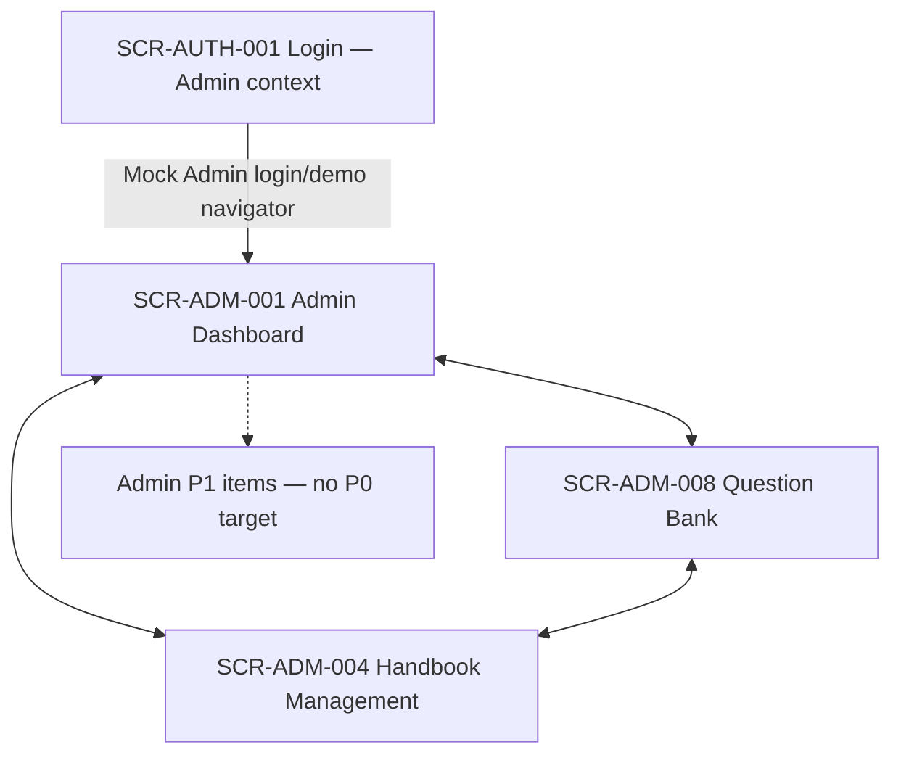
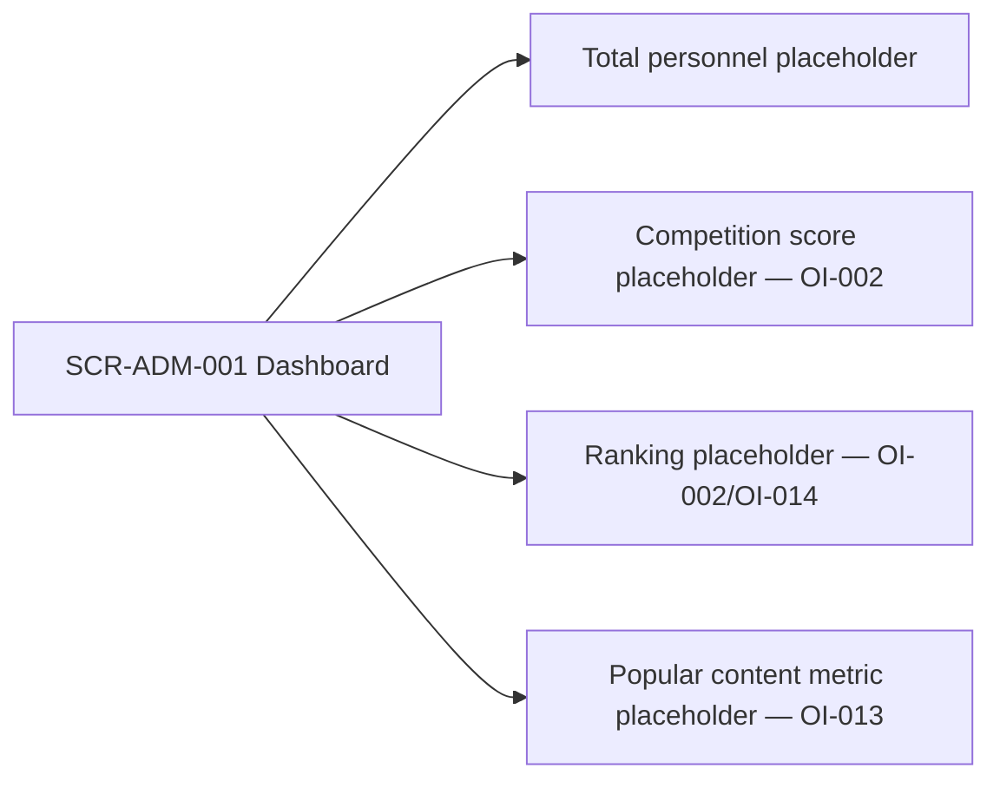
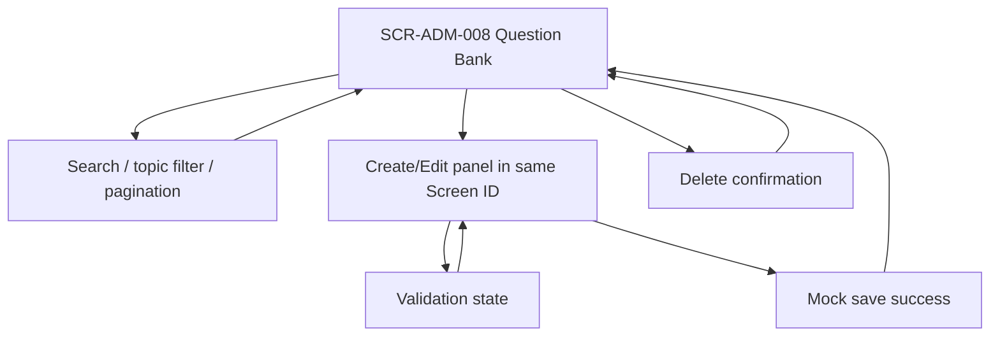
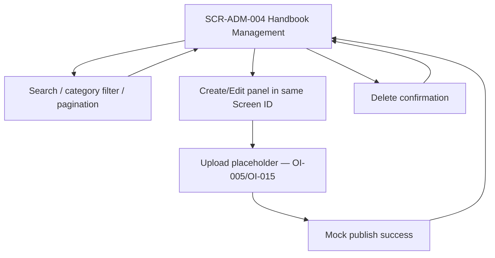

# ADMIN FLOW — P0

**Project:** Hệ thống Giáo dục Chính trị  
**Version:** 0.2  
**Date:** 2026-08-16  
**Status:** Review Ready  
**Depends on:** `wireframes/WIREFRAME-SPEC.md`, `docs/v0.2/SCREEN-CATALOG.md`

## 1. Scope

Flow này chỉ dùng đúng 3 Admin screens có Priority P0. Các Admin module còn lại là P1 và chỉ xuất hiện như disabled/annotated navigation labels.

## 2. Portal navigation

Interactive HTML cho phép mở Dashboard qua demo navigator để không phát minh role-selection field trong Login.

## 3. Dashboard behavior

- Widget values là dash/mock-labelled, không phải production data.
- Không polling; retry chỉ theo explicit action.
- Popular content không chọn views/likes/plays làm metric.

## 4. Question Bank management

Không tạo screen ID cho modal/panel; CRUD không persist trong standalone HTML.

## 5. Handbook management

- Direct publish reflects `ADM-002`; no approval workflow.
- Editor/storage/upload limit/Office preview mechanism are not designed.

## 6. Responsive admin behavior

- Desktop: sidebar + topbar + content.
- Mobile: accessible expandable menu; filters/actions stack; table is contained in labeled horizontal scroller.
- Admin screen keeps heading and primary action visible before table content.

## 7. Screen coverage

`SCR-ADM-001`, `SCR-ADM-008`, `SCR-ADM-004`: **3/3 P0 Admin screens**.
