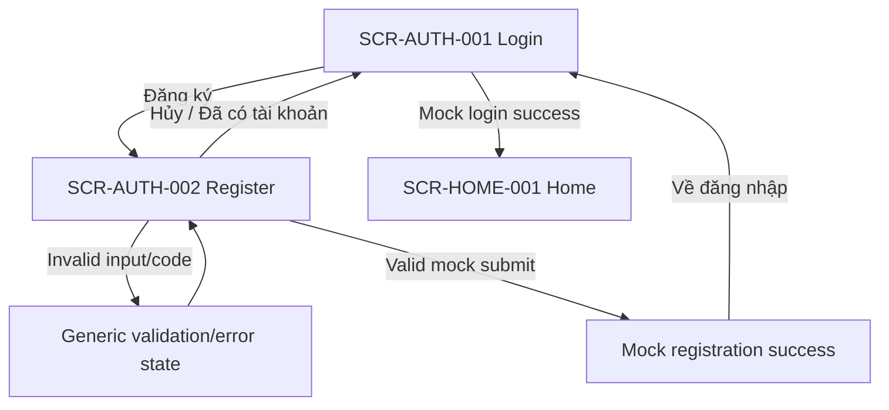
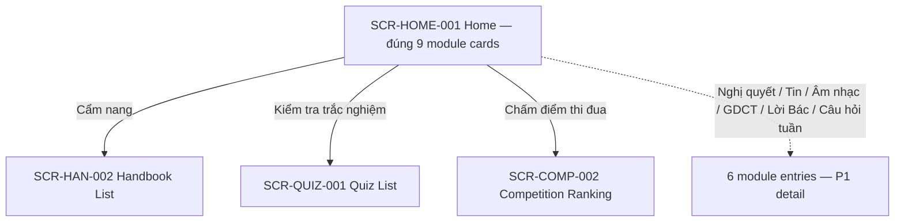
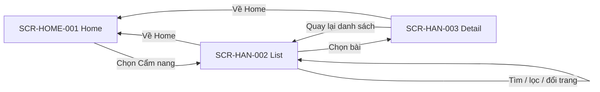
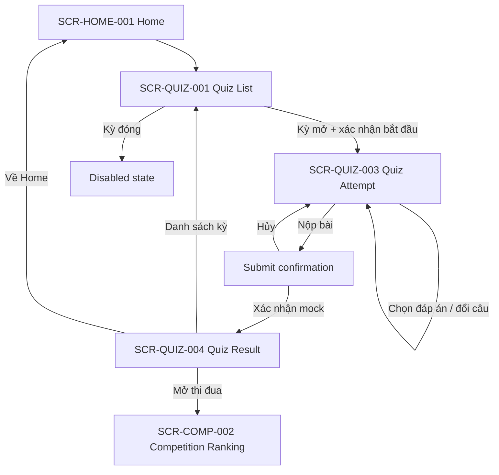
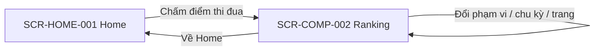
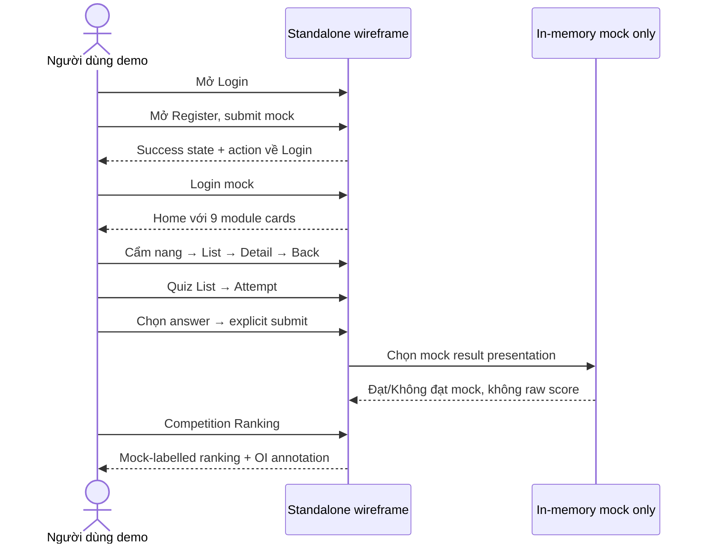

# USER FLOW — P0

**Project:** Hệ thống Giáo dục Chính trị  
**Version:** 0.2  
**Date:** 2026-08-16  
**Status:** Review Ready  
**Depends on:** `wireframes/WIREFRAME-SPEC.md`, `docs/v0.2/SCREEN-CATALOG.md`

## 1. Scope

Flow này chỉ dùng 9 P0 User/Public screens. Sáu Home module không có P0 detail vẫn hiện đủ trên Home nhưng được ghi `P1 — chưa có target trong P0`.

## 2. Authentication

- Register không auto-login.
- Invalid invitation chỉ là generic validation presentation.
- Expiration, one-time/multi-use, quota và owner chờ `OI-006`.
- Login không mô tả JWT/session.

## 3. Home navigation

P1 marker không phải screen và không có navigation target trong interactive P0.

## 4. Handbook

- Search/pagination là mock presentation trong HTML.
- Media chỉ mở theo action; không preload/autoplay.

## 5. Quiz

- `SCR-QUIZ-002` là P1; P0 dùng confirmation trong Quiz List, không tạo Screen ID mới.
- Không hiển thị số attempt, không quyết định submit câu trống, fixed/resume (`OI-007`).
- Timer là vùng hiển thị tĩnh; không countdown/auto-submit (`OI-008`).
- Result chỉ là mock Đạt/Không đạt; không raw score/ranking metric/tie-breaker (`OI-009`).
- JavaScript không random câu hỏi hoặc chấm điểm thật.

## 6. Competition ranking

Ranking dùng neutral mock rows và bắt buộc hiển thị: `Mock UI data — business formula pending OI-002/OI-012/OI-014`.

## 7. Critical UI-report demo

## 8. Screen coverage

`SCR-AUTH-001`, `SCR-AUTH-002`, `SCR-HOME-001`, `SCR-HAN-002`, `SCR-HAN-003`, `SCR-QUIZ-001`, `SCR-QUIZ-003`, `SCR-QUIZ-004`, `SCR-COMP-002`: **9/9 P0 User/Public screens**.
